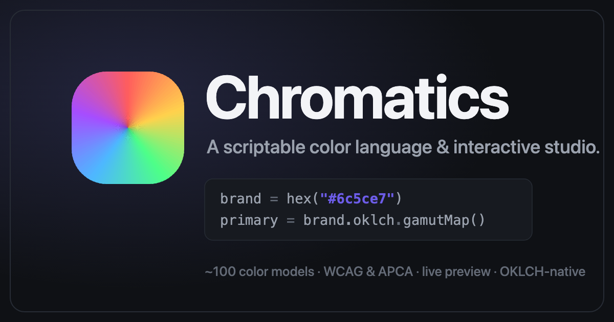

<div align="center">



# Chromatics

**A scriptable color language and an interactive studio for designing, analyzing and exploring color.**

Write a tiny program that derives a whole palette from one brand color, inspect any color across ~100 color models, check accessibility, and preview it on real UI — all in the browser.

[**🎨 Open the studio →**](https://lilbunnyrabbit.github.io/chromatics/) · [Color models](https://lilbunnyrabbit.github.io/chromatics/models) · [Mixer](https://lilbunnyrabbit.github.io/chromatics/mixer)

</div>

> Built with SvelteKit + Svelte 5, [culori](https://culorijs.org/) for color math, and CodeMirror for the editor. Stored canonically in OKLCH.

---

## What's inside

### 🎨 The color DSL

A small, expression-oriented language for generating palettes. Every value is a model-agnostic color: construct it in any space, read any channel, and chain operations — the engine converts implicitly.

```text
// Dark mode — change the brand color, the rest follows.
brand = hex("#6c5ce7")

bg      = OKLCH(0.17, brand.ok_c * 0.3, brand.ok_h)
surface = bg.lighten(0.05)
fg      = OKLCH(0.96, 0.012, brand.ok_h)
muted   = fg.darken(0.32)

primary = brand.oklch.gamutMap()
accent  = brand.oklch.rotate(150)

success = HSL(155, 0.5, 0.55)
error   = hex("#e74c3c")
```

- **Constructors** for every backed space — `OKLCH`, `OKLAB`, `HSL`, `HSV`, `HWB`, `LAB`, `LCH`, `RGB`, `P3`, `hex(...)`.
- **Channel accessors** on any color regardless of how it was made — `c.ok_c`, `c.lab_a`, `c.h`, `c.r` … and per-model views: `c.oklch`, `c.hsl`, `c.lab`.
- **Operations** — `lighten` / `darken`, `rotate`, `saturate`, `mix`, `tint` / `shade` / `tone`, `gamutMap`, harmony helpers, and more (each model contributes its own).
- **Scheme output** — name your colors and they become a role-mapped scheme you can export or theme with.
- **Design surfaces as blocks** — `tokens { … }` (type/space/radius/shadow + custom token groups), `component { … }` (button/card/type specs), `preview { … }` (cards that render in the Inspector) and `roles { primary = brand, … }` (bind theme roles to your named colors). Inside a block you call the primitives bare — no repeated `preview.` / `component.` prefix; the dotted forms (`preview.x`, `theme({…})`, …) still work too.
- A CodeMirror editor with autocompletion, hover docs, inline diagnostics and shareable URLs.

### 🧪 The studio

A tabbed workspace around the editor:

- **Inspector** — a deep read-out of any color: its values across every model, plus analysis.
- **Studio** — build and refine the palette.
- **Matrix** — a contrast matrix of every foreground/background pair with WCAG levels.
- **Validate** — accessibility validation across the scheme.
- **Preview** — your palette on real typography and UI, driven by the DSL's `preview.*` primitives.
- **Explore** — the color tools (below).
- **Export** — copy the scheme out in multiple formats.

### 🌈 100 color models & systems

The whole engine is built on one canonical store (OKLCH) with every other space as a lazy [culori](https://culorijs.org/) projection — so any color reaches any model as a view, with no privileged "base".

- **`/models`** — an interactive encyclopedia of all 100 spaces (perceptual, RGB working/display, CIE tristimulus, video/broadcast, subtractive/print, color systems). Each entry has a live channel playground, a 2-D gamut plane, a pinned 3-D model viewer, cross-model read-outs, and relationship cross-links. 65+ are fully convertible; the rest are documented stubs.
- **`/mixer`** — a cross-model mixer: one card per model, every channel a slider. Drag any slider to set a single color and watch every _other_ model re-read it live, with the model you're editing locked so it never jumps. Grouped by family with toggles.

### ♿ Accessibility & analysis

- **Contrast** — WCAG 2.x ratios + levels (AA/AAA, normal & large) and **APCA** (WCAG 3 draft).
- **Color-vision deficiency** simulation — protanopia, deuteranopia, tritanopia and more.
- **Color difference** — ΔE (CIE76, CIE94, CIEDE2000, CMC) and nearest-name lookup.
- **Print** — CMYK total-area-coverage / rich-black proofing.
- **Quantization** — extract a palette from an image.

### 🛠️ Tools

Harmony generation, gradients, tonal ramps, image color extraction, an eyedropper/picker, and an accessibility auto-fix.

### 📦 Exports

Hex / CSS, swatch SVG, Markdown tables, and round-trippable DSL source.

---

## As a library

The color engine is framework-light and exported as a Svelte package — `culori` lives behind a single seam (the model registry), so it stays swappable.

```js
import { ColorValue, OKLCH, hex, allModels, getModel } from 'chromatics';

const c = hex('#6c5ce7');
c.oklch.l; // lightness
c.lighten(0.1).hex; // → "#…"
allModels().length; // every registered model/system
```

---

## Platform

- **SvelteKit** static SPA (adapter-static), **Svelte 5 runes** throughout.
- Responsive **desktop and mobile** shells; light / dark themes.
- State persists to the **URL hash** and `localStorage`, so any palette is shareable by link.

## Development

```sh
bun install
bun run dev        # start the studio
```

## Building & testing

```sh
bun run build      # static build → build/
bun run preview    # preview the production build
bun test           # unit tests (bun:test)
bun run check      # svelte-check + types
bun run format     # prettier
```

Deployed to **GitHub Pages** via GitHub Actions on every push to `master`.

## Routes

| Route     | What                                                           |
| --------- | -------------------------------------------------------------- |
| `/`       | The studio — editor, inspector, matrix, preview, tools, export |
| `/models` | Interactive encyclopedia of all 100 color models & systems     |
| `/mixer`  | Cross-model color mixer — one color, every model, live sliders |

---

## The vault — research, decisions & the color encyclopedia

`docs/chromatics/` is the project's **second brain**: an Obsidian vault that preserves every idea, decision and plan from the run that produced Chromatics (npm template → color engine → DSL → this unified app). It's the in-depth investigation this whole project grew out of — start at [`docs/chromatics/Home.md`](docs/chromatics/Home.md).

- **00 · Overview** — Vision, Project History, Status & Inventory, Glossary.
- **01 · Decisions** — ADR-style Decision Log, _Build vs Buy_ (why we wrap **culori**), Architecture Decisions, Open Questions.
- **02 · Knowledge** — color science & algorithms, accessibility (WCAG/APCA/CVD), color theory, the library landscape.
- **03 · DSL** — the canonical language spec + implementation notes.
- **04 · Product** — the Implementation Plan, the Unified Product Plan, feature specs and roadmap.
- **06 · Reference** — a ~113-note encyclopedia of color models & systems (the source behind `/models`).
