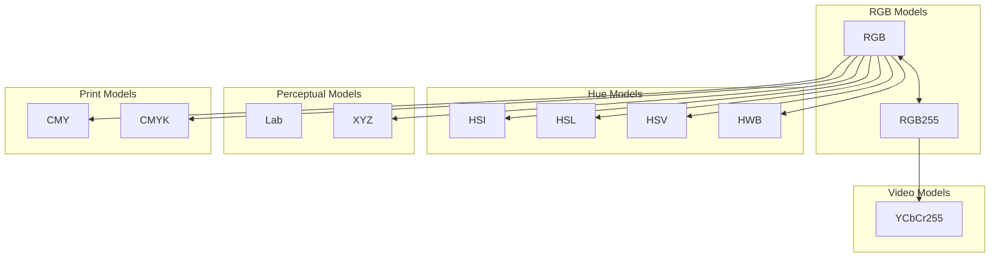

```mermaid
graph TD
  subgraph RGBModels[RGB Models]
    RGB
    RGB255
  end

  subgraph HueModels[Hue Models]
    HSI
    HSL
    HSV
    HWB
  end

  subgraph PerceptualModels[Perceptual Models]
    Lab
    XYZ
  end

  subgraph PrintModels[Print Models]
    CMY
    CMYK
  end

  subgraph VideoModels[Video Models]
    YCbCr255
  end

  RGB <--> RGB255
  RGB --> CMY
  RGB --> CMYK
  RGB --> HSI
  RGB --> HSL
  RGB --> HSV
  RGB --> HWB
  RGB --> XYZ

  RGB255 --> YCbCr255  
```
