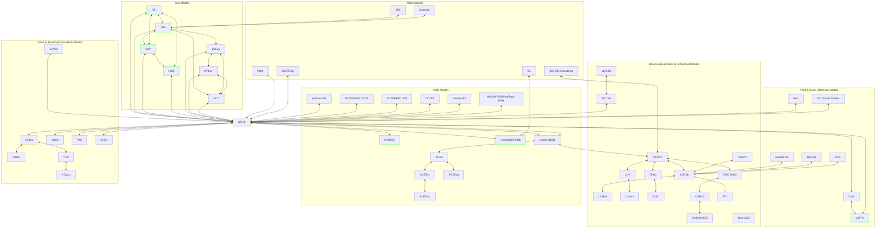

```mermaid
graph TD
    classDef implemented stroke:lime
    classDef partial stroke:orange
    classDef wont stroke:red

  %% Central Node
  sRGB[sRGB]:::partial

  %% Hue Models
  subgraph Hue_Models[Hue Models]
    HSI[HSI]:::implemented
    HSL[HSL]:::implemented
    HSV[HSV]:::implemented
    HWB[HWB]:::implemented
    HSLuv[HSLuv]
    HPLuv[HPLuv]
    HCT[HCT]
  end

  %% Device-Independent & Perceptual Models
  subgraph Perceptual_Models[Device-Independent & Perceptual Models]
    CIELab[CIELab]
    LCHab[LCHab]
    CIELCh[CIELCh]
    CIEXYZ[CIEXYZ]
    LUV[LUV]
    LCHuv[LCHuv]
    Oklab[Oklab]
    Oklch[Oklch]
    JzAzBz[JzAzBz]
    JzCzHz[JzCzHz]
    CIECAM02[CIECAM02]
    CAM16[CAM16]
    CAM16_UCS[CAM16-UCS]
    Osa_UCS[Osa-UCS]
    IPT[IPT]
  end

  %% Print & Color Difference Models
  subgraph Print_Models[Print & Color Difference Models]
    CMY[CMY]:::implemented
    CMYK[CMYK]:::implemented
    HunterLAB[HunterLAB]
    ICC[ICC-based Profiles]
    Munsell[Munsell]
    NCS[NCS]
    RAL[RAL]
  end

  %% RGB Models
  subgraph RGB_Models[RGB Models]
    RGB255[RGB255]:::implemented
    NormalizedRGB[Normalized RGB]:::implemented
    Linear_sRGB[Linear sRGB]
    ACES[ACES]
    ACEScc[ACEScc]
    ACEScct[ACEScct]
    ACEScg[ACEScg]
    AdobeRGB[Adobe RGB]
    BT2020[BT.2020/REC.2020]
    BT709[BT.709/REC.709]
    DCI_P3[DCI P3]
    Display_P3[Display P3]
    ROMM_RGB[ROMM RGB/ProPhoto RGB]
  end

  %% Video & Broadcast Standards Models
  subgraph Video_Models[Video & Broadcast Standards Models]
    xvYCC[xvYCC]
    YCbCr[YCbCr]:::partial
    YPbPr[YPbPr]
    YUV[YUV]
    ICtCp[ICtCp]
    YIQ[YIQ]
    sYCC[sYCC]
    YCgCo[YCgCo]
  end

  %% Other Models
  subgraph Other_Models[Other Models]
    ANSI[ANSI]
    GL[GL]
    TSL[TSL]
    ISO_CIE[ISO-CIE Encodings]
    SCOTDIC[SCOTDIC]
    Coloroid[Coloroid]
  end

Other_Models ~~~ Hue_Models
Video_Models ~~~ Other_Models ~~~ Hue_Models ~~~ sRGB
Perceptual_Models ~~~ Print_Models

  %% Direct Hue Model Conversions
  HSI <--> HSL
  HSL <--> HSV
  HSV <--> HWB
  HSI <--> HSV
  HSI <--> HWB
  HSL <--> HSLuv
  HSLuv <--> HPLuv
  HSL <--> HCT
  HSLuv <--> HCT
  HPLuv <--> HCT

  %% Hue Models <--> sRGB
  HSI <--> sRGB
  HSL <--> sRGB
  HSV <--> sRGB
  HWB <--> sRGB
  HSLuv <--> sRGB
  HPLuv <--> sRGB
  HCT <--> sRGB

  %% Perceptual Models Conversions (via Linear sRGB)
  sRGB <--> Linear_sRGB
  Linear_sRGB <--> CIEXYZ
  CIEXYZ <--> CIELab
  CIELab <--> LCHab
  CIELCh <--> CIELab
  CIEXYZ <--> LUV
  LUV <--> LCHuv
  CIEXYZ <--> Oklab
  Oklab <--> Oklch
  CIEXYZ <--> CIECAM02
  CIECAM02 <--> CAM16
  CAM16 <--> CAM16_UCS
  CIELab <--> IPT
  JzAzBz <--> JzCzHz
  JzCzHz <--> sRGB

  %% Print Models Conversions
  CMY <--> sRGB
  CMY <--> CMYK
  CMYK <--> sRGB
  HunterLAB <--> CIELab
  Munsell <--> CIELab
  NCS <--> CIELab
  RAL <--> sRGB
  ICC <--> sRGB

  %% RGB Models Conversions
  sRGB <--> RGB255
  sRGB <--> NormalizedRGB
  sRGB <--> Linear_sRGB
  Linear_sRGB <--> ACES
  ACES <--> ACEScc
  ACEScc <--> ACEScct
  ACES <--> ACEScg
  AdobeRGB <--> sRGB
  BT2020 <--> sRGB
  BT709 <--> sRGB
  DCI_P3 <--> sRGB
  Display_P3 <--> sRGB
  ROMM_RGB <--> sRGB

  %% Video Models Conversions
  sRGB <--> YCbCr
  YCbCr <--> YPbPr
  YCbCr <--> YUV
  sRGB <--> YIQ
  sRGB <--> ICtCp
  YUV <--> YCgCo
  sRGB <--> sYCC
  xvYCC <--> sRGB

  %% Other Models Conversions
  ANSI <--> sRGB
  GL <--> NormalizedRGB
  TSL <--> HSL
  ISO_CIE <--> CIEXYZ
  SCOTDIC <--> sRGB
  Coloroid <--> HSL
```