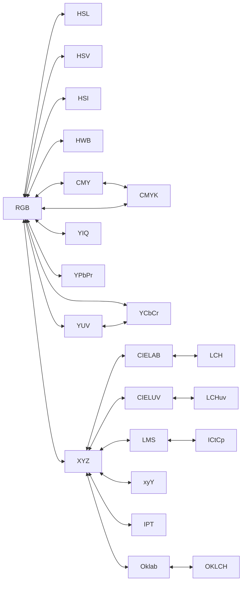

Got it! I will conduct thorough research to ensure your collection of color models is complete, refining descriptions and usage cases for each model. I will also compile only direct conversion paths between them for the Mermaid diagram. Additionally, I will gather references from academic sources, industry standards, and practical implementation resources, including conversion formulas, theoretical background, and explanatory blogs. I'll let you know once I have the complete findings ready!

# All Known Color Models – Comprehensive Overview

## RGB (Red, Green, Blue) Color Model  
**Refined Description:** RGB is an **additive color model** based on human trichromatic vision, using red, green, and blue primary light components ([HSL and HSV - Wikipedia](https://en.wikipedia.org/wiki/HSL_and_HSV#:~:text=Most%20televisions%2C%20computer%20displays%2C%20and,Furthermore%2C%20neither)) ([CMYK color model - Wikipedia](https://en.wikipedia.org/wiki/CMYK_color_model#:~:text=In%20additive%20color%20%20models%2C,of%20cyan%2C%20magenta%2C%20and%20yellow)). Colors are represented by a triplet (R,G,B) defining intensities of these primaries, typically normalized between 0 and 1 (or 0–255 in 8-bit systems). Mathematically, RGB defines a 3D coordinate system (often visualized as a cube) where each axis corresponds to a primary color intensity ([HSL and HSV - Wikipedia](https://en.wikipedia.org/wiki/HSL_and_HSV#:~:text=For%20example%2C%20imagine%20we%20have,by%2059%2C%20as%20pictured%20below)). Combining full-intensity red, green, and blue yields white (additive mixing), while zero of all yields black ([CMYK color model - Wikipedia](https://en.wikipedia.org/wiki/CMYK_color_model#:~:text=In%20additive%20color%20%20models%2C,of%20cyan%2C%20magenta%2C%20and%20yellow)). RGB differs from subtractive models (like CMYK) in that it describes emitted light rather than reflected light. Specific RGB *color spaces* (sRGB, Adobe RGB, etc.) further define the exact chromaticities and gamma corrections, but RGB as a model is device-dependent and not perceptually uniform.

**Usages:** RGB underpins electronic displays (monitors, TVs, projectors) and digital imaging. Each pixel in an LCD/OLED, for example, has sub-pixels emitting red, green, and blue light in varying intensities to produce colors ([HSL and HSV - Wikipedia](https://en.wikipedia.org/wiki/HSL_and_HSV#:~:text=Most%20televisions%2C%20computer%20displays%2C%20and,Furthermore%2C%20neither)). It’s used in image formats (PNG, JPEG), graphics APIs, and web design as the fundamental representation of color. The model is beneficial for devices that *emit* light because it aligns with hardware and the eye’s sensitivity peaks (roughly in R, G, B regions). Its strength is direct mapping to display hardware and a broad gamut for additive mixing. However, RGB is not intuitive for color selection (e.g., adjusting “red” and “green” sliders to get a desired orange can be non-obvious ([HSL and HSV - Wikipedia](https://en.wikipedia.org/wiki/HSL_and_HSV#:~:text=For%20example%2C%20imagine%20we%20have,by%2059%2C%20as%20pictured%20below))) and not perceptually uniform (numerical differences don’t linearly correspond to perceived differences). This led to the development of more user-friendly or uniform models like HSL, HSV, and Lab.

**Parameters:** RGB has three parameters:  
- **Red (R)** – Intensity of red light. Typical range 0–255 (8-bit) or 0.0–1.0 normalized. *Effect:* Increasing R adds red hue to the color and brightens any components with a red contribution, while 0 means no red contribution (the color has no red tint).  
- **Green (G)** – Intensity of green light. Range 0–255 or 0.0–1.0. *Effect:* Increasing G makes the color more greenish and lighter if green is a component; zero G removes any green tint.  
- **Blue (B)** – Intensity of blue light. Range 0–255 or 0.0–1.0. *Effect:* Increasing B adds blue tint and lightness; zero B yields no blue component in the mixture.  

Each channel’s effect is partly context-dependent: e.g. adding blue to yellow (R+G) yields white, not a “more blueish yellow,” because of additive mixing to reach a neutral balance.

**Direct Conversion Paths:** RGB is directly convertible with many other models via explicit formulas: **RGB ↔ HSL**, **RGB ↔ HSV/HSB**, **RGB ↔ HSI**, **RGB ↔ HWB**, **RGB ↔ CMY/CMYK**, and **RGB ↔ YUV/YIQ/YCbCr/YPbPr** (using defined linear transformations) ([List of color spaces and their uses - Wikipedia](https://en.wikipedia.org/wiki/List_of_color_spaces_and_their_uses#:~:text=The%20analogue%20YUV%20%20and,signals%20instead)) ([Merging RGB and 422](https://www.poynton.ca/PDFs/Merging_RGB_and_422.pdf#:~:text=can%20be%20formed%20simultaneously%20from,from%20the%20appear%02ance%20of%20the)). It also converts to the CIE XYZ space through a linear combination (specific to primaries) ([Lab and RGB / Mike Bostock - Observable](https://observablehq.com/@mbostock/lab-and-rgb#:~:text=Bruce%20Lindbloom%20maintains%20a%20list,referent%2C%20applying%20the%20Bradford)), though that is often considered an intermediate step rather than a direct *model-to-model* user manipulation. (See **Mermaid diagram** below for all direct links.)

**References:** Foundational theory of RGB is rooted in trichromatic color vision experiments by Maxwell and others, later standardized in spaces like CIE RGB (1931). Modern sRGB standards (IEC 61966-2-1) define a specific RGB space. Academic comparisons (Schwarz et al., 1987) have evaluated RGB against other models in graphics ([HSL and HSV - Wikipedia](https://en.wikipedia.org/wiki/HSL_and_HSV#:~:text=7.%20,318011)). For practical usage, the W3C and MDN documentation provide guidance on using RGB in web/CSS ([hsl() - CSS: Cascading Style Sheets - MDN Web Docs - Mozilla](https://developer.mozilla.org/en-US/docs/Web/CSS/color_value/hsl#:~:text=hsl%28%29%20,hue%2C%20saturation%2C%20and%20lightness%20components)). Conversion matrices for RGB to XYZ and others are catalogued by Lindbloom ([List of color spaces and their uses - Wikipedia](https://en.wikipedia.org/wiki/List_of_color_spaces_and_their_uses#:~:text=7.%20%5E%20,www.itu.int)) and in color libraries (e.g. python-colormath). The intuitive shortcomings of raw RGB for users are discussed in Alvy Ray Smith’s 1978 paper introducing HSV ([HSL and HSV - Wikipedia](https://en.wikipedia.org/wiki/HSL_and_HSV#:~:text=In%20an%20attempt%20to%20accommodate,as%20upon%20traditional%20color%20mixing)) ([HSL and HSV - Wikipedia](https://en.wikipedia.org/wiki/HSL_and_HSV#:~:text=,was%20a%20researcher%20at%20NYIT%27s)).

---

## CMYK (Cyan, Magenta, Yellow, Black) Color Model  
**Refined Description:** CMYK is a **subtractive color model** used in color printing, based on absorbing (masking) light using pigments ([CMYK color model - Wikipedia](https://en.wikipedia.org/wiki/CMYK_color_model#:~:text=subtractive%20%20%20112%2C%20based,most%20often%20black)). It extends the CMY model (cyan, magenta, yellow – the complements of RGB primaries) by adding **K (black)** ink. In CMY, ideal cyan absorbs red, magenta absorbs green, and yellow absorbs blue, so combining them subtracts various wavelengths from white light ([CMYK color model - Wikipedia](https://en.wikipedia.org/wiki/CMYK_color_model#:~:text=The%20CMYK%20model%20works%20by,light%20minus%20blue%20leaves%20yellow)). The “K” component accounts for black ink usage, since mixing 100% C, M, Y in real inks often produces a muddy dark brown rather than a true black ([Why is the color Black designated by the letter K in CMYK?](https://www.colorvisionprinting.com/blog/why-is-the-color-black-designated-by-the-letter-k-in-cmyk#:~:text=CMYK%3F%20www,prints%20as%20a%20truer%20black)) ([CMYK color model - Wikipedia](https://en.wikipedia.org/wiki/CMYK_color_model#:~:text=In%20additive%20color%20%20models%2C,of%20cyan%2C%20magenta%2C%20and%20yellow)). Mathematically, the ideal CMYK can be seen as an inverted RGB: C = 1–R, M = 1–G, Y = 1–B under an assumption of normalized [0,1] values, and K is an additional component usually defined as K = min(C,M,Y) in one common formulation (to remove the minimum cyan/magenta/yellow and put it into black). This model differs from RGB in that it describes how inks or dyes on a white substrate produce color by *subtracting* light; thus, white is the absence of inks (paper color) and black is achieved by full ink coverage ([CMYK color model - Wikipedia](https://en.wikipedia.org/wiki/CMYK_color_model#:~:text=In%20additive%20color%20%20models%2C,of%20cyan%2C%20magenta%2C%20and%20yellow)).

**Usages:** CMYK is the standard for **printing** (books, magazines, packaging) and any process that lays pigments on paper. It is beneficial because it aligns with how inks mix and allows a wider tonal range with the black ink: using black (K) improves shadow depth and contrast, and is more economical (since using all three C, M, Y to achieve dark tones is inefficient) ([CMYK color model - Wikipedia](https://en.wikipedia.org/wiki/CMYK_color_model#:~:text=In%20additive%20color%20%20models%2C,of%20cyan%2C%20magenta%2C%20and%20yellow)). In industry, colors are often specified in CMYK for press – e.g., a certain corporate logo color might be given as a CMYK percentage. Compared to RGB, CMYK’s strength is in representing reflective color on white media and in matching the printing process; however, it is device-dependent (the exact results vary with printer profiles, ink formulations, paper) and not intuitive for picking specific hues (designers often use Pantone or Lab to select colors, then convert to CMYK for print). It also has a smaller gamut than typical RGB spaces – many vivid RGB colors cannot be reproduced exactly in CMYK. ICC profiles for printers define mappings from device-independent spaces (like CIE Lab) to CMYK for accurate color reproduction ([ICC Profiles - IBM](https://www.ibm.com/docs/en/i/7.4?topic=management-icc-profiles#:~:text=ICC%20Profiles%20,to%20include%20all%20the)).

**Parameters:** CMYK has four parameters corresponding to ink percentages:  
- **Cyan (C)** – Amount of cyan ink (0–100%). *Effect:* Higher cyan yields more absorption of red light (the print looks more greenish-blue). 0% cyan means no red is absorbed (full red reflectance passes through that layer).  
- **Magenta (M)** – Amount of magenta ink (0–100%). *Effect:* Higher magenta absorbs more green light (print gains a purplish/red cast). 0% magenta yields no green absorption (full green reflectance).  
- **Yellow (Y)** – Amount of yellow ink (0–100%). *Effect:* Higher yellow absorbs more blue light (color appears more yellow/orange). 0% yields full blue reflectance.  
- **Black (K)** – Amount of black ink (0–100%). *Effect:* Adds neutral black density. Increasing K darkens the color and reduces its saturation by overlaying black; 0% means no black ink (shadows must be achieved by C+M+Y alone).  

In practice, when K is added, the C, M, Y values may be reduced to compensate (“GCR” – gray component replacement). For example, a medium gray might be specified as 0% C, 0% M, 0% Y, 50% K rather than 50% of each C,M,Y. Adjusting each parameter changes the print color nonlinearly: e.g., raising K makes colors duller (since black absorbs all wavelengths) and is typically used to deepen shadows and text.

**Direct Conversion Paths:** **CMY ↔ RGB** conversions are direct by inversion (assuming idealized inks and no gamma correction: C=1–R, M=1–G, Y=1–B) ([List of color spaces and their uses - Wikipedia](https://en.wikipedia.org/wiki/List_of_color_spaces_and_their_uses#:~:text=The%20analogue%20YUV%20%20and,signals%20instead)). **CMYK ↔ RGB** also has formula-based conversions if a strategy for K is defined (one common formula: K = 1−max(R,G,B); then C=(1−R−K)/(1−K), etc., when 1−K > 0) ([List of color spaces and their uses - Wikipedia](https://en.wikipedia.org/wiki/List_of_color_spaces_and_their_uses#:~:text=The%20analogue%20YUV%20%20and,signals%20instead)). **CMY ↔ CMYK** is straightforward: given C, M, Y, one can compute a K (typically the minimum or a desired black level) and subtract it out to get CMYK, and vice versa by adding K back to C, M, Y. However, exact conversions depend on print calibration – in professional workflows, conversions involve lookup tables or profiles rather than a single formula. There are no *direct* conversions between CMYK and models like HSL/HSV or CIE Lab without going through RGB or an intermediary colorimetric space, because CMYK is inherently device-specific. (Color management systems convert CMYK ⇄ Lab/XYZ using printer profiles ([ICC Profiles - IBM](https://www.ibm.com/docs/en/i/7.4?topic=management-icc-profiles#:~:text=ICC%20Profiles%20,to%20include%20all%20the)), but that is an ICC profile pipeline, not a simple analytic conversion.)

**References:** The subtractive model theory is covered in color science texts (e.g., **Billmeyer & Saltzman’s Principles of Color Technology** for how pigments mix). The Wikipedia summary concisely explains the CMYK mechanism and rationale for the black component ([CMYK color model - Wikipedia](https://en.wikipedia.org/wiki/CMYK_color_model#:~:text=In%20additive%20color%20%20models%2C,of%20cyan%2C%20magenta%2C%20and%20yellow)). X-Rite’s color guides and printing industry specs discuss practical usage of CMYK and how black (“K”) improves print quality ([CMYK color model - Wikipedia](https://en.wikipedia.org/wiki/CMYK_color_model#:~:text=In%20additive%20color%20%20models%2C,of%20cyan%2C%20magenta%2C%20and%20yellow)). ICC specification (ISO 15076) defines how CMYK values map via the Profile Connection Space (usually CIE Lab D50) for consistent reproduction ([Profile connection space (PCS) – Part 2 of ICC profile series – Color Sherlock's Journal](https://printcolormanagement.wordpress.com/2012/09/24/profile-connection-space-pcs-part-2-of-icc-profile-series/#:~:text=The%20profile%20connection%20space%20is,those%20defined%20for%20the%20colorimetry)) ([Profile connection space (PCS) – Part 2 of ICC profile series – Color Sherlock's Journal](https://printcolormanagement.wordpress.com/2012/09/24/profile-connection-space-pcs-part-2-of-icc-profile-series/#:~:text=The%20default%20measurement%20parameters%20for,illumination%20level%20of%20500%20lux)). For a historical perspective, printing journals from the late 19th century document the introduction of the four-color process (CMYK) in color comics (c. 1890s) ([CMYK color model - Wikipedia](https://en.wikipedia.org/wiki/CMYK_color_model#:~:text=The%20CMYK%20printing%20process%20was,to%20publish%20color%20comic%20strips)).

---

## HSV (Hue, Saturation, Value) Color Model  
**Refined Description:** HSV (Hue, Saturation, Value), also known as **HSB (Hue, Saturation, Brightness)**, is a **cylindrical-coordinate** transformation of RGB designed to be more intuitive for humans ([List of color spaces and their uses - Wikipedia](https://en.wikipedia.org/wiki/List_of_color_spaces_and_their_uses#:~:text=Main%20article%3A%20HSL%20and%20HSV)). It represents color by three components: the **hue** (the type of color, as an angle on the color wheel), **saturation** (color intensity or purity), and **value** (brightness). Geometrically, one can imagine the RGB cube oriented on a corner (with black at the bottom and white at the top); HSV corresponds to using polar coordinates in this cube ([HSL and HSV - Wikipedia](https://en.wikipedia.org/wiki/HSL_and_HSV#Joblove#:~:text=,40)) ([HSL and HSV - Wikipedia](https://en.wikipedia.org/wiki/HSL_and_HSV#Joblove#:~:text=,chroma%20and%20hue%20to%20RGB)). Hue (H) is the angle around the vertical neutral axis (0° = red, 120° = green, 240° = blue, etc.). Value (V) corresponds to the vertical axis – V=0 is black (no brightness), V=1 is the brightest level of a color (at full illumination) ([List of color spaces and their uses - Wikipedia](https://en.wikipedia.org/wiki/List_of_color_spaces_and_their_uses#:~:text=natural%20to%20think%20about%20a,appear%20darker%20and%20less%20bright)). Saturation (S) is the radial distance from the neutral (gray) axis, representing the intensity of the hue – S=0 means no hue (a shade of gray), S=1 means full vivid color. The **mathematical basis**: given an RGB color (with components R′, G′, B′ in [0,1]), Value *V* = max(R′,G′,B′). Saturation *S* = (V - min(R′,G′,B′)) / V (except define S=0 when V=0) ([List of color spaces and their uses - Wikipedia](https://en.wikipedia.org/wiki/List_of_color_spaces_and_their_uses#:~:text=HSV%20and%20HSL%20are%20transformations,color%20in%20HSL%20is%20pure)). Hue *H* is computed based on which component is max and the difference between other components, resulting in an angle in [0°,360°) (for example, if R′ is max, H = 60°*(G′−B′)/(V−min) + (if G′<B′ then add 360°)) ([HSL and HSV - Wikipedia](https://en.wikipedia.org/wiki/HSL_and_HSV#Joblove#:~:text=,2%20HSL%20to%20HSV)). HSV’s Value component differs from HSL’s Lightness in that Value is tied to the *maximum* channel (like shining a brighter light on a colored object) ([List of color spaces and their uses - Wikipedia](https://en.wikipedia.org/wiki/List_of_color_spaces_and_their_uses#:~:text=natural%20to%20think%20about%20a,appear%20darker%20and%20less%20bright)). This model mimics the artist notion of tinting a color by adding white or shading by adding black via the V and S controls.

**Usages:** HSV is widely used in **graphics software and color pickers** because it aligns better with how people think about color adjustments ([List of color spaces and their uses - Wikipedia](https://en.wikipedia.org/wiki/List_of_color_spaces_and_their_uses#:~:text=HSV%20and%20HSL%20are%20transformations,color%20in%20HSL%20is%20pure)). For example, an artist can choose a hue (like “blue”), then adjust saturation to get from a vivid blue to a grayish blue, and adjust value to make it a dark navy or a light pastel. It has been popular since the 1970s when computer graphics researchers at PARC and NYIT introduced it for real-time interactive color selection ([HSL and HSV - Wikipedia](https://en.wikipedia.org/wiki/HSL_and_HSV#:~:text=In%20an%20attempt%20to%20accommodate,as%20upon%20traditional%20color%20mixing)) ([HSL and HSV - Wikipedia](https://en.wikipedia.org/wiki/HSL_and_HSV#:~:text=The%20following%20year%2C%201979%2C%20at,12)). Notably, Alvy Ray Smith’s 1978 paper formalized HSV (the “hexcone” model) as efficient to compute in hardware ([HSL and HSV - Wikipedia](https://en.wikipedia.org/wiki/HSL_and_HSV#:~:text=In%20an%20attempt%20to%20accommodate,as%20upon%20traditional%20color%20mixing)) ([HSL and HSV - Wikipedia](https://en.wikipedia.org/wiki/HSL_and_HSV#:~:text=,was%20a%20researcher%20at%20NYIT%27s)). HSV is beneficial for tasks like image editing, where separating brightness from hue can make operations like changing illumination or colorization easier. Its strength is intuitive control: Hue changes the color type without affecting brightness, Value changes the brightness, and Saturation changes how vivid or pale the color is. However, HSV is **not perceptually uniform** – equal numeric changes do not produce equal visual changes ([List of color spaces and their uses - Wikipedia](https://en.wikipedia.org/wiki/List_of_color_spaces_and_their_uses#:~:text=The%20issue%20with%20both%20HSV,setting%20being%20fixed)). For instance, at constant V, lowering saturation may still change the perceived lightness of the color ([List of color spaces and their uses - Wikipedia](https://en.wikipedia.org/wiki/List_of_color_spaces_and_their_uses#:~:text=The%20issue%20with%20both%20HSV,setting%20being%20fixed)). Also, HSV’s hue circle is not perceptually uniform (e.g., the yellow region covers a smaller angle yet is very visually salient). Despite these issues, it remains a convenient model for user interfaces and simple color transformations (it’s the basis of many “color picker” tools in operating systems and design software).

**Parameters:**  
- **Hue (H)** – The angle on the color wheel [0°–360°). *Description:* Indicates the base color: e.g., 0° = red, 120° = green, 240° = blue. *Effect:* Changing H rotates around the spectrum; at full saturation, this produces a different pure color. At low saturation or value, changing hue may have subtle effect (e.g., near black or gray, hue is not evident) ([HSI Color Conversion - Imaging toolkit feature                                                                                                                                                                                                                                                               - Document Imaging SDK                                                                                                                                  ](https://www.blackice.com/colorspaceHSI.htm#:~:text=The%20Hue%20component%20describes%20the,yellow%2C%20300%20degrees%20is%20magenta)).  
- **Saturation (S)** – The purity of the color [0–1 or 0–100%]. *Description:* 1 means full saturation (no addition of gray), 0 means the color is a neutral gray at that brightness. *Effect:* Increasing S makes the color more intense/vivid (less washed-out); decreasing S adds gray, reducing vibrancy. At S=0, hue becomes irrelevant (the result is grayscale) ([HSI Color Conversion - Imaging toolkit feature                                                                                                                                                                                                                                                               - Document Imaging SDK                                                                                                                                  ](https://www.blackice.com/colorspaceHSI.htm#:~:text=The%20Hue%20component%20describes%20the,yellow%2C%20300%20degrees%20is%20magenta)).  
- **Value (V)** – The brightness value [0–1 or 0–100%]. *Description:* 0 is absolute black (regardless of hue/saturation), 1 is the maximum brightness of that hue (with no black component). *Effect:* Increasing V makes the color lighter (closer to white for a given hue); decreasing V darkens it. Notably, at V=1 and S=1 you get a fully bright, fully saturated color (e.g., pure red, green, blue, etc.), while at V=1 and S<1 you get a pastel or lighter tint (adding white), and at V<1 and S=1 you get a deep shade (adding black) ([List of color spaces and their uses - Wikipedia](https://en.wikipedia.org/wiki/List_of_color_spaces_and_their_uses#:~:text=natural%20to%20think%20about%20a,appear%20darker%20and%20less%20bright)).  

The interplay: if V is low (dark color), even high saturation may appear very dark; if S is low, changing V mostly produces different levels of gray.

**Direct Conversion Paths:** **HSV ↔ RGB** has a straightforward formula set and is invertible ([HSL and HSV - Wikipedia](https://en.wikipedia.org/wiki/HSL_and_HSV#Joblove#:~:text=,2%20HSL%20to%20HSV)). There are also direct formulas for **HSV ↔ HSL**, since both are from the RGB cube – one can derive HSL from HSV without going through RGB by mathematically relating their definitions ([HSL and HSV - Wikipedia](https://en.wikipedia.org/wiki/HSL_and_HSV#Joblove#:~:text=,2%20HSL%20to%20HSV)) ([HSL and HSV - Wikipedia](https://en.wikipedia.org/wiki/HSL_and_HSV#Joblove#:~:text=,chroma%20and%20hue%20to%20RGB)). (In practice, conversion implementations often go via RGB for simplicity, but closed-form direct conversions exist ([HSL and HSV - Wikipedia](https://en.wikipedia.org/wiki/HSL_and_HSV#Joblove#:~:text=,2%20HSL%20to%20HSV)).) **HSV ↔ HSI** is similarly related (HSI intensity is a simple function of V and S). HSV is essentially a different parameterization of the same RGB geometry as HSL/HSI, so these cylindrical models are inter-transformable ([HSL and HSV - Wikipedia](https://en.wikipedia.org/wiki/HSL_and_HSV#Joblove#:~:text=,chroma%20and%20hue%20to%20RGB)). No direct one-step conversion exists between HSV and CIE Lab or YUV without first converting to RGB (since HSV is tied to a specific RGB space’s primaries). 

**References:** HSV was first described in Alvy Ray Smith’s 1978 paper “Color Gamut Transform Pairs,” which introduced the hexcone model and provided fast RGB ↔ HSV algorithms ([HSL and HSV - Wikipedia](https://en.wikipedia.org/wiki/HSL_and_HSV#:~:text=In%20an%20attempt%20to%20accommodate,as%20upon%20traditional%20color%20mixing)) ([HSL and HSV - Wikipedia](https://en.wikipedia.org/wiki/HSL_and_HSV#:~:text=,was%20a%20researcher%20at%20NYIT%27s)). Joblove and Greenberg’s 1978 paper introduced HSL and compared it to HSV ([HSL and HSV - Wikipedia](https://en.wikipedia.org/wiki/HSL_and_HSV#:~:text=model%20for%20computer%20display%20technology,darker%2C%20or%20less%20colorful%20colors)) ([HSL and HSV - Wikipedia](https://en.wikipedia.org/wiki/HSL_and_HSV#:~:text=,which%20it%20compares%20to%20HSV)). These works (published in *Computer Graphics*, SIGGRAPH proceedings) were foundational in bringing hue-based models to computer graphics. The model’s use in user interfaces is documented in human factors studies showing users prefer HSL/HSV over raw RGB for selecting colors ([HSL and HSV - Wikipedia](https://en.wikipedia.org/wiki/HSL_and_HSV#:~:text=2.%20,RGB%20coordinates%2C%20after%20being%20taught)). Modern descriptions and formulas can be found in the Wikipedia entry ([List of color spaces and their uses - Wikipedia](https://en.wikipedia.org/wiki/List_of_color_spaces_and_their_uses#:~:text=HSV%20and%20HSL%20are%20transformations,color%20in%20HSL%20is%20pure)) and graphics textbooks (e.g., Foley et al., *Computer Graphics: Principles and Practice*). The advantages and issues of HSV and HSL are discussed in detail by Fairchild (color appearance) and in the W3C’s color module drafts ([List of color spaces and their uses - Wikipedia](https://en.wikipedia.org/wiki/List_of_color_spaces_and_their_uses#:~:text=The%20issue%20with%20both%20HSV,setting%20being%20fixed)). Practical implementations are available in many libraries (OpenCV, PIL, etc.), and color conversion tools like Pascal Getreuer’s `colorspace` package cover HSV alongside other spaces ([Convert between RGB, YUV, HSV, CIE Lab, …](https://getreuer.info/posts/colorspace/#:~:text=This%20package%20converts%20colors%20between,as%20a%20Matlab%20MEX%20function)).

---

## HSL (Hue, Saturation, Lightness) Color Model  
**Refined Description:** HSL (Hue, Saturation, Lightness), also called **HLS** or **HSI (Hue, Saturation, Intensity)** in some contexts ([List of color spaces and their uses - Wikipedia](https://en.wikipedia.org/wiki/List_of_color_spaces_and_their_uses#:~:text=natural%20to%20think%20about%20a,appear%20darker%20and%20less%20bright)), is another cylindrical-coordinate color model derived from RGB. It was developed to more closely align with traditional artists’ notions of tint, shade, and tone ([HSL and HSV - Wikipedia](https://en.wikipedia.org/wiki/HSL_and_HSV#:~:text=Alvy%20Ray%20Smith%20,darker%2C%20or%20less%20colorful%20colors)). Like HSV, HSL uses **hue** as the angle around the color wheel and **saturation** as the radial component. The difference lies in the definition of the third axis: **Lightness (L)** is defined as the average of the maximum and minimum of the R′,G′,B′ components (i.e., *(max + min)/2*) ([List of color spaces and their uses - Wikipedia](https://en.wikipedia.org/wiki/List_of_color_spaces_and_their_uses#:~:text=natural%20to%20think%20about%20a,appear%20darker%20and%20less%20bright)). This means L=0 corresponds to black, L=1 corresponds to white, and L=0.5 represents a “mid-value” color (neither very dark nor very light). In contrast to HSV’s Value, which measures brightness relative to a single component, Lightness symmetrically measures brightness relative to both black and white. The result is the HSL “double cone” or bi-hexcone geometry: at L=0 (bottom) and L=1 (top) the space collapses to a point (black or white, regardless of hue), and at L=0.5 the space has its widest cross-section (fully saturated pure colors exist at L=0.5, S=1) ([List of color spaces and their uses - Wikipedia](https://en.wikipedia.org/wiki/List_of_color_spaces_and_their_uses#:~:text=luminance,appear%20darker%20and%20less%20bright)). HSL was first described formally by Joblove and Greenberg in 1978, who actually termed L “Intensity” in their paper and defined S as “relative chroma” ([HSL and HSV - Wikipedia](https://en.wikipedia.org/wiki/HSL_and_HSV#:~:text=model%20for%20computer%20display%20technology,darker%2C%20or%20less%20colorful%20colors)) ([HSL and HSV - Wikipedia](https://en.wikipedia.org/wiki/HSL_and_HSV#:~:text=1.%20,and%20compared%20three%20models%3A%20hue%2Fchroma%2Fintensity)). In essence, HSL attempts to more directly map to the idea of adding white (to lighten) or black (to darken) a color: Lightness controls the mixture with white/black, while Saturation controls mixture with gray of the same lightness.

**Usages:** HSL is commonly used in digital art and design tools for color selection, as well as in CSS and SVG for web colors (the `hsl()` function in CSS) ([hsl() - CSS: Cascading Style Sheets - MDN Web Docs - Mozilla](https://developer.mozilla.org/en-US/docs/Web/CSS/color_value/hsl#:~:text=hsl%28%29%20,hue%2C%20saturation%2C%20and%20lightness%20components)). Designers find it useful because Lightness = 50% gives the “pure” version of a color, and adjusting L up or down gives tints (color mixed with white) or shades (mixed with black) in a perceptually intuitive way. For example, to create a palette of related colors, one might keep H constant (same hue) and vary L and S to get a range of lighter/darker or duller/brighter variants. HSL’s strength is human-friendly manipulation: it’s easier to make a color “lighter” by just raising L than by tweaking RGB components. It also aligns somewhat with artistic color theory (mixing pigments with white or black). HSL is used in graphics applications like Adobe Illustrator, Inkscape, and in color scheming tools. However, like HSV, HSL is not perceptually uniform ([List of color spaces and their uses - Wikipedia](https://en.wikipedia.org/wiki/List_of_color_spaces_and_their_uses#:~:text=The%20issue%20with%20both%20HSV,setting%20being%20fixed)). A notable issue: the saturation in HSL doesn’t correspond to colorfulness in a consistent way – e.g., a medium-lightness yellow (L ~0.5, S=1) is perceived as much lighter than a medium-lightness blue at the same numeric L ([List of color spaces and their uses - Wikipedia](https://en.wikipedia.org/wiki/List_of_color_spaces_and_their_uses#:~:text=The%20issue%20with%20both%20HSV,setting%20being%20fixed)). This is because the formula is still tied to RGB primaries and not corrected for human vision non-linearities. Despite this, HSL is favored for simplicity when precise colorimetry isn’t required.

**Parameters:**  
- **Hue (H)** – [0°–360°) The base color angle, same as in HSV. *Effect:* Determines the hue family (red, yellow, green, cyan, blue, magenta, etc.). At full saturation and L=0.5, H picks the pure pigment. At L=0 or L=1, hue has no visible effect (since the color is black or white).  
- **Saturation (S)** – [0–1 or 0–100%] The color intensity, defined in HSL as distance from the neutral gray at the same lightness. *Effect:* S=1 means no gray added – the color is as vivid as possible for that hue at that lightness. S=0 means the color is a neutral gray (no hue). Adjusting S controls how “washed out” or “pure” the color appears. Note: At L=0.5, S=1 gives a vivid color; at L=0.5, S=0 gives a middle gray. At extreme lightness values (near 0 or 1), even S=1 yields not a vivid hue but nearly black or white; thus saturation’s impact diminishes near the top and bottom of the lightness range ([HSI Color Conversion - Imaging toolkit feature                                                                                                                                                                                                                                                               - Document Imaging SDK                                                                                                                                  ](https://www.blackice.com/colorspaceHSI.htm#:~:text=As%20the%20above%20figure%20shows%2C,also%20limits%20the%20saturation%20values)).  
- **Lightness (L)** – [0–1 or 0–100%] The lightness (sometimes called luminosity). *Effect:* L=0 produces black, regardless of H or S. L=1 produces white. L=0.5 yields the “balanced” version of the hue. Increasing L from 0.5 to 1 will add white to the color (a tint), making it less saturated visually and lighter; decreasing L from 0.5 towards 0 adds black (a shade), also often reducing the apparent saturation. For example, pure red (H=0) at L=0.5, S=1 is a bright red; at L=0.75, S=1 it becomes a light pinkish (since it’s 25% closer to white); at L=0.25, S=1 it becomes a dark burgundy. Lightness thus controls the overall brightness and white/black mix.  

**Direct Conversion Paths:** **HSL ↔ RGB** has direct formulas similar in complexity to HSV’s conversion ([HSL and HSV - Wikipedia](https://en.wikipedia.org/wiki/HSL_and_HSV#Joblove#:~:text=,chroma%20and%20hue%20to%20RGB)). **HSL ↔ HSV** can be converted via explicit equations since both are defined in terms of RGB’s min/max: for example, a given HSL can be converted to an equivalent HSV without needing to go through RGB by using relationships between lightness and value ([HSL and HSV - Wikipedia](https://en.wikipedia.org/wiki/HSL_and_HSV#Joblove#:~:text=,2%20HSL%20to%20HSV)). **HSL ↔ HSI** (intensity) is also directly related (HSI uses a different definition of saturation and intensity – often intensity = (R′+G′+B′)/3). In practice, many libraries convert HSL↔HSV by first converting to RGB (for simplicity), but one can derive direct conversion algebraically ([HSL and HSV - Wikipedia](https://en.wikipedia.org/wiki/HSL_and_HSV#Joblove#:~:text=,40)) ([HSL and HSV - Wikipedia](https://en.wikipedia.org/wiki/HSL_and_HSV#Joblove#:~:text=,chroma%20and%20hue%20to%20RGB)). HSL does not convert directly to models like YUV or Lab except via RGB as an intermediate (since HSL is just a re-parametrization of RGB). Because HSL and HSV share the same hue definition, they and related models (HSI, HSB, etc.) are all interrelated in the cylindrical coordinate family ([List of color spaces and their uses - Wikipedia](https://en.wikipedia.org/wiki/List_of_color_spaces_and_their_uses#:~:text=HSV%20and%20HSL%20are%20transformations,color%20in%20HSL%20is%20pure)).

**References:** Joblove & Greenberg’s 1978 paper “Color Spaces for Computer Graphics” introduced the HSL model and provided conversion formulae, labeling the components (hue, relative chroma, intensity) ([HSL and HSV - Wikipedia](https://en.wikipedia.org/wiki/HSL_and_HSV#:~:text=Alvy%20Ray%20Smith%20,darker%2C%20or%20less%20colorful%20colors)) ([HSL and HSV - Wikipedia](https://en.wikipedia.org/wiki/HSL_and_HSV#:~:text=,which%20it%20compares%20to%20HSV)). They compared HSL to HSV, noting HSL’s approach of treating tint/shade symmetrically about L=50% ([HSL and HSV - Wikipedia](https://en.wikipedia.org/wiki/HSL_and_HSV#:~:text=In%20the%20same%20issue%2C%20Joblove,darker%2C%20or%20less%20colorful%20colors)). The model’s use in computer graphics interfaces grew in the early 1980s, recommended in SIGGRAPH reports and adopted by graphics terminals (Tektronix, 1979) ([HSL and HSV - Wikipedia](https://en.wikipedia.org/wiki/HSL_and_HSV#:~:text=The%20following%20year%2C%201979%2C%20at,15)). Extensive discussion of HSL/HSV appears in the Wikipedia article ([List of color spaces and their uses - Wikipedia](https://en.wikipedia.org/wiki/List_of_color_spaces_and_their_uses#:~:text=HSV%20and%20HSL%20are%20transformations,color%20in%20HSL%20is%20pure)) ([List of color spaces and their uses - Wikipedia](https://en.wikipedia.org/wiki/List_of_color_spaces_and_their_uses#:~:text=natural%20to%20think%20about%20a,appear%20darker%20and%20less%20bright)) and in Maureen Stone’s “A Survey of Color for Computer Graphics” ([HSL and HSV - Wikipedia](https://en.wikipedia.org/wiki/HSL_and_HSV#:~:text=1.%20,and%20compared%20three%20models%3A%20hue%2Fchroma%2Fintensity)). W3C’s CSS Color Level 4 spec defines `hsl()` and provides notes on how it maps to sRGB ([Day 30: the hwb() color function - Manuel Matuzovic](https://www.matuzo.at/blog/2022/100daysof-day30#:~:text=HWB%2C%20which%20stands%20for%20hue,mix%20into%20that%20base%20hue)). From a practical standpoint, many image processing texts (Gonzalez & Woods, etc.) cover HSL/HSI for tasks like segmentation, emphasizing its advantage that hue is invariant to lighting intensity changes. However, they also caution about the model’s non-uniformity. These trade-offs are documented in publications like **Schwarz et al. 1987** (which experimentally compared HSV, HSL, RGB, etc. in terms of how well they cluster colors) ([HSL and HSV - Wikipedia](https://en.wikipedia.org/wiki/HSL_and_HSV#:~:text=7.%20,318011)).

---

## HSI (Hue, Saturation, Intensity) Color Model  
**Refined Description:** HSI is a variant of the hue-saturation models, where **Intensity (I)** is used instead of HSV’s value or HSL’s lightness. Often, “HSI” refers to a model where Intensity is defined as the simple average of the R′, G′, B′ components: *I = (R′ + G′ + B′) / 3* ([HSL and HSV - Wikipedia](https://en.wikipedia.org/wiki/HSL_and_HSV#:~:text=HSL%20and%20HSV%20,This%20is%20simply%20the)). The hue (H) definition in HSI is usually the same as for HSL/HSV (angle in the RGB plane), and saturation (S) is defined in terms of how far the color is from a gray of the same intensity. One common formulation: *S = 1 – (min(R′,G′,B′) / I)* for I>0 ([HSL and HSV - Wikipedia](https://en.wikipedia.org/wiki/HSL_and_HSV#:~:text=HSL%20and%20HSV%20,This%20is%20simply%20the)). Geometrically, HSI also can be derived from the tilted RGB cube, but here the neutral axis goes from black to white through the center of the cube, and intensity is the projection of a color onto that neutral axis ([HSL and HSV - Wikipedia](https://en.wikipedia.org/wiki/HSL_and_HSV#:~:text=the%20three%20components%2C%20in%20the,chroma%2C%20this%20representation%20preserves%20distances)). The key difference: HSI’s intensity treats the contribution of all three RGB components equally (a true average), whereas HSL’s lightness gives equal weight to the extremes (min and max) and HSV’s value focuses only on the maximum. This makes HSI popular in machine vision and remote sensing, because intensity as an average is akin to a grayscale image of the color (useful for image processing tasks). HSI separates the chromatic content (H, S) from the average brightness (I) more cleanly in some contexts ([HSI Color Conversion - Imaging toolkit feature                                                                                                                                                                                                                                                               - Document Imaging SDK                                                                                                                                  ](https://www.blackice.com/colorspaceHSI.htm#:~:text=The%20HSI%20color%20space%20is,the%20human%20eye%20senses%20colors)) ([HSI Color Conversion - Imaging toolkit feature                                                                                                                                                                                                                                                               - Document Imaging SDK                                                                                                                                  ](https://www.blackice.com/colorspaceHSI.htm#:~:text=The%20Hue%20component%20describes%20the,yellow%2C%20300%20degrees%20is%20magenta)).

**Usages:** HSI is often used in **image analysis**, **computer vision**, and **image processing**. For example, in remote sensing, HSI can be used to enhance or classify images by manipulating the intensity channel (which is basically the grayscale), separate from color information. Because I = (R+G+B)/3, it is invariant to certain lighting conditions (e.g., pure changes in overall intensity affect I but not H or S), which can be useful for algorithms that need to detect colored objects under varying illumination. HSI is also mentioned in some older graphics systems; however, many systems use HSL/HSV interchangeably with HSI terminology. The strength of HSI in vision applications is that the I component is exactly the grayscale image (useful for edge detection, etc.), and hue and saturation are decoupled from overall brightness ([HSL and HSV - Wikipedia](https://en.wikipedia.org/wiki/HSL_and_HSV#:~:text=The%20HSI%20model%20commonly%20used,end%20users%2C%20the%20goal%20of)). Compared to HSV, HSI’s saturation definition tends to yield a saturation value of 1 for pure colors and 0 for grays, similar to others, but handles intermediate tones slightly differently (because intensity being an average means a fully saturated color has one component 0, two others equal – this geometry leads to a somewhat different saturation metric). In practice, HSI and HSL are quite similar; the difference is most noticed for colors like pure white or pure black: in HSL, L=1 or 0 respectively, whereas in HSI, I could be high but S=0 for white. HSI’s weaknesses are like those of HSL/HSV – it’s not perceptually uniform and suffers from singularities at low intensities (hue becomes undefined when I ~ 0, as color approaches black, and when saturation is 0) ([HSI Color Conversion - Imaging toolkit feature                                                                                                                                                                                                                                                               - Document Imaging SDK                                                                                                                                  ](https://www.blackice.com/colorspaceHSI.htm#:~:text=As%20the%20above%20figure%20shows%2C,also%20limits%20the%20saturation%20values)).

**Parameters:**  
- **Hue (H)** – [0°–360°) The same hue angle as in other models. *Effect:* Determines the base color tone (e.g. 0° red, 120° green, etc.). When intensity is high and saturation is high, hue is clearly visible; when intensity is very low (nearly black) or saturation is very low (nearly gray), changing hue has little visible effect.  
- **Saturation (S)** – [0–1] Defines how pure the color is, relative to a gray with the same intensity. In one formulation S = 1 – *min(R′,G′,B′)/I*. *Effect:* S=1 means the color has one of the RGB components zero (the most extreme chroma for that intensity), and S=0 means R=G=B (a gray). Increasing S makes the color less gray (more “colorful”), while decreasing S makes it more washed out. Notably, at full intensity (I = 1) and S=1, we get a very vivid color, whereas at half intensity (I ~0.5) and S=1, the color is vivid but darker (since overall brightness is lower).  
- **Intensity (I)** – [0–1] Represents the overall light intensity or brightness, defined as the average of R, G, B. *Effect:* I=0 is black. I=1 is white only if saturation is 0; if saturation is 1 and I=1, actually one component would be 1 and others 0, so the color is a fully bright primary (which is bright but not white). Generally, increasing I makes the color lighter (approaching white if saturation isn’t also maxed). Decreasing I darkens the color (approaching black). Because intensity is an average, an HSI color with S less than 1 will actually approach a *gray of that intensity* as S→0, rather than pure white or black. For example, H arbitrary, S=0.5, I=0.5 would be a mixture: half way from the neutral gray at 50% intensity towards a fully saturated hue at that intensity.  

**Direct Conversion Paths:** **HSI ↔ RGB** conversion formulas are available (though slightly more complex than HSL/HSV due to the different S definition) ([HSI Color Conversion - Imaging toolkit feature                                                                                                                                                                                                                                                               - Document Imaging SDK                                                                                                                                  ](https://www.blackice.com/colorspaceHSI.htm#:~:text=or%201,the%20saturation%20values)). Converting from RGB to HSI involves computing I = (R+G+B)/3, then hue similar to other models, and saturation by the formula above (or alternative geometric definitions) ([HSL and HSV - Wikipedia](https://en.wikipedia.org/wiki/HSL_and_HSV#:~:text=HSL%20and%20HSV%20,This%20is%20simply%20the)). **HSI ↔ HSV/HSL:** These are interrelated – for a given color, one can derive HSI’s parameters from HSV or vice versa if needed (often via converting to RGB internally). For example, HSI’s intensity I = (2−S_HSL)*L in terms of HSL parameters (there are known relations when assuming same hue) ([HSL and HSV - Wikipedia](https://en.wikipedia.org/wiki/HSL_and_HSV#Joblove#:~:text=,2%20HSL%20to%20HSV)). Typically, direct conversion might not be done in one formula, but since all these models share H and are functions of R,G,B, one can cascade the known direct conversions: e.g., HSV → RGB → HSI or derive a composite formula. No direct link to models like YUV or Lab without going through RGB (since HSI is tied to RGB values). In summary, HSI is directly interchangeable with HSL/HSV given the appropriate equations, and numerous vision libraries implement HSI alongside HSV.

**References:** The HSI model is often credited to work in the late 1970s (for example, a Master’s thesis by *John Kender (1976)* proposed HSI for computer vision ([HSL and HSV - Wikipedia](https://en.wikipedia.org/wiki/HSL_and_HSV#:~:text=match%20at%20L863%20human%20color,with%20more%20complex%20models%2C%20and))). Ohta et al. (1980) also used a similar color space in vision, demonstrating its efficacy in image analysis ([HSL and HSV - Wikipedia](https://en.wikipedia.org/wiki/HSL_and_HSV#:~:text=human%20color%20response,with%20more%20complex%20models%2C%20and)). Gonzalez and Woods’s textbook *Digital Image Processing* has a section on HSI color space and its advantages for image processing tasks ([HSL and HSV - Wikipedia](https://en.wikipedia.org/wiki/HSL_and_HSV#:~:text=HSL%20and%20HSV%20,This%20is%20simply%20the)). The Wikipedia article on HSL/HSV clarifies the relationship and mentions that HSL is sometimes called HSI, though the pure form of HSI (with intensity as average) is used in vision literature ([List of color spaces and their uses - Wikipedia](https://en.wikipedia.org/wiki/List_of_color_spaces_and_their_uses#:~:text=natural%20to%20think%20about%20a,appear%20darker%20and%20less%20bright)). Black Ice Software’s documentation snippet provides a simple description of HSI components ([HSI Color Conversion - Imaging toolkit feature                                                                                                                                                                                                                                                               - Document Imaging SDK                                                                                                                                  ](https://www.blackice.com/colorspaceHSI.htm#:~:text=The%20Hue%20component%20describes%20the,yellow%2C%20300%20degrees%20is%20magenta)). In practice, color manipulation libraries and tools (e.g., MATLAB’s `rgb2hsv` can be adapted for HSI) use HSI for tasks like shadow removal or color-based segmentation. Academic research (e.g., *“HSI and HSV color space for image analysis”* on StackExchange ([HSI and HSV color space - image processing - Stack Overflow](https://stackoverflow.com/questions/20853527/hsi-and-hsv-color-space#:~:text=HSI%20and%20HSV%20color%20space,Is%20HSI)) or various IEEE papers) compare HSI vs HSV in terms of computational performance and results for specific tasks.

---

## HWB (Hue, Whiteness, Blackness) Color Model  
**Refined Description:** HWB stands for **Hue-Whiteness-Blackness**, a cylindrical color model introduced as an alternative to HSL/HSV to provide a more intuitive way to blend a hue with white or black ([Day 30: the hwb() color function - Manuel Matuzovic](https://www.matuzo.at/blog/2022/100daysof-day30#:~:text=HWB%2C%20which%20stands%20for%20hue,mix%20into%20that%20base%20hue)). Formally proposed by Alvy Ray Smith in 1996 ([HWB-A more intuitive hue-based color model - ResearchGate](https://www.researchgate.net/publication/240035805_HWB-A_more_intuitive_hue-based_color_model#:~:text=HWB,the%20context%20of%20computer%20graphics)), HWB retains the same **hue (H)** angle as HSV/HSL but replaces the saturation/value axes with **whiteness (W)** and **blackness (B)**. The idea is that a color can be described by taking a pure hue, mixing in some amount of white, and some amount of black. Whiteness is the fraction of white mixed in, and blackness is the fraction of black. If we consider an HSL double-cone, HWB coordinates are another way to navigate it: W corresponds to moving toward the white tip, B corresponds to moving toward the black tip. Mathematically, for an HWB color (H, W, B) with all components in [0,1], the color is defined as: start with a pure hue color at full saturation and brightness corresponding to H, then mix W fraction of white and B fraction of black (with the remainder (1–W–B) being “pure hue” portion) ([Day 30: the hwb() color function - Manuel Matuzovic](https://www.matuzo.at/blog/2022/100daysof-day30#:~:text=HWB%2C%20which%20stands%20for%20hue,mix%20into%20that%20base%20hue)). If W + B >= 1, the result is a shade of gray (since adding that much white and black essentially desaturates the hue completely). HWB differs from HSL/HSV in that it’s directly additive in terms of white and black mixing, which can be conceptually simpler for users (“add x% white, y% black to this hue”). The model is still ultimately another view of the RGB color solid (and conversions to/from RGB are well-defined), but is linear in the amount of white/black dilution.

**Usages:** HWB was proposed in the context of computer graphics as a more user-friendly model for color pickers ([HWB-A more intuitive hue-based color model - ResearchGate](https://www.researchgate.net/publication/240035805_HWB-A_more_intuitive_hue-based_color_model#:~:text=ResearchGate%20www,the%20context%20of%20computer%20graphics)). It’s been adopted in the **CSS Color Level 4** specification as a new way to specify colors (`hwb(hue, whiteness%, blackness%)`) ([hwb() - CSS: Cascading Style Sheets - MDN Web Docs](https://developer.mozilla.org/en-US/docs/Web/CSS/color_value/hwb#:~:text=The%20hwb,its%20hue%2C%20whiteness%2C%20and%20blackness)). This is useful for designers because it parallels the way one might describe creating a paint: e.g., “take some red, add 10% white and 20% black”. It is beneficial when one wants to quickly generate tints or shades of a given hue without worrying about the exact brightness. For example, to get a pastel blue, one could pick hue≈240° (blue) and then a high whiteness percentage, moderate blackness. Or to get a dark olive, pick hue≈60° (yellowish) and add significant blackness. The strength of HWB is its intuitive approach: many find it more straightforward to think in terms of “make this color lighter by adding white” (increase W) or “darker by adding black” (increase B) rather than adjusting both saturation and lightness in HSL. HWB also has the nice property that the sum W+B can never exceed 1 for a real color (any excess is effectively clamped to gray), which ensures all HWB values map to a valid RGB color. It’s gaining traction with web developers as browsers start supporting the `hwb()` function. One limitation is that, like HSL/HSV, it’s not perceptually uniform – it’s mainly a convenience model. Also, it’s tied to an RGB space (usually sRGB in implementations), so it’s device-dependent.

**Parameters:**  
- **Hue (H)** – [0°–360°) The hue of the color, same as in HSL/HSV. *Effect:* Determines the base hue that will be tinted or shaded. H=0 and H=360 both denote red, 120 = green, 240 = blue, etc. If either W or B is 1 (maxed out), hue becomes irrelevant (fully white or black).  
- **Whiteness (W)** – [0–1 or 0–100%] Proportion of white mixing. *Description:* Fraction of the final color that is white. *Effect:* Higher W makes the color lighter/paler, adding white. W=1 yields pure white (regardless of hue or B). W=0 means no white added. For example, W=0.3 means 30% of the mixture is white, so the color is significantly lightened. Increasing W will always move the color toward white (pastel tones if some hue remains, eventually white if W+B →1).  
- **Blackness (B)** – [0–1 or 0–100%] Proportion of black mixing. *Description:* Fraction of the final color that is black. *Effect:* Higher B makes the color darker, adding black. B=1 yields pure black. B=0 means no black added. For instance, B=0.2 means 20% black is mixed in – the color is a darker shade of the hue. Increasing B drags the color toward black (lowering its brightness and saturation).  

The constraints: typically W + B ≤ 1 for a chromatic color (when W+B = 1, the remaining hue portion is 0, so the color is a shade of gray between white and black). If W+B is less than 1, the remainder (1 – W – B) is effectively the fraction of pure hue color. So a color in HWB can be thought of as: **Color = (1−W−B)*Hue_color + W*White + B*Black**. Adjusting W and B thus linearly interpolates with white and black respectively ([HWB - ColorAide Documentation](https://facelessuser.github.io/coloraide/colors/hwb/#:~:text=The%20mental%20model%20is%20that,Channel%20Aliases)).

**Direct Conversion Paths:** **HWB ↔ RGB** is directly computed by the above mixture logic: conversion algorithms exist to go from (H, W, B) to an RGB triple without intermediate spaces. For example, one can derive it by first computing the RGB of the given hue at full saturation (like an HSV color with V=1, S=1, that’s the “Hue_color”), then linearly interpolating toward white and black according to W and B ([Day 30: the hwb() color function - Manuel Matuzovic](https://www.matuzo.at/blog/2022/100daysof-day30#:~:text=HWB%2C%20which%20stands%20for%20hue,mix%20into%20that%20base%20hue)). The inverse (RGB to HWB) is also straightforward: compute the hue of the color, then the whiteness is min(R,G,B) (fraction of white relative to 1) and blackness is 1–max(R,G,B) (fraction of black) ([HWB-A more intuitive hue-based color model - ResearchGate](https://www.researchgate.net/publication/240035805_HWB-A_more_intuitive_hue-based_color_model#:~:text=ResearchGate%20www,the%20context%20of%20computer%20graphics)). These formulas come from the fact that min(R,G,B) indicates how much white light is present equally in all components (common intensity that could be taken as “white” portion), and 1–max(R,G,B) indicates how far the color is from full brightness (how much black has been added). Because of this, **HWB ↔ HSV** conversion is also easy: H is the same, and W = (1 – S)*V in terms of HSV, B = 1 – V ([HWB-A more intuitive hue-based color model - ResearchGate](https://www.researchgate.net/publication/240035805_HWB-A_more_intuitive_hue-based_color_model#:~:text=ResearchGate%20www,the%20context%20of%20computer%20graphics)). HWB does not directly convert to models like Lab or YUV except through RGB (like other RGB-derived models). It is effectively a reparameterization of HSL/HSV, so it slots into the same conversion graph near RGB.

**References:** HWB was described by Alvy Ray Smith and Eric Lyons in 1996 as an improvement over HSV for choosing colors intuitively ([HWB-A more intuitive hue-based color model - ResearchGate](https://www.researchgate.net/publication/240035805_HWB-A_more_intuitive_hue-based_color_model#:~:text=ResearchGate%20www,the%20context%20of%20computer%20graphics)). The W3C CSS Color Module Level 4 includes a definition of HWB and cites Smith’s work ([CSS hwb() Function - Quackit](https://www.quackit.com/css/color/values/css_hwb_function.cfm#:~:text=blackness%20components%20of%20the%20color%2C,which%20stands%20for)). Developer resources like MDN provide usage examples for the `hwb()` function ([hwb() - CSS: Cascading Style Sheets - MDN Web Docs](https://developer.mozilla.org/en-US/docs/Web/CSS/color_value/hwb#:~:text=The%20hwb,its%20hue%2C%20whiteness%2C%20and%20blackness)). A detailed introduction titled “HWB – A more intuitive hue-based color model” was published (Smith & Lyons, 1996) explaining the rationale (the researchgate reference notes it was “reinvented” by Smith in that context) ([HWB-A more intuitive hue-based color model - ResearchGate](https://www.researchgate.net/publication/240035805_HWB-A_more_intuitive_hue-based_color_model#:~:text=HWB,the%20context%20of%20computer%20graphics)). Practical guides such as *Smashing Magazine* and *CSS Tricks* have started covering HWB for designers, showing how it complements HSL ([Day 30: the hwb() color function - Manuel Matuzovic](https://www.matuzo.at/blog/2022/100daysof-day30#:~:text=HWB%2C%20which%20stands%20for%20hue,mix%20into%20that%20base%20hue)). The conversion math is relatively simple; for instance, the ColourAide library documentation provides formulas for HWB↔RGB ([HWB - ColorAide Documentation](https://facelessuser.github.io/coloraide/colors/hwb/#:~:text=HWB%20,Channel%20Aliases)). In summary, HWB stands on the shoulders of HSV/HSL, adjusting the axes to align with an artist’s mixing paradigm (white/black paint), and references from W3C and Smith’s original work detail its implementation and benefits.

---

## CIE 1931 XYZ Color Model  
**Refined Description:** **CIE XYZ** is a fundamental **device-independent color model** developed by the Commission Internationale de l’Éclairage (CIE) in 1931 ([List of color spaces and their uses - Wikipedia](https://en.wikipedia.org/wiki/List_of_color_spaces_and_their_uses#:~:text=Main%20article%3A%20CIE%201931%20color,space)). It was the first quantitative, linkable model of human color perception, based on experimental color matching functions. XYZ is a **linear** color space with three parameters X, Y, Z which are fictitious primaries (they do not correspond to real colors but are constructed to simplify calculations). The model is based on integrating spectral power distributions with three color matching functions $\bar{x}(\lambda)$, $\bar{y}(\lambda)$, $\bar{z}(\lambda)$, which were derived from human observer experiments. By design, the Y component in XYZ is proportional to **luminance** (i.e., it matches closely the photopic luminous efficiency function) ([Profile connection space (PCS) – Part 2 of ICC profile series – Color Sherlock's Journal](https://printcolormanagement.wordpress.com/2012/09/24/profile-connection-space-pcs-part-2-of-icc-profile-series/#:~:text=The%20profile%20connection%20space%20is,those%20defined%20for%20the%20colorimetry)). X and Z together with Y define the chromaticity. One key aspect: all **visible colors** can be represented as a positive combination of X, Y, Z values (one reason these particular primaries were chosen was to avoid negative coordinates for the gamut of human vision). XYZ is often considered more a **reference color space** than a practical color-picking model; it is the root from which many other color spaces (Lab, Luv, etc.) are derived. It differs from models like RGB or CMYK in that it’s not tied to any device – it represents an absolute measure of color as perceived, given a standard observer and illuminant. The unit scaling of XYZ can vary – often Y is normalized to 1.0 for a reference white, or to 100 for percentage luminance. XYZ is not uniform (distances in XYZ do not correspond to perceptual differences), but it is linear in terms of color mixing: adding XYZ values or scaling them corresponds to physically adding lights.

**Usages:** CIE XYZ serves as a **fundamental reference** in colorimetry and color science. All color profiles (such as ICC profiles) use either XYZ or a derivative as the Profile Connection Space ([Profile connection space (PCS) – Part 2 of ICC profile series – Color Sherlock's Journal](https://printcolormanagement.wordpress.com/2012/09/24/profile-connection-space-pcs-part-2-of-icc-profile-series/#:~:text=The%20profile%20connection%20space%20is,those%20defined%20for%20the%20colorimetry)) – meaning when converting between a monitor and a printer, both are converted via XYZ (or Lab) as an exchange format. XYZ is used to specify standard illuminants and reference whites (for example, D65 white is given in XYZ coordinates). It’s also used in the definition of other spaces: e.g., sRGB is defined by linear transformations from XYZ, and CIELAB is defined via nonlinear transforms of XYZ. In practice, one might not choose colors in XYZ coordinates (they’re not intuitive), but color management systems and image processing pipelines convert colors through XYZ to ensure a device-independent specification. Strengths of XYZ include its comprehensive gamut (it can describe any visible color), and the fact that Y is tied to luminance allows separation of light/dark from chromaticity (further exploited in xyY). It’s also additive and linear, making it useful for computational mixing of spectra. Compared to RGB, XYZ covers all visible colors (RGB is limited by its primaries). Compared to Lab, XYZ is simpler (no nonlinearities) but not perceptually scaled. Any industry standard color (like a paint or a Pantone) can ultimately be specified in XYZ given its spectral data, making XYZ a go-to space for color specification in standards (CIE publishes standard observer data for computing XYZ).

**Parameters:**  
- **X** – Tristimulus value X (arbitrary unit). *Description:* X is a weighted sum of the spectral power of a color, roughly corresponding to a mix of responses from **L (red)** and **M (green)** cones (but not exactly any single cone). It doesn’t have an intuitive meaning by itself (it’s not “red” but influenced by red sensitivity) ([LMS color space - Wikipedia](https://en.wikipedia.org/wiki/LMS_color_space#:~:text=LMS%20,long%2C%20medium%2C%20and%20short%20wavelengths)). *Typical range:* For a normalized system where Y=1 for white, X usually ranges 0–>1 for colors in that white-relative scale (e.g., for D65 white, X ≈0.950, Y=1.000, Z≈1.089 in one normalization). In absolute terms, X can be scaled to lumens or an absolute luminance if needed. *Effect when adjusted:* Changing X while keeping Y,Z fixed will shift the color’s hue and saturation, generally affecting the red-green balance of the color’s chromaticity. For instance, increasing X (with Y constant) can make a color appear less blue and more yellowish/red (since X is influenced by longer wavelengths).  
- **Y** – Tristimulus value Y (corresponding to luminance). *Description:* Y directly correlates with the perceived brightness (luminance) of the color ([Profile connection space (PCS) – Part 2 of ICC profile series – Color Sherlock's Journal](https://printcolormanagement.wordpress.com/2012/09/24/profile-connection-space-pcs-part-2-of-icc-profile-series/#:~:text=The%20profile%20connection%20space%20is,those%20defined%20for%20the%20colorimetry)). *Typical range:* Often 0 to 1 (or 0 to 100, if scaled to percentage) for the range from black to reference white. *Effect:* Adjusting Y changes the lightness of the color without ideally changing its chromaticity (if we adjust X and Z proportionally as well). For example, scaling X, Y, Z all together up or down is like making the color brighter or darker (dimming or brightening the light source). Holding chromaticity fixed (X/X+Y+Z and Z/X+Y+Z fixed) but increasing Y will move the color towards white (because you’re increasing luminance while keeping the chromaticity same, eventually it might exceed the normalization for white). In practice, Y is used to compute lightness in Lab and other models.  
- **Z** – Tristimulus value Z (arbitrary unit). *Description:* Z is weighted towards the **S (blue)** cone response range (it has a lot of influence from the blue end of spectrum). *Typical range:* Similar scale as X. For a typical D65 white, Z ~1.089 (with Y=1). *Effect:* Changing Z (with X,Y fixed) shifts the blue-yellow balance of the color’s chromaticity. Increasing Z relative to X will make a color appear bluer (or less yellow), as Z is tied to the blue visible spectrum. Decreasing Z (with X constant) tends to add a yellowish cast (since blue component is reduced).  

Because X, Y, Z are not independent perceptual axes, their adjustments interact: the *chromaticity* of a color can be described by the normalized values x = X/(X+Y+Z), y = Y/(X+Y+Z) (and z = Z/(X+Y+Z) = 1–x–y). So often one speaks of adjusting chromaticity (x,y) versus luminance (Y). X and Z mainly matter in relation to each other and Y to define chromaticity.

**Direct Conversion Paths:** **XYZ ↔ RGB**: Any specific RGB color space (sRGB, Adobe RGB, etc.) has a defined linear transform to/from XYZ ([Lab and RGB / Mike Bostock - Observable](https://observablehq.com/@mbostock/lab-and-rgb#:~:text=Bruce%20Lindbloom%20maintains%20a%20list,referent%2C%20applying%20the%20Bradford)). For example, sRGB to XYZ is a 3×3 matrix multiply (after linearizing gamma), and the inverse matrix gives XYZ to sRGB ([Lab and RGB / Mike Bostock - Observable](https://observablehq.com/@mbostock/lab-and-rgb#:~:text=Bruce%20Lindbloom%20maintains%20a%20list,referent%2C%20applying%20the%20Bradford)). These are direct linear conversions (one matrix multiplication each way) with no intermediate. **XYZ ↔ xyY**: One can directly convert XYZ to the chromaticity + luminance space xyY by computing x = X/(X+Y+Z), y = Y/(X+Y+Z), and carrying Y along; and invert by given x,y,Y, get X = (x/y)*Y, Z = (1–x–y)/y * Y ([LMS colour space | lightcolourvision.org](https://lightcolourvision.org/dictionary/definition/lms-colour-space/#:~:text=There%20is%20a%20simple%20linear,own%20page%20with%20a)). **XYZ ↔ CIELAB/CIELUV**: These involve a direct formula (XYZ is input to nonlinear Lab functions or Luv functions) ([List of color spaces and their uses - Wikipedia](https://en.wikipedia.org/wiki/List_of_color_spaces_and_their_uses#:~:text=Main%20article%3A%20CIELAB%20color%20space)) ([List of color spaces and their uses - Wikipedia](https://en.wikipedia.org/wiki/List_of_color_spaces_and_their_uses#:~:text=Main%20article%3A%20CIELUV)), but since Lab and Luv are usually considered separate models, we list those conversions under their sections (they are one-step analytic conversions, albeit involving conditionals for the nonlinear curve). **XYZ ↔ LMS**: There is a direct linear transform between XYZ and the LMS cone response space (for example, using the *Hunt-Pointer-Estevez* matrix) ([LMS colour space | lightcolourvision.org](https://lightcolourvision.org/dictionary/definition/lms-colour-space/#:~:text=LMS%20colour%20space%20,own%20page%20with%20a)) ([LMS color space - Wikipedia](https://en.wikipedia.org/wiki/LMS_color_space#:~:text=The%20numerical%20range%20is%20generally,more%20cone%20types%20are%20defective)). **XYZ ↔ IPT/Oklab**: similarly, IPT and Oklab define transformations from XYZ (or linear RGB) via matrices and nonlinear ops ([List of color spaces and their uses - Wikipedia](https://en.wikipedia.org/wiki/List_of_color_spaces_and_their_uses#:~:text=exchange,11)) ([List of color spaces and their uses - Wikipedia](https://en.wikipedia.org/wiki/List_of_color_spaces_and_their_uses#:~:text=4.%20%5E%20Ottosson%2C%20Bj%C3%B6rn%20%282020,Retrieved%2011%20January%202023)), but again those are covered in their own entries. In summary, XYZ serves as a hub: it directly converts to *most other* color spaces through known formulas (the Mermaid diagram will show many connections radiating from XYZ, e.g., to RGB, Lab, Luv, LMS, etc.).

**References:** The CIE’s 1931 report defined the XYZ system; historic references include CIE Publication 15 (1931) and updated standards. Wyszecki & Stiles’s *Color Science* provides an in-depth explanation of XYZ and the underlying color matching experiments. Wikipedia’s summary notes it as “the basis for almost all other color spaces” ([List of color spaces and their uses - Wikipedia](https://en.wikipedia.org/wiki/List_of_color_spaces_and_their_uses#:~:text=Main%20article%3A%20CIE%201931%20color,space)). The *CIE Standard Observer* data (CIE 1931 2° observer) is the canonical dataset for computing XYZ from spectra. In industry, standards like ISO 13655 and ICC profiles assume D50 XYZ as a reference ([Profile connection space (PCS) – Part 2 of ICC profile series – Color Sherlock's Journal](https://printcolormanagement.wordpress.com/2012/09/24/profile-connection-space-pcs-part-2-of-icc-profile-series/#:~:text=The%20default%20measurement%20parameters%20for,illumination%20level%20of%20500%20lux)). ICC’s Profile Connection Space uses D50-normalized XYZ or Lab ([ICC Profiles - IBM](https://www.ibm.com/docs/en/i/7.4?topic=management-icc-profiles#:~:text=ICC%20Profiles%20,to%20include%20all%20the)). Academic research that builds on XYZ includes color appearance models (e.g. CIECAM02 uses XYZ as a start before further processing). For practical formulas, resources like Bruce Lindbloom’s site list the matrices for XYZ ↔ various RGB spaces ([Lab and RGB / Mike Bostock - Observable](https://observablehq.com/@mbostock/lab-and-rgb#:~:text=Bruce%20Lindbloom%20maintains%20a%20list,referent%2C%20applying%20the%20Bradford)). The CIE XYZ and xyY diagrams are also widely reproduced in color science literature to illustrate the gamut of human vision (horseshoe diagram). The concept of luminance being tied to Y is documented in CIE standards (Y is essentially the photopic luminance in candela/m² if scaled properly). Overall, CIE XYZ is *the* reference in colorimetry, and all serious color science references will cover it in detail ([List of color spaces and their uses - Wikipedia](https://en.wikipedia.org/wiki/List_of_color_spaces_and_their_uses#:~:text=Main%20article%3A%20CIE%201931%20color,space)).

---

## CIE xyY (Chromaticity) Color Model  
**Refined Description:** CIE **xyY** is not a separate color space per se, but a repacking of XYZ into chromaticity coordinates **x**, **y** and luminance **Y**. It addresses the fact that in XYZ, the absolute scale and the ratios both carry information. By computing *x = X/(X+Y+Z)* and *y = Y/(X+Y+Z)*, we obtain two chromaticity parameters that describe the color’s hue and saturation (chromaticity) independent of brightness ([LMS colour space | lightcolourvision.org](https://lightcolourvision.org/dictionary/definition/lms-colour-space/#:~:text=There%20is%20a%20simple%20linear,own%20page%20with%20a)). The parameter Y is carried over as is (often representing luminance or relative brightness). The pair (x,y) can be plotted on the famous **CIE 1931 chromaticity diagram**, a 2D plane where all visible colors’ chromaticities lie (the horseshoe-shaped spectrum locus with white in the middle). The motivation for xyY is that many tasks in color science care about color *regardless of brightness* – xyY cleanly separates the perceived color proportions (x,y) from how bright it is (Y). Mathematically, given X+Y+Z > 0, x and y are well-defined (for black, X=Y=Z=0, chromaticity is undefined). The **difference from other models:** xyY still covers all colors (except needing Y for brightness), but unlike RGB or Lab, it explicitly isolates chromaticity. It is not uniform (distance on the xy plane doesn’t equal perceptual difference), but it’s useful for understanding gamut and mixing. 

**Usages:** The primary use of xyY is in **lighting and color quality**, and for plotting colors on the chromaticity diagram. For instance, the color of an illuminant or a display primary is often given by its x,y coordinates. Lighting engineers specify the chromaticity of LEDs or lamps as (x,y) coordinates to indicate the tint of white light or color of a lamp. xyY is also used in the definition of standard illuminants (like D65 has a known x≈0.3127, y≈0.3290 for the white point). In color mixing studies, one can linearly interpolate between chromaticities on the (x,y) plane to predict mixtures (in a straightforward way if working in XYZ behind the scenes). In color management, the chromaticity diagram is used to compare the gamut of devices: e.g., plot the triangle of an RGB display’s primaries on the xy plane. The **strengths** of xyY are its clear separation of brightness (Y) from color, and that it’s directly tied to the physics of XYZ. It’s beneficial whenever one needs to specify or compare color independent of intensity – for example, measuring if two lights have the same hue regardless of one being dimmer. Compared to Lab, xyY is simpler and directly based on measurements, though Lab is more uniform. Compared to UV spaces (like CIE u’v’), xy is less uniform (green area is stretched). A limitation: equal distances in (x,y) are a very poor indicator of perceptual difference especially in blues and greens, which led to later chromaticity definitions (u,v and u′,v′ in 1960 and 1976) to improve uniformity. But xy remains the reference for chromaticity.

**Parameters:**  
- **x** – Chromaticity x = X/(X+Y+Z). *Description:* Represents the normalized amount of the X component relative to total XYZ. *Range:* [0, 1] in theory, though in practice for human-visible colors x is roughly between 0 and 0.8 (the extremes approach the spectral red where x → 0.7347, y → 0.2653 for 700 nm, or blue where x→0, y→0). *Effect when adjusted:* Changing x (with y) changes the hue/saturation. For a fixed y, increasing x generally means the color has relatively more “red/green” content vs blue. For instance, moving along a constant y line on the chromaticity chart shifts the color through different hues. If y is held, x uniquely determines hue along that line (except extremely, where x + y > 1 not possible).  
- **y** – Chromaticity y = Y/(X+Y+Z). *Description:* Normalized amount of Y (luminance-related component). *Range:* [0, 1], with typical visible range roughly 0 to 0.9 (pure spectral green ~ (x≈0.17, y≈0.78) is a high y extreme). *Effect:* Changing y (with x) alters the color’s hue and saturation. Often y is interpreted loosely as “how green vs magenta” the chromaticity is, since Y corresponds to green sensitivity strongly. On the chromaticity diagram, moving in the y direction (vertical) changes the color’s balance between greenish and purplish. If x is fixed and y increases, that usually means the color is more green (approaching the spectral green edge if possible). The combination (x,y) determines the hue: e.g., (x≈0.3,y≈0.3) is near neutral, (x≈0.15,y≈0.06) would be a highly saturated blue, etc.  
- **Y (luminance)** – Same as in XYZ. *Description:* The brightness or luminance of the color, often given in cd/m² or a relative value. *Range:* 0 to 1 (or 0 to 100) relative, or in absolute units. *Effect:* Increasing Y makes the color brighter but does not change its (x,y) chromaticity. For example, a dim red light and a bright red light have the same x,y but different Y. So adjusting Y is independent: it moves the color up and down in brightness without moving its point on the chromaticity diagram. If Y=0, the color is black (chromaticity undefined). If Y is extremely high, the color is just a very bright light of that chromaticity.  

**Direct Conversion Paths:** **xyY ↔ XYZ**: direct formulas exist. Given (x, y, Y), one can recover X and Z as: X = (x/y)*Y, Z = (1–x–y)/y * Y ([LMS colour space | lightcolourvision.org](https://lightcolourvision.org/dictionary/definition/lms-colour-space/#:~:text=There%20is%20a%20simple%20linear,own%20page%20with%20a)). Conversely, from (X, Y, Z) (with nonzero sum), x = X/(X+Y+Z), y = Y/(X+Y+Z), and Y is carried over. **xyY ↔ other models:** Typically, one would convert xyY to XYZ, then onward. There’s no direct conversion to say RGB without using XYZ as the middle step, since RGB spaces expect full tristimulus values. However, specifying a chromaticity and luminance is often an intermediate step in conversions (like when adapting white points, one often goes through xy). Also, CIE u’v’ (1976 UCS chromaticity) can be obtained directly from xy (via formula u′ = 4x / (−2x+12y+3), etc.), but that’s essentially one chromaticity to another. So the main direct path is between xyY and XYZ.

**References:** The concept of chromaticity coordinates (x,y) was introduced alongside XYZ in CIE 1931 publications. They are derived in CIE standards and explained in texts like *Wyszecki & Stiles*. Wikipedia’s *Chromaticity* entry or sections in the XYZ article explain the derivation ([LMS colour space | lightcolourvision.org](https://lightcolourvision.org/dictionary/definition/lms-colour-space/#:~:text=There%20is%20a%20simple%20linear,own%20page%20with%20a)). CIE diagrams plotting (x,y) are found in most color science references – e.g., Judd et al. (JOSA, 1931) originally presented the chromaticity chart. The transformation to u,v and u′,v′ (CIE 1960, 1976) is documented in CIE publications; those are essentially attempts to fix non-uniformity of (x,y). For practical reference, many color calculators and apps let you input x,y and get a visible color if Y (or an assumption of Y= some value) is given. The notion that x,y are useful for device characterization is backed by e.g. the specification of standard primaries: Rec.709 (sRGB) primaries are listed by their x,y chromaticities (e.g., red at (0.64,0.33), etc.). Such values come from ITU-R BT.709 and similar documents ([List of color spaces and their uses - Wikipedia](https://en.wikipedia.org/wiki/List_of_color_spaces_and_their_uses#:~:text=panel%20displays%20used%20in%20HDTV,11)). Illuminant D65’s x,y is often cited from CIE standard illuminant definitions. Overall, xyY is ubiquitous in the literature for its conceptual simplicity and as the 2D representation of color, with countless references in both academic and practical documents.

---

## CIELAB (CIE L\*a\*b\*) Color Model  
**Refined Description:** **CIELAB**, often just “Lab,” is a **perceptually uniform color model** defined by the CIE in 1976 ([List of color spaces and their uses - Wikipedia](https://en.wikipedia.org/wiki/List_of_color_spaces_and_their_uses#:~:text=Main%20article%3A%20CIELAB%20color%20space)). Its coordinates are **L\*** (lightness), **a\*** (green–red opponent axis), and **b\*** (blue–yellow opponent axis). CIELAB is derived from CIE XYZ through nonlinear transformations designed to mimic the nonlinear response of human vision and to spread out colors so that Euclidean distances correspond more closely to perceived color differences ([List of color spaces and their uses - Wikipedia](https://en.wikipedia.org/wiki/List_of_color_spaces_and_their_uses#:~:text=CIELAB%20produces%20a%20color%20space,2)). Specifically, L* (0 to 100) represents lightness from black to white. The a* axis is horizontal in the opponent color plane (negative values = green, positive = red), and the b* axis is vertical (negative = blue, positive = yellow) ([Microsoft Word - Notes.doc](http://graphics.stanford.edu/courses/cs448b-02-spring/04cdrom.pdf#:~:text=or%20JND,necessary%20to%20create%20a%20single)). The mathematical basis: first XYZ of the sample is scaled relative to the XYZ of a reference white (to account for absolute intensity and white point). Then: $L^* = 116 \, f(Y/Y_n) - 16$, $a^* = 500 [f(X/X_n) - f(Y/Y_n)]$, $b^* = 200 [f(Y/Y_n) - f(Z/Z_n)]$, where $f(t) = t^{1/3}$ for $t > 0.008856$ and $f(t) = 7.787 t + 16/116$ for lower values (this piecewise ensures smoothness and a linear portion near black) ([Microsoft Word - Notes.doc](http://graphics.stanford.edu/courses/cs448b-02-spring/04cdrom.pdf#:~:text=or%20JND,necessary%20to%20create%20a%20single)). These formulas come from the earlier Hunter Lab and are tuned so that a given ΔE (Euclidean distance in Lab) roughly corresponds to just noticeable differences in color ([Microsoft Word - Notes.doc](http://graphics.stanford.edu/courses/cs448b-02-spring/04cdrom.pdf#:~:text=color%20dif%02ferences,They%20have)). CIELAB is *device-independent* and spans the entire visible range (it can represent colors outside typical RGB gamuts if those colors exist). It differs from RGB/HSV in that it’s not tied to any device primaries and is much more uniform; it differs from older YUV-type spaces by being non-linear to better fit perception.

**Usages:** CIELAB is extremely important in color science and industry as a **master color space for interchange and measurement**. It’s used whenever people talk about color difference ΔE (like “ΔE < 2 is a visible difference” in quality control) ([Microsoft Word - Notes.doc](http://graphics.stanford.edu/courses/cs448b-02-spring/04cdrom.pdf#:~:text=color%20dif%02ferences,They%20have)). Graphics software (Photoshop, etc.) has Lab mode for advanced editing – e.g., sharpening luminance without affecting chroma, or shifting hues in Lab. Lab is the **Profile Connection Space** in ICC color management (usually Lab or XYZ D50) ([List of color spaces and their uses - Wikipedia](https://en.wikipedia.org/wiki/List_of_color_spaces_and_their_uses#:~:text=exchange,for%20production%20and%20international%20programme)), meaning an image’s RGB is converted to Lab as an intermediate before going to another device space ([ICC Profiles - IBM](https://www.ibm.com/docs/en/i/7.4?topic=management-icc-profiles#:~:text=ICC%20Profiles%20,to%20include%20all%20the)). It’s used in defining standard color values for surface colors (paint, textiles) because Lab values are invariant under different devices (assuming same illuminant and observer). In research, CIELAB is often the default for clustering or computing color differences because of its quasi-uniformity. Its strength is that it’s more perceptually linear: a change of 1 in L* or a* or b* tends to be of similar perceptual magnitude anywhere in the space (though not perfectly, especially in very saturated blues ([List of color spaces and their uses - Wikipedia](https://en.wikipedia.org/wiki/List_of_color_spaces_and_their_uses#:~:text=CIELAB%20and%20CIELUV%20are%20soon,required%20and%20overall%20algorithmic%20complexity))). Compared to RGB, Lab is far more uniform and device-independent. Compared to HSV/HSL, Lab’s axes correspond to actual vision opponent-process channels, so it’s more meaningful for perception (e.g., a* aligns with how we perceive redness vs greenness). Lab’s weaknesses: It’s not intuitive to select colors by a* and b* values, and it’s not bounded by [0,1] ranges – many combinations fall outside real colors (e.g., a* = b* = 0, L* = 50 is gray; but a* = 128, b* = 128, L* = 50 would be an impossible super-saturated color). Also, Lab assumes a reference white; using Lab across different illuminants requires chromatic adaptation. Nonetheless, it’s the workhorse for color quality control and a reference for color difference formulas (with later refinements like ΔE2000 building on Lab).

**Parameters:**  
- **L\*** – Lightness (0 to 100). *Description:* L* = 0 corresponds to perfect black, L* = 100 corresponds (by definition) to the luminance of the reference white. *Effect:* Changing L* makes the color lighter or darker. It is roughly proportional to the cube root of relative luminance Y. A difference of about 1–2 in L* is near the threshold of noticeable lightness difference in mid-range. High L* (e.g. 80+) means a very light color (pastel or near-white if chroma is low). Low L* (<20) is very dark (near-black if chroma low). Adjusting L* alone in Lab is often used to correct brightness without altering hue or saturation of a color image (since a* and b* remain the same).  
- **a\*** – Green–Red axis. *Description:* a* has no fixed bounds (in practice for real surface colors, a* roughly ranges from -128 to +127 in older 8-bit encodings). Negative a* values indicate green, positive indicate red. a* = 0 means no green/red bias (color is neutral in that axis, could be gray or a perfectly balanced yellow-blue). *Effect:* Increasing a* adds red hue, decreasing a* adds green hue. For example, a* = +50, b* = 0 might be a moderate red, whereas a* = -50, b* = 0 a moderate green, with L* controlling brightness of those. If a* is adjusted while b* is zero, the hue shifts along the red-green line through gray. a* works in tandem with b*: together (a*, b*) can be converted to a polar coordinate of chroma and hue: *C = √(a*² + b*²)*, *h = atan2(b*, a*)*. So a* influences chroma as well: large |a*| (with significant |b*|) means high saturation. Changing a* while keeping b* fixed will change the hue angle except when b*=0 or a*=0.  
- **b\*** – Blue–Yellow axis. *Description:* b* similarly ranges roughly -128 to +127. Negative b* = blue, positive b* = yellow. b* = 0 means no blue/yellow bias. *Effect:* Increasing b* makes the color more yellowish, decreasing makes it more bluish. For instance, a* = 0, b* = 80 would be a bright yellow (L* high enough), and a* = 0, b* = -80 a vivid blue (assuming L* moderate). As with a*, altering b* will change the hue/chroma. If a* is fixed and b* is increased, the hue rotates toward the yellow direction in Lab’s plane. Large |b*| indicates strong presence of blue or yellow.  

The combination of a* and b* defines the chromaticity: (a*=0,b*=0) is on the neutral gray axis (no hue). The typical gamut for surface colors (under illuminant D65) is within roughly a*∈[-128,127], b*∈[-128,127] – these were the limits when encoding Lab in 8-bit. Real-world fluorescent or emissive colors can exceed those slightly. Note Lab is theoretically unbounded, but extremely high chroma Lab coordinates don’t correspond to real colors because the reference white limits them.

**Direct Conversion Paths:** **CIELAB ↔ CIE XYZ**: Direct formulas as given above. One can convert an XYZ (relative to a reference white) to Lab in one step ([Microsoft Word - Notes.doc](http://graphics.stanford.edu/courses/cs448b-02-spring/04cdrom.pdf#:~:text=or%20JND,necessary%20to%20create%20a%20single)), and invert Lab back to XYZ (by inverting the cube-root or linear segment equations). This is a direct, analytic conversion defined by the standard. **Lab ↔ LCH (CIE L*C*h)**: Lab can be converted to cylindrical form LCH by calculating C = √(a*²+b*²) and h = arctan2(b*, a*) ([List of color spaces and their uses - Wikipedia](https://en.wikipedia.org/wiki/List_of_color_spaces_and_their_uses#:~:text=LCh%3A%20uniform%20color%20space)). This is a simple coordinate transform (no loss of information), so LCH is effectively Lab in polar form. The reverse (LCH to Lab) is equally direct (a* = C*cos(h), b* = C*sin(h)). **Lab ↔ CIELUV**: There is no one-step direct formula between Lab and Luv; typically one would go Lab→XYZ→Luv (because they use different reference functions and intermediate XYZ scaling). Thus Lab and Luv are linked via XYZ, not directly. **Lab ↔ sRGB (or other RGB)**: That typically goes through XYZ (sRGB -> XYZ -> Lab). There’s no simple formula to jump from Lab to nonlinearly gamma-compressed RGB without XYZ. So the primary direct path is Lab and XYZ (and by extension LCH). Lab is also often an intermediate for computing color differences (ΔE) directly, but that’s not a conversion, just a computation in Lab space.

**References:** CIELAB was standardized in 1976 by the CIE (often referred to as CIE L*a*b* 1976). The original documentation is in CIE publications from that time, which replaced earlier models like Hunter Lab ([List of color spaces and their uses - Wikipedia](https://en.wikipedia.org/wiki/List_of_color_spaces_and_their_uses#:~:text=CIELAB%20produces%20a%20color%20space,2)). It’s documented that CIELAB “produces a color space more perceptually linear” ([List of color spaces and their uses - Wikipedia](https://en.wikipedia.org/wiki/List_of_color_spaces_and_their_uses#:~:text=Main%20article%3A%20CIELAB%20color%20space)) and has largely replaced Hunter’s Lab. The theoretical basis is the opponent-process theory of vision (first formalized by Dörr and others), which Lab approximates. Fairchild’s *Color Appearance Models* book covers Lab extensively as a baseline uniform space. The Wikipedia article on CIELAB provides the equations and notes its common use ([List of color spaces and their uses - Wikipedia](https://en.wikipedia.org/wiki/List_of_color_spaces_and_their_uses#:~:text=CIELAB%20produces%20a%20color%20space,2)). In industry, Lab values are referenced in standards like ISO 13655 (for measurement) and by the ICC (Lab as PCS) ([List of color spaces and their uses - Wikipedia](https://en.wikipedia.org/wiki/List_of_color_spaces_and_their_uses#:~:text=exchange,for%20production%20and%20international%20programme)). The ΔE formulas (1976, 1994, 2000) related to Lab can be found in technical papers (e.g., the 1976 ΔE* formula is Euclidean in Lab). Maureen Stone’s survey notes Lab is commonly used for surface colors and how it’s almost entirely replaced the older Lab (Hunter) ([List of color spaces and their uses - Wikipedia](https://en.wikipedia.org/wiki/List_of_color_spaces_and_their_uses#:~:text=CIELAB%20produces%20a%20color%20space,2)). For practical conversion and reference, see color conversion software like Lindbloom’s site for XYZ↔Lab formulas ([Microsoft Word - Notes.doc](http://graphics.stanford.edu/courses/cs448b-02-spring/04cdrom.pdf#:~:text=color%20dif%02ferences,They%20have)), or the official CIE documentation for exact coefficients. Lab remains one of the most cited color models in both academic literature (for color difference research ([HSL and HSV - Wikipedia](https://en.wikipedia.org/wiki/HSL_and_HSV#:~:text=7.%20,318011))) and applied fields (paint color matching, textile color QC, etc.).

---

## CIELUV (CIE L\*u\*v\*) Color Model  
**Refined Description:** **CIELUV** is another 1976 CIE uniform color space, like Lab, but with a different formulation tuned for consistency in additive color mixtures ([List of color spaces and their uses - Wikipedia](https://en.wikipedia.org/wiki/List_of_color_spaces_and_their_uses#:~:text=Main%20article%3A%20CIELUV)). Its coordinates are **L\*** (same concept of lightness as in Lab, scaled 0–100) and **u\***, **v\*** which define the chromaticity in a different way. CIELUV is based on the CIE 1960 UCS (Uniform Chromaticity Scale) diagram; it uses u’, v’ coordinates derived from XYZ to compute u* and v*. The forward transform from XYZ (with reference white X_n, Y_n, Z_n) is: $L^* = 116\,f(Y/Y_n) - 16$ (same L* formula as Lab), and $u^* = 13L^*(u' - u'_n)$, $v^* = 13L^*(v' - v'_n)$, where $u' = \frac{4X}{X + 15Y + 3Z}$ and $v' = \frac{9Y}{X + 15Y + 3Z}$ ([LMS color space - Wikipedia](https://en.wikipedia.org/wiki/LMS_color_space#:~:text=LMS%20,long%2C%20medium%2C%20and%20short%20wavelengths)). Here (u′,v′) are the chromaticity coordinates of the color, and (u′_n, v′_n) for the reference white. The factor 13L* comes from scaling to make the space more uniform. The a* and b* of Lab are replaced by u* and v* which align differently: u* roughly left-right corresponds to a blue-yellow axis in u’v’ space (note: not exactly the same as Lab’s axes), and v* roughly up-down corresponds to a purple-green axis (since u’v’ space rotated things – actually, in CIELUV, +u* tends toward red, -u* toward green, +v* toward yellow, -v* toward blue, if using D65 reference). Importantly, CIELUV is considered more suitable for **additive mixing** of lights ([List of color spaces and their uses - Wikipedia](https://en.wikipedia.org/wiki/List_of_color_spaces_and_their_uses#:~:text=A%20modification%20of%20,2)) because it is linear with respect to tristimulus addition: if you mix two lights, their LUV coordinates mix proportionally to their luminances. (Lab doesn’t preserve linear additivity of chromaticity for lights). CIELUV differs from Lab primarily in these chromaticity dimensions and uniformity behavior: it is known to be more uniform in mid to high saturation regions for certain colors, though neither Lab nor Luv is perfect. CIELUV tends to allocate more space to blue hues uniformly (Lab has issues with blue compressing) ([List of color spaces and their uses - Wikipedia](https://en.wikipedia.org/wiki/List_of_color_spaces_and_their_uses#:~:text=CIELAB%20and%20CIELUV%20are%20soon,required%20and%20overall%20algorithmic%20complexity)).

**Usages:** CIELUV saw use in applications dealing with **light color mixtures** and display color interpolation. For example, when interpolating colors for gradient generation on a monitor, doing so in Luv can avoid artifacts because it interpolates in a perceptually linear way for additive color blending ([List of color spaces and their uses - Wikipedia](https://en.wikipedia.org/wiki/List_of_color_spaces_and_their_uses#:~:text=A%20modification%20of%20,2)). It was used in some TV and lighting industries for calculations involving colored lights. Another use is in specifying colors in the LCH_uv cylindrical form (where H is now an angle in Luv space) for certain systems. However, over time Lab became more commonly used overall, as it’s more popular in printing and surface colors. Luv is beneficial in that its u*,v* are tied to the uniform chromaticity scale, so for choosing colors by their chromaticity (like given a reference white, adjusting hue in Luv might be more uniform in saturation than Lab in some regions). Its **strength**: as CIE notes, it’s useful for additive mixture predictions ([List of color spaces and their uses - Wikipedia](https://en.wikipedia.org/wiki/List_of_color_spaces_and_their_uses#:~:text=A%20modification%20of%20,2)). If you have two spectra and you want to predict the color mix, converting to XYZ then to Luv and interpolating might yield a closer perceptual linear blend. Another example: computing color shifts in illumination (Luv is used in some chromatic adaptation calculations along with u′v′). Compared to Lab, Luv is less used for surfaces (Lab better correlates with sample differences for pigments), but often appears in lighting design. Both Lab and Luv are device-independent; Luv just uses a different underlying chromaticity (u′v′ vs xy). One weakness: CIELUV is known to be unstable for very saturated colors of certain hues (the *L* axis can produce imaginary colors if you try to go beyond the gamut boundary, similar to Lab’s issue). It’s also less commonly supported in software than Lab, so fewer people use it day-to-day. But it remains important in color science historical context.

**Parameters:**  
- **L\*** – Lightness, 0 to 100, same definition as in Lab. *Effect:* Changes brightness of the color. In Luv, just like Lab, L* = 0 is black, L* = 100 corresponds to reference white. Changing L* doesn’t change chromaticity u* and v* (assuming we hold u* and v* fixed) – it moves the color along the neutral axis between black and the chroma specified by (u*, v*).  
- **u\*** – Chromaticity axis roughly from green (–) to red (+). *Description:* u* is proportional to the difference between the color’s u′ and the reference white’s u′ scaled by L*. *Range:* No fixed bounds, but typically in practice about -100 to +100 for most real colors (varies with L*; at L*=100, u* = 13*100*(u′-u′_n) = 1300*(Δu′), and Δu′ max is less than 0.1 usually, so roughly ±130). *Effect:* Increasing u* moves the color towards the “red” direction, decreasing it moves towards “green” (though the exact hues for ±u* depend on the reference white’s chromaticity). For D65, positive u* indicates more magenta/red, negative u* indicates more cyan/green. Changing u* alone will change the hue (and slightly the saturation) of the color toward those poles. At u*=0 (relative to white), the color is somewhere on the blue-yellow v* axis or neutral if v* is also 0.  
- **v\*** – Chromaticity axis roughly from blue (–) to yellow (+). *Description:* v* is proportional to the difference in v′ from white. *Range:* Similar scale to u*, about -100 to +100-something in typical gamut. *Effect:* Increasing v* makes the color more yellowish (toward the positive v* direction), decreasing makes it more bluish (negative v*). For example, with D65 white, v* positive means tilting toward yellow-green, v* negative tilts toward blue-purple. Changing v* rotates the hue toward those ends. Together, (u*, v*) specify the hue and saturation: one can compute *C_uv = √(u*² + v*²)* as the chroma in Luv, and *h_uv = atan2(v*, u*)* as the hue angle in Luv space. If either u* or v* is zero, the hue is aligned on one of the axes (purely along a single opponent direction).  

One notable difference: in CIELAB, a* corresponds to red-green and b* to yellow-blue directly. In CIELUV, u* and v* both contribute to these opponent dimensions in combination. Roughly, +u*, +v* is reddish-yellow (like orange), -u*, +v* is greenish-yellow, -u*, -v* is greenish-blue (cyan), +u*, -v* is purplish (magenta). So the axes are rotated relative to Lab’s axes.

**Direct Conversion Paths:** **CIELUV ↔ XYZ**: There are direct formulas as given above (using u′, v′ intermediate) to go both ways. To invert Luv to XYZ: first compute u′ = (u* / (13L*)) + u′_n (for L*>0), v′ = (v* / (13L*)) + v′_n. Then Y = $Y_n * f^{-1}((L*+16)/116)$ (same as Lab inversion for Y). And X, Z can be obtained from Y and u′, v′: X = Y * (9u′)/(4v′), Z = Y * (12 - 3u′ - 20v′) / (4v′) (these come from the definitions of u′, v′) ([LMS color space - Wikipedia](https://en.wikipedia.org/wiki/LMS_color_space#:~:text=The%20cone%20response%20functions%20Image%3A,are%20defined%20as)). So XYZ and Luv are directly linked. **Luv ↔ LCH_uv**: Similar to Lab, one can convert Luv to cylindrical form: L* stays, C_uv = √(u*²+v*²), H_uv = atan2(v*, u*). And back via u* = C*cos(H), v* = C*sin(H). **Luv ↔ Lab**: Not directly (the route is Luv → XYZ → Lab). There is no simple direct formula connecting a*,b* to u*,v* because they are based on different reference diagrams (xy vs u′v′). **Luv ↔ sRGB**: again via XYZ. So main direct link is XYZ and LCH.

**References:** CIELUV was introduced alongside CIELAB in 1976 as an alternative uniform space ([List of color spaces and their uses - Wikipedia](https://en.wikipedia.org/wiki/List_of_color_spaces_and_their_uses#:~:text=)). The CIE’s motivation is recorded: CIELUV “is useful for additive mixtures of lights, due to its linear addition properties” ([List of color spaces and their uses - Wikipedia](https://en.wikipedia.org/wiki/List_of_color_spaces_and_their_uses#:~:text=Main%20article%3A%20CIELUV)). Wyszecki & Stiles discuss the 1976 UCS spaces and how Luv was formulated from the 1960 UCS. The ISO/CIE standards (like CIE15) document the formulas. In practice, fewer consumer tools expose Luv, but it's used under-the-hood in some color appearance models (e.g., CIECAM02 uses u′,v′ for computing certain intermediate). The Wikipedia page for CIELUV provides formulas and notes differences from Lab ([List of color spaces and their uses - Wikipedia](https://en.wikipedia.org/wiki/List_of_color_spaces_and_their_uses#:~:text=)). Some color science texts note that CIELUV performed better for CRT color difference prediction (since CRT color gamut is additive) than CIELAB in some early tests. As a reference, the original CIE 1976 definition (published in *CIE 15.2*) is authoritative. Also, Luv is the basis for the LCH_uv space and the HSLuv adaptation (which is a modern re-mapping of LCH_uv to a 0–100 scale for each component) ([List of color spaces and their uses - Wikipedia](https://en.wikipedia.org/wiki/List_of_color_spaces_and_their_uses#:~:text=ImageCIELUV%20LCh%20and%20HSLuv%20comparison,needed)). HSLuv (formerly “Human-friendly HSL”) uses Luv’s dimensions to create a more perceptually uniform HSL; its documentation explicitly references Luv and LCH_uv ([List of color spaces and their uses - Wikipedia](https://en.wikipedia.org/wiki/List_of_color_spaces_and_their_uses#:~:text=)). For implementation details, one can consult Bruce Lindbloom’s site or Getreuer’s conversion code ([Convert between RGB, YUV, HSV, CIE Lab, …](https://getreuer.info/posts/colorspace/#:~:text=This%20package%20converts%20colors%20between,as%20a%20Matlab%20MEX%20function)), which includes Luv conversions. Although CIELUV is less common now, it’s an important part of color science history and still relevant for tasks involving light mixture and certain uniformity considerations.

---

## CIE LCH (L\*C\*h°, cylindrical Lab/Luv) Color Model  
**Refined Description:** **CIE LCH** is not a new color space but a **cylindrical representation** of either CIELAB or CIELUV. It expresses colors in terms of **L\*** (lightness), **C\*** (chroma), and **h°** (hue angle) ([List of color spaces and their uses - Wikipedia](https://en.wikipedia.org/wiki/List_of_color_spaces_and_their_uses#:~:text=LCh%3A%20uniform%20color%20space)). Essentially, LCH coordinates are derived by converting the (a*, b*) or (u*, v*) coordinates to polar form: $C^* = \sqrt{a^{*2} + b^{*2}}$ and $h^* = \arctan2(b^*, a^*)$ (for Lab), commonly denoted as L*C*_ab*h_ab, or using u*,v* for Luv (notated L*C*_uv*h_uv). Most often, “LCH” refers to L*C*h from Lab, as that’s widely used in design and now in CSS Color 4 (written as `lch()`), but one should clarify which base. LCH’s **hue angle (h°)** runs 0° to 360° (0 = +a* axis = red in Lab’s case, 90 = +b* = yellow, 180 = -a* = green, 270 = -b* = blue). **Chroma (C*)** is the radial distance from the neutral axis – it quantifies color saturation/intensity. **Lightness (L*)** is the same as in the base space. The benefit of LCH is that it explicitly separates the perceptual dimensions of hue, chroma, and lightness (similar to HSL but on a perceptually uniform base). This makes it easier to manipulate colors: e.g., one can increase C* to make a color more vivid without changing its hue or lightness. LCH differs from HSL/HSV in that it’s based on Lab’s nonlinearity and opponent axes, so a given change in C* or h corresponds more closely to a uniform change in perception than a change in S in HSL would ([List of color spaces and their uses - Wikipedia](https://en.wikipedia.org/wiki/List_of_color_spaces_and_their_uses#:~:text=value%20should%20produce%20a%20change,2)).

**Usages:** LCH (Lab) is used in **color pickers and palettes** that aim for perceptual uniformity. For instance, some modern design tools and libraries allow selecting colors in LCH to ensure consistent contrast changes. The W3C has included LCH in CSS Color Module Level 4, meaning web designers can specify colors in LCH for more predictable adjustments across hues ([List of color spaces and their uses - Wikipedia](https://en.wikipedia.org/wiki/List_of_color_spaces_and_their_uses#:~:text=4.%20%5E%20Ottosson%2C%20Bj%C3%B6rn%20%282020,Retrieved%2011%20January%202023)). LCH is also used in color difference formulas indirectly – e.g., CIEDE2000 uses LCH coordinates to apply corrections in the hue dimension. The **strength** of LCH is giving intuitive control (especially hue angle) in a space that’s more uniform than HSV. For example, if you take LCH colors with fixed L and C but varying h, you get a set of colors that are roughly equally bright and equally saturated as perceived (though note that Lab’s uniformity isn’t perfect, so some hues might appear a bit different in lightness at the same L, but far less variation than in RGB or HSV). Also, designers often use LCH to create harmonious color schemes: by keeping L constant and choosing hues separated by certain angles, or by smoothly interpolating in LCH for gradients (which avoids muddy middle colors that might occur if interpolating in RGB). LCH (Luv) is less commonly used explicitly, but HSLuv (an open-source color system) is essentially LCH_uv reparameterized to 0–100 scales, aiming for a user-friendly uniform color picker ([List of color spaces and their uses - Wikipedia](https://en.wikipedia.org/wiki/List_of_color_spaces_and_their_uses#:~:text=)). Limitations: Because Lab itself isn’t perfectly perceptual, LCH will still have some issues (particularly, at high chroma some hue rotations are not uniform). Also not all LCH coordinates map to real colors – if C* is too large for a given L*, the color is out of gamut (imaginary), which can happen especially for blue hues beyond what sRGB can display. Tools often clamp or indicate out-of-gamut LCH colors.

**Parameters:**  
- **L\*** – Lightness (same as in Lab or Luv base). [0–100]. *Effect:* Controls perceived light/dark. At L*=50 in LCH(ab), you have mid-lightness colors; raise to L*=80 and you approach pastel/near-white if chroma is moderate; lower to 20 you get deep dark colors. Holding C* and h constant and changing L will create a tint or shade of that chroma/hue (becoming more pastel as L increases toward 100, or more “rich dark” as L decreases toward 0).  
- **C\*** – Chroma (0 to theoretically high values). *Effect:* Controls colorfulness/saturation. C*=0 means the color is gray (no hue, just a shade of gray at that L). Increasing C* makes the color more vivid. For instance, L=70, h=0 (red hue), C=0 is a neutral light gray, C=50 might be a pinkish red, C=100 a very strong red (if within gamut). Different hues have different maximum C achievable for real colors (e.g., around h=120° green, very high chroma is possible for surface colors, whereas in blue (~270°) the max chroma is lower due to human vision and gamut limits ([List of color spaces and their uses - Wikipedia](https://en.wikipedia.org/wiki/List_of_color_spaces_and_their_uses#:~:text=CIELAB%20and%20CIELUV%20are%20soon,required%20and%20overall%20algorithmic%20complexity))). In usage, adjusting C* lets you fine-tune saturation while preserving hue and lightness – helpful for accessibility (e.g. ensuring enough chroma contrast).  
- **h°** – Hue angle (0–360°). *Effect:* Determines the hue family. It behaves like the hue in HSL but mapped onto Lab’s color wheel. For LCH(ab): 0° = red, 90° = yellow, 180° = green, 270° = blue (and intermediate angles for intermediate colors, e.g., 210° might be cyan). Rotating h changes the perceived hue continuously. Because Lab’s gamut is more uniform, a 90° change (say from 0 to 90) from red to yellow is a fairly uniform big change in hue, similarly 90 to 180 (yellow to green) and so on. However, note that at low chroma (C* near 0), h becomes meaningless (just like hue in HSV is undefined for gray). Changing h while keeping L and C fixed will shift the color around the color wheel at that brightness and saturation.  

One must specify whether using LCH_ab or LCH_uv, but generally in design contexts LCH_ab is meant. LCH_ab and LCH_uv have slightly different numeric values for the same color but conceptually similar parameters.

**Direct Conversion Paths:** **LCH ↔ Lab (or Luv)**: Direct and lossless by polar->cartesian conversion ([List of color spaces and their uses - Wikipedia](https://en.wikipedia.org/wiki/List_of_color_spaces_and_their_uses#:~:text=LCh%3A%20uniform%20color%20space)). Given (L,C,h), convert to (L, a, b) by a* = C * cos(h), b* = C * sin(h) ([List of color spaces and their uses - Wikipedia](https://en.wikipedia.org/wiki/List_of_color_spaces_and_their_uses#:~:text=For%20uniform%20color%20spaces%20that,h)). And similarly from Lab to LCH by computing C and h as above. **LCH ↔ RGB**: This goes through Lab and XYZ (LCH→Lab→XYZ→RGB). There’s no single-step formula linking LCH directly to device RGB. **LCH ↔ HSL/HSV**: Also not direct; they’re fundamentally different (one perceptual, one device-dependent). Typically one would convert HSL to RGB to Lab to LCH if needed. So the key “direct” nature is that LCH is just Lab in different coordinates, so it directly interconverts with Lab (or Luv).

**References:** The idea of LCH is mentioned in CIE documentation as simply the cylindrical version of 1976 spaces ([List of color spaces and their uses - Wikipedia](https://en.wikipedia.org/wiki/List_of_color_spaces_and_their_uses#:~:text=LCh%3A%20uniform%20color%20space)). The Wikipedia snippet explains that “CIELCh_ab and CIELCh_uv are cylindrical transformations of CIELAB and CIELUV” ([List of color spaces and their uses - Wikipedia](https://en.wikipedia.org/wiki/List_of_color_spaces_and_their_uses#:~:text=For%20uniform%20color%20spaces%20that,h)). In standards, you might see “CIE L* C* h°” notation in specifications for color tolerances, etc., as it’s convenient to describe a color’s hue and chroma. The W3C CSS Color 4 draft explicitly includes Lab and LCH with examples, citing that they are device-independent and using D65 as white by default ([hsl() - CSS: Cascading Style Sheets - MDN Web Docs - Mozilla](https://developer.mozilla.org/en-US/docs/Web/CSS/color_value/hsl#:~:text=The%20hsl,hue%2C%20saturation%2C%20and%20lightness%20components)). Ongoing work by the color science community like **Oklch** (see below) also mirrors this cylindrical approach. For practical guidance, articles like *“A Guide To Modern CSS Colors With RGB, HSL, HWB, Lab and LCH”* ([A Guide To Modern CSS Colors With RGB, HSL, HWB, LAB And LCH](https://www.smashingmagazine.com/2021/11/guide-modern-css-colors/#:~:text=A%20Guide%20To%20Modern%20CSS,in%20software%20like%20Photoshop)) show how LCH is used to get consistent lightness adjustments. Academic references for using LCH include studies on color harmony and palettes (since working in LCH can produce smoother gradients). Also, as mentioned, an implementation called HSLuv (formerly HSLuv = HSL in Luv space) uses LCH_uv to create a uniform HSL-like interface, referencing its math on its site ([List of color spaces and their uses - Wikipedia](https://en.wikipedia.org/wiki/List_of_color_spaces_and_their_uses#:~:text=)). 

---

## LMS (Long–Medium–Short) Cone Color Model  
**Refined Description:** **LMS color model** represents colors in terms of the stimulation of the three types of cone photoreceptors in the human eye ([LMS color space - Wikipedia](https://en.wikipedia.org/wiki/LMS_color_space#:~:text=LMS%20,long%2C%20medium%2C%20and%20short%20wavelengths)). The name comes from L (long-wavelength sensitive cones, peak ~560 nm, often called “red” cones), M (medium-wavelength, peak ~530 nm, “green” cones), and S (short-wavelength, peak ~420 nm, “blue” cones). An LMS color space is essentially a linear transform of CIE XYZ, because the XYZ color matching functions were originally derived from human cone responses. In fact, one can derive an LMS space by applying a matrix to XYZ (or vice versa) that corresponds to a particular cone sensitivity basis ([LMS colour space | lightcolourvision.org](https://lightcolourvision.org/dictionary/definition/lms-colour-space/#:~:text=There%20is%20a%20simple%20linear,own%20page%20with%20a)) ([LMS color space - Wikipedia](https://en.wikipedia.org/wiki/LMS_color_space#:~:text=The%20numerical%20range%20is%20generally,more%20cone%20types%20are%20defective)). There isn’t a single “LMS” definition; it depends on which cone fundamentals are used (Stockman & Sharpe fundamentals are common in modern color science). Typically, L,M,S values are proportional to the rate of quantal catch in each cone type. LMS is a **physiologically-based model**, differing from perceptual spaces (Lab) by being closer to raw visual stimuli, and from device models (RGB) by being tied to human biology rather than device primaries. It’s not meant to be uniform or intuitive for picking colors; instead, it’s useful for color computations involving vision, like chromatic adaptation and simulating color blindness.

**Usages:** LMS is used primarily in **color appearance models** and **vision science**. For example, the Bradford chromatic adaptation transform operates by converting XYZ to LMS, scaling the LMS to adapt white points, then converting back ([[PDF] ICtCp - Dolby Professional](https://professional.dolby.com/siteassets/pdfs/ictcp_dolbywhitepaper_v071.pdf#:~:text=%5BPDF%5D%20ICtCp%20,especially%20near%20the%20BT)). This works because cone responses (LMS) are the stage where adaptation (von Kries adaptation) can be approximated by simple scaling. Another use is in simulating color vision deficiencies: e.g., to simulate a protanopic (red-blind) view, one can zero out or reduce the L channel in LMS and convert back to RGB ([Color Blindness Simulation Research | ixora.io](https://ixora.io/projects/colorblindness/color-blindness-simulation-research/#:~:text=For%20simplicity%20we%20can%20multiply,to%20the%20LMS%20color)). LMS is also fundamental in understanding color blindness tests, cone sensitivity curves, and color opponent process theory (which says that combinations of L and M form red-green opponent channel, etc.). It’s beneficial in any context requiring biologically accurate handling of color. Compared to XYZ, LMS is more directly related to the *eye’s* response (XYZ is a standardized linear combination of LMS). Compared to RGB, LMS is device-independent and anchored in human perception (an RGB monitor can be set to stimulate LMS in specific ways, but LMS is the common ground of our eyes). A variant called *CAT02 LMS* (from CIECAM02) is often referenced: it’s an LMS space scaled for that color appearance model ([List of color spaces and their uses - Wikipedia](https://en.wikipedia.org/wiki/List_of_color_spaces_and_their_uses#:~:text=The%20IPT%20color%20space%20of,6)). Strength: using LMS one can incorporate knowledge of cone adaptation, and do operations that are difficult in RGB (like isolating the effect on one type of cone). There’s no notion of uniformity or easy visual selection in LMS; one typically doesn’t manually tweak LMS values as a designer. It’s more for computation and analysis.

**Parameters:**  
- **L (Long cone response)** – Represents the signal from L-cones (peak in red region). *Typical range:* Usually normalized such that for a reference white, L, M, S each = 1 (or 100). Or sometimes scaled to 0–255 or arbitrary units. It’s not bounded to [0,1] unless normalized by white. *Effect:* Increasing the L value (with M,S fixed) means the color has a stronger stimulation of the long-wave cones relative to others – this generally corresponds to a shift toward “redder” colors (because red hues strongly stimulate L cones). However, because M and S might also be contributing, the exact effect on color is complex – LMS values by themselves aren’t intuitive, but broadly, higher L relative to M means a more reddish or magenta tint (since magenta stimulates L and S, whereas green stimulates M).  
- **M (Medium cone response)** – Signal from M-cones (green sensitive). *Effect:* If M is high relative to L and S, the color will appear greenish (M cones are strongly stimulated by green light ~530 nm). For instance, a pure green light will give a high M, moderate L, low S. If you increase M while holding L and S, it means boosting wavelengths around 530 nm – the color might shift towards green-cyan (depending on original balance).  
- **S (Short cone response)** – Signal from S-cones (blue sensitive). *Effect:* High S relative to others yields a bluish or violet color (since S cones respond to short wavelengths ~420–440 nm). E.g., an increase in S (with L, M fixed) means more stimulation in the blue/indigo range, adding a blue component to the color.  

In practice, adjusting individual LMS without a transform to a known space is tricky. But one can say: color differences in LMS roughly align with how the eye might perceive differences at receptor level. For example, if you change a light such that L and M signals both increase proportionally (like adding a neutral luminance), the color might just appear brighter but not hue-changed. If L increases while M decreases, the color shifts toward red. If S increases (especially while L and M do not), the color shifts toward blue or purple. The LMS space is linear, so adding two lights’ LMS values gives the LMS of the mixture (one reason it’s used in adaptation).

**Direct Conversion Paths:** **LMS ↔ XYZ**: This is a linear conversion via a 3×3 matrix. For a given set of cone fundamentals, you have matrix *M* such that [L M S]^T = *M* · [X Y Z]^T ([LMS colour space | lightcolourvision.org](https://lightcolourvision.org/dictionary/definition/lms-colour-space/#:~:text=LMS%20colour%20space%20,own%20page%20with%20a)) ([LMS color space - Wikipedia](https://en.wikipedia.org/wiki/LMS_color_space#:~:text=The%20numerical%20range%20is%20generally,more%20cone%20types%20are%20defective)). The inverse *M^-1* converts LMS back to XYZ. For example, using the Stockman & Sharpe (2000) fundamentals, one common matrix (for D65 white) is: 
\[ 
\begin{pmatrix} 
L\\ M\\ S 
\end{pmatrix} = 
\begin{pmatrix}
0.4002 & 0.7076 & -0.0808\\ 
-0.2263 & 1.1653 & 0.0457\\ 
0 & 0 & 0.9182
\end{pmatrix}
\begin{pmatrix}
X\\ Y\\ Z
\end{pmatrix} 
\] 
(from the CAT02 transform) ([Preparation of Papers in Two-Column Format](https://professional.dolby.com/siteassets/pdfs/ictcp_dolbywhitepaper_v071.pdf#:~:text=1,5M%E2%80%99)). The exact coefficients differ by which “LMS” definition. **LMS ↔ RGB**: One can also convert from linear RGB to LMS if the RGB primaries are known in XYZ, by first mapping RGB->XYZ then XYZ->LMS (this is what is done in color appearance models for adaptation). **LMS ↔ ICtCp**: The ICtCp HDR color space uses an LMS (HPE transformed) as an intermediate ([Preparation of Papers in Two-Column Format](https://professional.dolby.com/siteassets/pdfs/ictcp_dolbywhitepaper_v071.pdf#:~:text=1,5M%E2%80%99)) ([Preparation of Papers in Two-Column Format](https://professional.dolby.com/siteassets/pdfs/ictcp_dolbywhitepaper_v071.pdf#:~:text=3,4096%20ICTCP%20DESIGN%20CRITERIA)). But generally, LMS’s direct links are with XYZ (and through XYZ to others). There’s no reason to go LMS to Lab directly (you’d go LMS->XYZ->Lab). 

**References:** The concept of LMS is fundamental in vision science; one reference is the cone fundamentals by Smith & Pokorny or Stockman & Sharpe that give the sensitivity curves. The Wikipedia article on LMS color space outlines its definition and use in chromatic adaptation ([LMS color space - Wikipedia](https://en.wikipedia.org/wiki/LMS_color_space#:~:text=LMS%20,long%2C%20medium%2C%20and%20short%20wavelengths)). It notes the numerical range isn't fixed except being nonnegative and that LMS is used for chromatic adaptation and color blindness studies ([LMS color space - Wikipedia](https://en.wikipedia.org/wiki/LMS_color_space#:~:text=The%20numerical%20range%20is%20generally,more%20cone%20types%20are%20defective)). Color science literature like *Fairchild* or *Hunt’s Measuring Colour* covers how cone responses relate to XYZ and various adaptation models. The **Von Kries adaptation** hypothesis (1902) is often cited, which assumes each LMS channel adapts independently – modern CAT methods rely on this, justifying LMS conversion ([LMS color space - Wikipedia](https://en.wikipedia.org/wiki/LMS_color_space#:~:text=The%20numerical%20range%20is%20generally,more%20cone%20types%20are%20defective)). In practical terms, the ICC profile connection can allow an “LMS” space for certain transforms (though not common). The Dolby ICtCp white paper ([Preparation of Papers in Two-Column Format](https://professional.dolby.com/siteassets/pdfs/ictcp_dolbywhitepaper_v071.pdf#:~:text=ICTCP%20DESIGN%20CRITERIA%20ICTCP%20was,signal%20response%20to%20mimic%20the)) explicitly mentions basing ICtCp on “HPE LMS cone fundamentals” to improve uniformity, illustrating a modern use of LMS in engineering. For color blindness, many research papers (e.g., Brettel et al. 1997) describe converting to LMS, altering signals, and converting back to simulate deficiency ([Color Blindness Simulation Research | ixora.io](https://ixora.io/projects/colorblindness/color-blindness-simulation-research/#:~:text=For%20simplicity%20we%20can%20multiply,to%20the%20LMS%20color)). All these underscore LMS as a pivotal internal model of human color processing.

---

## ICtCp Color Model  
**Refined Description:** **ICtCp** is a relatively new color model developed for high dynamic range (HDR) video, introduced by Dolby and standardized in **ITU Rec. 2100 (HDR television)** ([List of color spaces and their uses - Wikipedia](https://en.wikipedia.org/wiki/List_of_color_spaces_and_their_uses#:~:text=9.%20%5E%20a%20b%20,11)). The acronym stands for **Intensity (I)**, **Chroma T (Ct)**, and **Chroma P (Cp)**. It can be thought of as an improved Y’CbCr-like model that is more perceptually uniform, especially for wide color gamut and HDR content ([List of color spaces and their uses - Wikipedia](https://en.wikipedia.org/wiki/List_of_color_spaces_and_their_uses#:~:text=ICtCp%20is%20used%20similarly%20to,dynamic%20range%20uniform%20color%20space)). ICtCp is derived from an LMS representation: starting with linear Rec.2020 RGB, it applies a non-linear Perceptual Quantizer (PQ) or HLG curve (for HDR) to get nonlinear LMS′, then a decorrelation matrix to get I, Ct, Cp ([Preparation of Papers in Two-Column Format](https://professional.dolby.com/siteassets/pdfs/ictcp_dolbywhitepaper_v071.pdf#:~:text=HOW%20TO%20TRANSFORM%20LINEAR%20ITU,1%20%28LMS)) ([Preparation of Papers in Two-Column Format](https://professional.dolby.com/siteassets/pdfs/ictcp_dolbywhitepaper_v071.pdf#:~:text=3,cones%29%20in%20the%20eye)). The I component is like luma (brightness), and Ct and Cp are two chroma components but aligned approximately with the blue-yellow (Tritan) and red-green (Protan) color opponent axes of vision ([Preparation of Papers in Two-Column Format](https://professional.dolby.com/siteassets/pdfs/ictcp_dolbywhitepaper_v071.pdf#:~:text=3.%20The%20non,green%20Protan%20isoluminant%20axis)). The mathematical basis uses *HPE LMS* cone fundamentals and an opponent transform so that I, Ct, Cp are more perceptually uniform (particularly reducing hue linearity issues in highly saturated colors that YCbCr has) ([List of color spaces and their uses - Wikipedia](https://en.wikipedia.org/wiki/List_of_color_spaces_and_their_uses#:~:text=ICtCp%20is%20used%20similarly%20to,dynamic%20range%20uniform%20color%20space)). In effect, ICtCp aims for constant luminance (I is computed as a weighted sum of nonlinearly transformed LMS, preserving luminance), and decouples color in a way that color volume can be better utilized and compression applied with less artifact.

**Usages:** ICtCp is used in **HDR video systems** and formats. For example, Dolby Vision uses ICtCp for internal color processing. The model is included in ITU Rec.2100 as an alternative to YCbCr for HDR signals ([List of color spaces and their uses - Wikipedia](https://en.wikipedia.org/wiki/List_of_color_spaces_and_their_uses#:~:text=9.%20%5E%20a%20b%20,11)). Its benefits show in improved compression performance and more faithful hue linearity when compressing chroma. Because the human eye has lower acuity in chroma (especially in the Tritan (blue-yellow) axis), ICtCp’s separation allows more efficient chroma subsampling or quantization with fewer perceptible errors ([List of color spaces and their uses - Wikipedia](https://en.wikipedia.org/wiki/List_of_color_spaces_and_their_uses#:~:text=ICtCp%20is%20used%20similarly%20to,dynamic%20range%20uniform%20color%20space)). Strengths: It’s more uniform than YCbCr – meaning a given distortion in Ct or Cp is more consistently perceived across colors, enabling better PQ for compression. It also isolates luma better: changes in I affect brightness with minimal cross-talk into color, which was a flaw in Y’CbCr (where luma included some chroma crosstalk after gamma). Compared to older YUV/YCC, ICtCp is far better suited to HDR’s extended range and wide color gamut (BT.2020) as it was designed from human perceptual concepts from the start ([List of color spaces and their uses - Wikipedia](https://en.wikipedia.org/wiki/List_of_color_spaces_and_their_uses#:~:text=ICtCp%20is%20used%20similarly%20to,dynamic%20range%20uniform%20color%20space)). In practice, video encoders may transform HDR content to ICtCp, do compression, then inverse-transform for display. ICtCp’s weakness: it’s more complex to compute than YCbCr (needs an LMS transform and a PQ EOTF), and it’s relatively new – not as widely supported in all hardware yet. But it is becoming a standard for high-end HDR pipeline.

**Parameters:**  
- **I (Intensity)** – Represents luma/luminance perception. *Range:* 0–1 after normalization, often using a PQ curve it corresponds to 0 to 10,000 nits range mapped nonlinearly. *Effect:* I carries the majority of the brightness information. Adjusting I changes the overall brightness of the color similar to how Y or L* would, but importantly I is computed to be constant luminance, meaning if you isolate I it closely matches the actual perceptual lightness. For example, an HDR scene encoded in ICtCp: if you reduce I while keeping Ct, Cp same, the scene darkens but retains the same color tint.  
- **Ct (Chroma T)** – The chroma component aligned roughly with the **Tritan** axis (blue vs yellow direction). *Range:* Typically -0.5 to 0.5 for signals (depending on implementation). *Effect:* Ct controls the blue-yellow balance of color. Positive Ct might correspond to adding more yellow, negative Ct adding more blue (or vice versa, depending on exact matrix orientation). If you vary Ct alone (with Cp constant), you’d shift colors through bluish to yellowish hues, particularly affecting content like sky (blue) vs gold (yellow) coloring. Ct is designed so that compressing it will create mostly blue-yellow hue shifts, which our eyes are a bit less sensitive to in detail.  
- **Cp (Chroma P)** – The chroma component aligned roughly with the **Protan** axis (red vs green direction). *Effect:* Cp controls the red-green balance. Positive Cp adds red/magenta, negative adds green/cyan tint (depending on orientation). Varying Cp alone shifts hues between greenish and purplish (magenta) tones. In ICtCp, the axes Ct and Cp are not exactly the classical opponent axes but are optimized; however, conceptually Cp is similar to Cb or one axis of CIELAB’s a*/b* plane. The range is also about -0.5 to 0.5 for typical normalized values.  

Both Ct and Cp together describe the color’s hue and saturation in this space. The combination of (Ct,Cp) can be converted to a chroma magnitude and hue angle (like a polar coordinate in that plane). Because ICtCp is designed to be more uniform, a given distance in the (Ct,Cp) plane is closer to a constant ΔE perceptually than the same distance in (Cb,Cr) would be, especially for HDR intensities ([List of color spaces and their uses - Wikipedia](https://en.wikipedia.org/wiki/List_of_color_spaces_and_their_uses#:~:text=ICtCp%20is%20used%20similarly%20to,dynamic%20range%20uniform%20color%20space)).

**Direct Conversion Paths:** **ICtCp ↔ LMS**: The design of ICtCp involves a *decorrelation matrix* from LMS′ to ICtCp ([Preparation of Papers in Two-Column Format](https://professional.dolby.com/siteassets/pdfs/ictcp_dolbywhitepaper_v071.pdf#:~:text=3,cones%29%20in%20the%20eye)). Specifically, after applying the PQ curve to LMS to get non-linear L′M′S′, a 3×3 matrix gives I, Ct, Cp ([Preparation of Papers in Two-Column Format](https://professional.dolby.com/siteassets/pdfs/ictcp_dolbywhitepaper_v071.pdf#:~:text=3,cones%29%20in%20the%20eye)). Thus one can invert that matrix to go back to L′M′S′, and then invert the PQ to get linear LMS. So effectively ICtCp <-> LMS (non-linear) is one step of matrix plus PQ. **ICtCp ↔ Rec.2020 YCbCr**: Not direct in one step, typically goes via LMS or at least via linear RGB. But given the standard, one could derive a direct combined formula: Rec.2100 defines how to get ICtCp from either PQ-coded RGB or from YCbCr. Usually, one would do: YCbCr (PQ) -> RGB (PQ) -> LMS′ -> ICtCp. A direct matrix from Y′CbCr to ICtCp could be computed by multiplying those transforms, but it’s not a simple standard formula. **ICtCp ↔ XYZ**: also via LMS and linear RGB; not direct in one formula commonly provided. In practice, conversions are implemented as described (RGB->LMS->ICtCp). ICtCp is more an encoding format in video than a color space one would manually convert to and from in isolation.

**References:** ITU-R BT.2100 (2018) is the standard that includes ICtCp; it provides matrix coefficients and describes it as a constant luminance, ICTCP color representation for HDR ([List of color spaces and their uses - Wikipedia](https://en.wikipedia.org/wiki/List_of_color_spaces_and_their_uses#:~:text=9.%20%5E%20a%20b%20,11)). Dolby’s white paper “ICtCp” (M. P. Hill et al.) explains the design and shows improved uniformity ([List of color spaces and their uses - Wikipedia](https://en.wikipedia.org/wiki/List_of_color_spaces_and_their_uses#:~:text=ICtCp%20is%20used%20similarly%20to,dynamic%20range%20uniform%20color%20space)) ([Preparation of Papers in Two-Column Format](https://professional.dolby.com/siteassets/pdfs/ictcp_dolbywhitepaper_v071.pdf#:~:text=ICTCP%20DESIGN%20CRITERIA%20ICTCP%20was,signal%20response%20to%20mimic%20the)). The Wikipedia entry on YUV/YCbCr hints at ICtCp as a more uniform color space for HDR ([List of color spaces and their uses - Wikipedia](https://en.wikipedia.org/wiki/List_of_color_spaces_and_their_uses#:~:text=ICtCp%20is%20used%20similarly%20to,dynamic%20range%20uniform%20color%20space)). Ottosson’s work on Oklab also cites ICtCp as an inspiration for improved perceptual uniformity using modern data ([List of color spaces and their uses - Wikipedia](https://en.wikipedia.org/wiki/List_of_color_spaces_and_their_uses#:~:text=range%20and%20a%20fixed%20viewing,as%20better%20coefficients%20are%20used)). For formulas, ITU’s documentation gives the matrix and references the PQ function (ST 2084) ([Preparation of Papers in Two-Column Format](https://professional.dolby.com/siteassets/pdfs/ictcp_dolbywhitepaper_v071.pdf#:~:text=1,5M%E2%80%99)) ([Preparation of Papers in Two-Column Format](https://professional.dolby.com/siteassets/pdfs/ictcp_dolbywhitepaper_v071.pdf#:~:text=3,cones%29%20in%20the%20eye)). A key reference is the *Journal of the SMPTE* paper by Dolby researchers where ICtCp was first presented. In summary, ICtCp stands at the intersection of perceptual color science and practical encoding – references from both realms (vision science for LMS and industry specs for implementation) converge in its definition.

---

## Oklab Color Model  
**Refined Description:** **Oklab** is a newer perceptual color model proposed by Björn Ottosson in 2020 ([List of color spaces and their uses - Wikipedia](https://en.wikipedia.org/wiki/List_of_color_spaces_and_their_uses#:~:text=4.%20%5E%20Ottosson%2C%20Bj%C3%B6rn%20%282020,Retrieved%2011%20January%202023)). It is designed to be a more accurate perceptual space (like Lab) specifically for sRGB and similar display environments, using modern color vision data. “Oklab” stands for Ottosson’s Lab; it has components **L** (luminance-like lightness), **a** (green–red axis), **b** (blue–yellow axis) similar in naming to CIELAB, but computed differently to achieve better perceptual uniformity for both color and lightness. The mathematical basis: Oklab is derived by first converting sRGB to linear XYZ (D65), then applying a linear transform to an LMS space (specifically using the XYZ→LMS matrix from the CAT16 chromatic adaptation) ([List of color spaces and their uses - Wikipedia](https://en.wikipedia.org/wiki/List_of_color_spaces_and_their_uses#:~:text=The%20IPT%20color%20space%20of,6)). Then it applies cube-root-like nonlinearities to each L, M, S channel (similar in spirit to CIELAB’s f() function) to get L_c, M_c, S_c. Finally, it forms L = 0.2103L_c + 0.7152M_c + 0.0722S_c (a luminance mix), a =  +0.6613L_c - 0.5583M_c - 0.1330S_c, b =  +0.2123L_c + 0.0270M_c - 0.9307S_c ([List of color spaces and their uses - Wikipedia](https://en.wikipedia.org/wiki/List_of_color_spaces_and_their_uses#:~:text=4.%20%5E%20Ottosson%2C%20Bj%C3%B6rn%20%282020,Retrieved%2011%20January%202023)). These coefficients are chosen to align axes with opponent hues and to fit data on uniformity (particularly hue linearity and constant-chroma lightness perception from CAM16). The result is a color space where differences in L correlate with perceived lightness differences (better than in CIELAB for dark colors), and a,b coordinate differences correlate more consistently with perceived chroma and hue differences across hues ([List of color spaces and their uses - Wikipedia](https://en.wikipedia.org/wiki/List_of_color_spaces_and_their_uses#:~:text=range%20and%20a%20fixed%20viewing,as%20better%20coefficients%20are%20used)). Oklab also defines a cylindrical version “Oklch” (L, C, h). The model differs from classic Lab in using D65 (sRGB white) as reference and in the transform’s specifics, yielding improved handling of bright colors and a smooth hue rotation (Lab had a problem with blues, which Oklab fixes) ([List of color spaces and their uses - Wikipedia](https://en.wikipedia.org/wiki/List_of_color_spaces_and_their_uses#:~:text=In%20addition%2C%20the%20performance%20of,as%20better%20coefficients%20are%20used)).

**Usages:** Oklab is very new but has quickly gained interest for **graphics and CSS**. It’s already slated for inclusion in CSS Color Level 4 alongside CIELab (the W3C draft lists “OKLab and OKLCH” as working, with an example) ([List of color spaces and their uses - Wikipedia](https://en.wikipedia.org/wiki/List_of_color_spaces_and_their_uses#:~:text=4.%20%5E%20Ottosson%2C%20Bj%C3%B6rn%20%282020,Retrieved%2011%20January%202023)). This means web designers will soon be able to use oklch() to interpolate colors in a perceptually uniform way. The motivation is to get better gradients and animations: e.g., a gradient from red to green in Oklab will pass through neutral colors without weird shifts, unlike in RGB or even CIELAB in some cases. Oklab’s strength is that it better predicts hue shifts at different luminance levels, based on the data from the CAM16 color appearance model and IPT space ([List of color spaces and their uses - Wikipedia](https://en.wikipedia.org/wiki/List_of_color_spaces_and_their_uses#:~:text=range%20and%20a%20fixed%20viewing,as%20better%20coefficients%20are%20used)). It’s essentially an easily implementable approximation of the complex CAM16, giving much improved uniformity while retaining simplicity (just matrix + nonlinearity). Compared to CIELAB: Oklab has been reported to have more consistent lightness scaling (Lab tends to compress darks too much) and more constant hue perception (Lab’s hue angle had issues where equal steps in hue didn’t look equal in different regions) ([List of color spaces and their uses - Wikipedia](https://en.wikipedia.org/wiki/List_of_color_spaces_and_their_uses#:~:text=In%20addition%2C%20the%20performance%20of,as%20better%20coefficients%20are%20used)). It’s device-dependent to the extent it assumes the sRGB primaries/D65 space, but it can be adapted to other RGB spaces similarly. Because it’s new, adoption is in progress: libraries in JavaScript, Python etc., are available, and designers experiment with it for color palette generation. A weakness might be that it’s not an international standard (yet), but being open and documented, it could become a de facto standard for uniform color on screens.

**Parameters:**  
- **L** – Perceptual lightness (0–1 in normalized form, often scaled to 0–100). *Effect:* Similar to L* in concept: 0 is black, 1 is white. Adjusting Oklab L changes the brightness while preserving hue and chroma. Because Oklab is designed to be perceptually uniform, equal increments in L should look like equal lightness changes across the range (CIELAB does this reasonably, but Oklab fine-tunes it especially for very dark and very light colors). If you have two colors and only L differs, they will appear as lighter vs darker versions of the same chroma/hue.  
- **a** – Opponent axis roughly green (–) to red (+). *Effect:* a=0 means no green-red bias. +a adds redness (magenta-red), –a adds greenness (aqua-green). It behaves like CIELAB’s a* but with differences: Oklab a covers slightly different ranges (approx -0.233 to +0.276 for the gamut of sRGB). Changing a while keeping L, b constant will shift the hue towards red or green. For instance, L=0.5, b=0, a from -0.1 to +0.1 moves from teal to purple through gray at 0. The effect is intended to be uniform: a given step in a yields about the same perceptual hue shift regardless of the base hue, more so than in CIELAB.  
- **b** – Opponent axis roughly blue (–) to yellow (+). *Effect:* b=0 means no blue-yellow bias. +b adds yellow (or rather yellowish-green in combination with +a, yellowish-red with -a, etc., depending on a; pure +b with a=0 is roughly yellow), –b adds blue (with a=0, negative b yields a blue). The sRGB gamut for b is about -0.311 to +0.198. Adjusting b shifts hue along the blue-yellow direction. Oklab b and a together define the hue and chroma similarly to Lab’s a,b but Oklab’s axes are rotated and scaled to improve uniformity. For example, at L=0.5 and a=0, increasing b from 0 to +0.1 yields a greenish-yellow, decreasing b to -0.1 yields a bluish-cyan.  

As with Lab, one can convert to polar form: **C (chroma)** = √(a²+b²) and **h (hue)** = atan2(b, a) for Oklab, giving Oklch. Oklch’s C=1 corresponds to the boundary of the sRGB gamut roughly. So typical mid-gamut colors have a and b in ±0.1–0.3 range.

**Direct Conversion Paths:** **Oklab ↔ sRGB (XYZ)**: Oklab was formulated to work with linear sRGB/XYZ D65 directly. There is an explicit formula: to get Oklab from sRGB, do sRGB -> linear RGB -> XYZ (D65) -> then apply the fixed matrices and cube-roots to get L, a, b ([List of color spaces and their uses - Wikipedia](https://en.wikipedia.org/wiki/List_of_color_spaces_and_their_uses#:~:text=4.%20%5E%20Ottosson%2C%20Bj%C3%B6rn%20%282020,Retrieved%2011%20January%202023)). This is a one-step pipeline but conceptually: linear transform (matrix) then nonlinearity. The inverse (Oklab -> RGB) similarly: invert the nonlinearity (cube), apply inverse matrix to get XYZ, then to RGB. So yes, **Oklab ↔ XYZ** is direct via known matrices and cube functions ([List of color spaces and their uses - Wikipedia](https://en.wikipedia.org/wiki/List_of_color_spaces_and_their_uses#:~:text=4.%20%5E%20Ottosson%2C%20Bj%C3%B6rn%20%282020,Retrieved%2011%20January%202023)). **Oklab ↔ OKLCH**: trivial polar coordinate conversion (like Lab/LCH). **Oklab ↔ CIELAB**: There’s no direct formula; you would go through XYZ. But since both take XYZ as input, one could convert Oklab L,a,b to XYZ then to CIELAB if needed. Oklab is meant as a replacement improvement, not directly tied to CIELAB’s axes except by concept. Summarily, Oklab connects directly with linear color spaces (RGB, XYZ) similarly to Lab but with different coefficients.

**References:** Ottosson’s original write-up “A perceptual color space for image processing” (2020) ([List of color spaces and their uses - Wikipedia](https://en.wikipedia.org/wiki/List_of_color_spaces_and_their_uses#:~:text=4.%20%5E%20Ottosson%2C%20Bj%C3%B6rn%20%282020,Retrieved%2011%20January%202023)) is the primary reference, which describes the derivation from CAM16 and IPT data and provides the formula. The W3C CSS draft references Oklab/OKLCH as a working draft addition to CSS colors ([List of color spaces and their uses - Wikipedia](https://en.wikipedia.org/wiki/List_of_color_spaces_and_their_uses#:~:text=4.%20%5E%20Ottosson%2C%20Bj%C3%B6rn%20%282020,Retrieved%2011%20January%202023)), showing its rapid adoption. Additionally, in the Colour Science community, Oklab has been discussed in blogs and implementations – e.g., on Colour Science (colour-science.org) and other coding blogs for its advantages. The Wikipedia reference [4][6] in the earlier list ([List of color spaces and their uses - Wikipedia](https://en.wikipedia.org/wiki/List_of_color_spaces_and_their_uses#:~:text=4.%20%5E%20Ottosson%2C%20Bj%C3%B6rn%20%282020,Retrieved%2011%20January%202023)) indicates that Oklab data was drawn into the public via W3C. Another source is the article “OKLab and OKLCH in CSS Color Module 4” by the W3C ([List of color spaces and their uses - Wikipedia](https://en.wikipedia.org/wiki/List_of_color_spaces_and_their_uses#:~:text=4.%20%5E%20Ottosson%2C%20Bj%C3%B6rn%20%282020,Retrieved%2011%20January%202023)) which explains how it fits with web standards. The performance of Oklab vs CIELAB is documented in Ottosson’s results: it shows reduced ΔE errors for certain datasets compared to Lab ([List of color spaces and their uses - Wikipedia](https://en.wikipedia.org/wiki/List_of_color_spaces_and_their_uses#:~:text=range%20and%20a%20fixed%20viewing,as%20better%20coefficients%20are%20used)). Tools like Adobe or Figma are evaluating such spaces for better gradients. As of now, Oklab stands on a strong theoretical foundation (modern vision model CAM16) and is validated by multiple independent implementations (e.g., on GitHub “bottosson/oklab”). It is a fine example of ongoing improvements in color models after decades since CIELAB.

---

## Direct Conversion Paths Diagram  
Below is a **Mermaid diagram** illustrating all direct conversion paths between the color models discussed. Nodes represent color models, and an arrow between two nodes indicates a direct conversion formula or algorithm exists *without requiring an intermediary pivot through a third model*. (For simplicity, cylindrical versions like LCH are combined with their base model, and “RGB” here assumes a standard reference RGB like sRGB for connecting to perceptual models.)

In the graph: **RGB** connects directly with its cylindrical forms (HSL, HSV, HSI, HWB) and idealized subtractive (CMY/CMYK), as well as luma-chroma models (YUV, YIQ, YCbCr, YPbPr) via linear or formula transformations ([List of color spaces and their uses - Wikipedia](https://en.wikipedia.org/wiki/List_of_color_spaces_and_their_uses#:~:text=The%20analogue%20YUV%20%20and,signals%20instead)) ([Merging RGB and 422](https://www.poynton.ca/PDFs/Merging_RGB_and_422.pdf#:~:text=can%20be%20formed%20simultaneously%20from,from%20the%20appear%02ance%20of%20the)). **XYZ** is a hub for perceptual models: it converts to CIELAB and CIELUV by defined equations ([Microsoft Word - Notes.doc](http://graphics.stanford.edu/courses/cs448b-02-spring/04cdrom.pdf#:~:text=or%20JND,necessary%20to%20create%20a%20single)) ([LMS color space - Wikipedia](https://en.wikipedia.org/wiki/LMS_color_space#:~:text=The%20cone%20response%20functions%20Image%3A,are%20defined%20as)), to **LMS** by a matrix ([LMS color space - Wikipedia](https://en.wikipedia.org/wiki/LMS_color_space#:~:text=The%20numerical%20range%20is%20generally,more%20cone%20types%20are%20defective)), and to **xyY** by normalization. **CIELAB ↔ LCH** and **CIELUV ↔ LCH_uv** are simple coordinate transforms (denoted as one node in diagram for brevity) ([List of color spaces and their uses - Wikipedia](https://en.wikipedia.org/wiki/List_of_color_spaces_and_their_uses#:~:text=LCh%3A%20uniform%20color%20space)). **Oklab** is shown linked to XYZ (meaning sRGB via XYZ) ([List of color spaces and their uses - Wikipedia](https://en.wikipedia.org/wiki/List_of_color_spaces_and_their_uses#:~:text=4.%20%5E%20Ottosson%2C%20Bj%C3%B6rn%20%282020,Retrieved%2011%20January%202023)) and to its LCH form. **LMS ↔ ICtCp** indicates the direct relationship via Dolby’s defined matrices ([Preparation of Papers in Two-Column Format](https://professional.dolby.com/siteassets/pdfs/ictcp_dolbywhitepaper_v071.pdf#:~:text=3,cones%29%20in%20the%20eye)). **IPT** (a 1998 color space) connects from XYZ similarly. This network underscores how most models ultimately tie into either RGB or XYZ as fundamental reference points for direct conversions.

