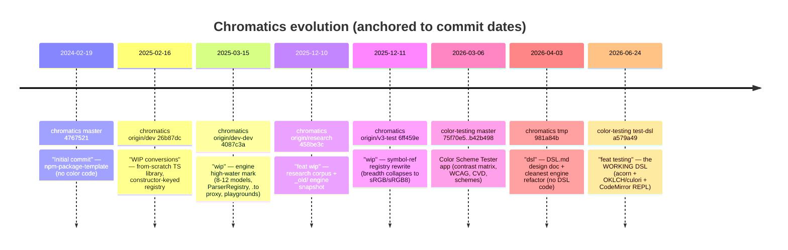

---
tags:
  - overview
  - history
  - timeline
  - evolution
  - chromatics
status: stable
updated: 2026-06-24
---

# Project History

A dated evolution narrative of Chromatics across **two repositories** and **five eras** — from an empty npm scaffold, through a from-scratch TypeScript color engine and a 100+-note research base, to the Strudel-inspired Color DSL that is the project's current spine. See [[Vision]] for where this is heading, [[Status & Inventory]] for what exists today, [[Decision Log]] and [[Build vs Buy]] for the choices made along the way.

> [!note] The one-line arc
> **npm-package-template → from-scratch TS color library (+ heavy AI research) → DSL pivot (spec) → a parallel Color Scheme Tester app → the DSL realized on `culori` → consolidation.**
> The decisive twist: the DSL was *specced* in the `chromatics` repo but actually *built* in the `color-testing` repo, on top of `culori`, bypassing the from-scratch engine entirely.

---

## Two repositories

| Repo | Role | Branches |
|------|------|----------|
| **chromatics** (`github.com/lilBunnyRabbit/chromatics`) | The npm color library + the DSL design doc + the docs vault | `master`, `origin/research`, `origin/dev`, `origin/dev-dev`, `origin/v3-test`, `tmp`, `the-final-decision` |
| **color-testing** | The Color Scheme Tester webapp and — on `test-dsl` — the *only working* DSL implementation | `master`, `test-dsl` |

The two repos never shared the engine they were supposed to share. That split is the project's defining tension — see [[Build vs Buy]].

---

## Timeline



> [!tip] Era → repo/branch → artifact → status → lesson

| Era | Repo / branch | Date | Artifact | Status | Lesson |
|-----|---------------|------|----------|--------|--------|
| **0** Origin | chromatics `master` | 2024-02-19 | npm-package-template | Frozen at initial commit | The whole project grew from an unaltered scaffold; `the-final-decision` still points here. |
| **1** From-scratch engine | chromatics `origin/dev`, `origin/dev-dev` | 2025-02 → 03 | TypedArray models + ConversionRegistry; React+Svelte playgrounds | Superseded ("mostly all AI"); registry migration abandoned | A real engine is huge; two conversion mechanisms (per-model vs registry) were never reconciled. |
| **1** Research base | chromatics `origin/research` | 2025-12-10 | `_old/research/*`, 100+-note knowledge base | Docs-only, mature but consolidating | Documented far more than built. Founding stance: deterministic, *"No AI — User in Control."* |
| **1.5** Registry rewrite | chromatics `origin/v3-test` | 2025-12-11 | Symbol-`ref` registry | WIP, breadth regression | Cleaner keying won, but threw away every model except sRGB/sRGB8. |
| **2** DSL pivot (spec) | chromatics `tmp` | 2026-04-03 | `DSL.md` (15,686 B) + `ColorModelBase` | Spec mature, **DSL code = ZERO** | The relationship-graph idea crystallized — but nothing implemented it here. |
| **3** Scheme Tester app | color-testing `master` | 2026-03-06 | Contrast matrix + WCAG + CVD + 7 scheme files | Stable, shipped | Donor of the accessibility framing; `brand-dark.ts` became the DSL's motivating example. |
| **3.5** DSL realized | color-testing `test-dsl` | 2026-06-24 | `src/lib/dsl/{evaluator,color,lang}.ts` + REPL | Active, functional v0.0.1 | The vision shipped — by *wrapping culori*, contradicting the from-scratch plan. |
| **4** Consolidation | chromatics `the-final-decision` | — | (none committed — identical to `master`) | Label only; vault still in Obsidian | The "wrap culori, the DSL is the novel contribution" decision hasn't landed in Git yet. |

---

## Branch map

```mermaid
graph TD
    subgraph chromatics
        M["master 4767521<br/>npm-package-template<br/>(2024-02)"]
        R["origin/research<br/>knowledge base + _old/<br/>(2025-12)"]
        D["origin/dev<br/>constructor-keyed registry<br/>(2025-02)"]
        DD["origin/dev-dev<br/>HIGH-WATER: 8-12 models,<br/>ParserRegistry, .to proxy<br/>(2025-03)"]
        V3["origin/v3-test<br/>symbol-ref rewrite,<br/>sRGB/sRGB8 only (2025-12)"]
        TMP["tmp<br/>DSL.md + ColorModelBase<br/>(2026-04)"]
        FD["the-final-decision<br/>= master, label only"]
    end
    subgraph color-testing
        CM["master<br/>Color Scheme Tester<br/>(2026-03)"]
        TD["test-dsl<br/>WORKING DSL on culori<br/>(2026-06)"]
    end
    M --> D --> DD --> V3 --> TMP
    M --> R
    M -.identical.-> FD
    CM --> TD
    DD -.spec motivates.-> TMP
    TMP -. spec implemented in OTHER repo .-> TD
    CM -. brand-dark.ts is the DSL motivating example .-> TMP
```

---

## Era-by-era

### Era 0 — npm-package-template origin (2024-02)

`chromatics/master` is, and remains, an empty scaffold. Its `README.md` literally reads *"# npm-package-template / Template repository for creating `npm` packages."* Tree: `.github/workflows/npm-publish.yml`, `jest.config.js`, `src/index.ts`, `tests/index.test.ts`, `tsconfig.json`, `LICENSE`, `package.json`. The package is scoped/published as `@lilbunnyrabbit/chromatics` (MIT, author Andraž Mesarič-Sirec), versioned via changesets, docs via typedoc, tested via jest. This is the unaltered floor the whole project grew from — and the commit that `the-final-decision` still points at.

### Era 1 — From-scratch TypeScript color library + heavy research (2025-02 → 2025-12)

The founding brief (`origin/research:_old/research/ai/prompt.md`) states the intent in one sentence:

> *"I am building a typescript color library. The library consists of color models (with specific operations) that extend typed arrays, conversion between models and model parsing."*

That sentence dictates the entire Era-1 architecture (visible in `origin/dev` and `origin/dev-dev`):

- **Models ARE typed arrays.** Fractional/angle/0–1 models (sRGB, HSL, HSV, HSI, HWB, Lab, XYZ, CMY, CMYK, LinearRGB) extend `Float32Array`; 0–255 models (RGB255, YCbCr255) extend `Uint8ClampedArray`. Channels live in array slots behind clamping `get`/`set` accessors, with an optional alpha defaulting to 1 (or 255).
- **Three separated concerns** per the brief — model / converter / parser — mirrored in the folder layout (`rgb255.model.ts`, `rgb255.converter.ts`, `rgb255.parser.ts`).
- **A registry, not a graph solver.** `dev` keys `Map<Constructor, Map<Constructor, ConversionFn>>` (static); `dev-dev` makes it an instance that self-populates via `registerConverters(this)` and adds a parallel priority-sorted, `canParse`-gated `ParserRegistry`. **No pathfinding** — only directly-registered edges work; multi-hop is manual (`rgb.to.RGB().to.LinearRGB().to.XYZ()`).
- **`dev-dev` ergonomics:** a lazy `get to()` proxy (`rgb.to.HSL()`) superseding `dev`'s baked-in `toRGB()/toHSL()`. Hue math centralized in `HueHelper` (`rgbToChroma` / `chromaToRGB`).

This era is documented far more thoroughly than it is built. `origin/research` carries the corpus: `spec-1..5.md`, `all-1..6.md`, `deep/color-models.md`, `deep/ideas.md`, `deep/dynamic-theme.md`, `conversions.md`, `TODO.md` — plus the **100+-note Obsidian knowledge base** (73 Color Models + 29 Color Systems, each with a `## Chromatics API` block; see [[Color Knowledge Hub]], [[Color Models]], [[Color Science & Algorithms]]). The product framing in `ideas.md` is a **deterministic, model-specific color tool**, emphatically *"No AI — User in Control."* `Untitled-1.md` already prototypes the WCAG-based foreground-from-background logic that becomes the project's accessibility through-line (see [[Accessibility]]).

> [!warning] Unresolved Era-1 tension
> Two conversion mechanisms (per-model methods/proxies vs the central registry) were never reconciled. `dev-dev`'s `TODO.md` says outright *"Remove converters from models,"* but its registry wires only ~3 edges while ~30 conversions live as methods — the migration was abandoned. See [[Architecture Decisions]].

### Era 1.5 — Registry rewrite (2025-12)

`origin/v3-test` restarts the engine ground-up: a **symbol-ref registry** — each model class carries `static ref = Symbol("srgb")` and the registry keys `Map<symbol, Map<symbol, fn>>`, resolving a ref from either a constructor or an instance. Architecturally cleaner, but a **catastrophic breadth regression**: only sRGB and sRGB8 survive; every other model, every parser, and the whole `ParserRegistry` are dropped. The engine vendors into a fresh Svelte 5 + Vite 7 + Tailwind 4 app under `src/packages/chromatics/`.

### Era 2 — The DSL pivot, as a design artifact (chromatics `tmp`, 2026-04)

`tmp` (HEAD *"dsl"*) contributes two things. First, the cleanest engine yet: `ColorModelBase` (abstract; generic `static from()` / instance `to()` both delegate to a shared registry singleton) over the symbol-ref registry — but still only sRGB↔sRGB8, plus a real copy-paste bug in `get()` (checks `!fromRegistry` instead of `!conversion`).

Second, and far more important, **`DSL.md`** — a complete *"Chromatics — Color DSL Design Document"* (15,686 bytes). Its thesis:

> *"A DSL-based color design tool where users define color variables, relationships, and transformations using JS-like code."*

The committed architecture is **"Parse as JS, Evaluate as Controlled Interpreter"**: use `acorn` to produce an ESTree AST but never run it as JavaScript; instead walk a restricted node set. It explicitly rejects both a hand-rolled grammar and raw `eval` (the latter gives *"almost no introspection"* — no dependency tracking, no source mapping). The novelty is **relationship-first authoring**: colors declared as formulas over other colors' channels (`fg = OKLCH(1 - bg.l, bg.c / 3, (bg.h + 180) % 360)`), tracked as a dependency DAG so changing one base color cascades downstream. The named inspiration is the **Strudel REPL** — *"a music language exposing a light JS-like environment in the browser."* Full spec lives in [[DSL Spec]].

> [!warning] Critical finding
> `DSL.md` is a spec with **zero implementation in chromatics**. `tmp`'s `package.json` lacks acorn/culori/codemirror; no evaluator/Scope/Color class exists on any chromatics branch. The spec also carries unresolved contradictions (`ok_l/ok_c/ok_h` vs `.l/.c/.h`; `shift/derive` object-literal args vs a "no object literals" rule; evaluator sketch omits ternary/comparison nodes). Its Phase-1 test gate — *"rewrite `brand-dark.ts` as DSL"* — points at a file that lives in the **other** repo. See [[DSL Gaps & Bugs]] and [[Open Questions]].

### Era 3 — The parallel Color Scheme Tester app (color-testing `master`, 2026-03)

Built in a separate repo, ~36 minutes of commits (*"batman"* → *"feat: schemes"* → *"feat: mobile support"*). README: *"A vibed-out playground project for testing color schemes."* Features: a **contrast-ratio matrix** for all fg/bg pairs, WCAG 2.1 AA/AAA levels, a foreground-opacity slider, **color-vision-deficiency simulation** (protanopia/deuteranopia/tritanopia…), markdown-table export, and authorable scheme files. `src/lib/schemes/` held seven: `brand-dark.ts`, `brand-dark-2.ts`, `brand-light-2.ts`, `catppuccin-mocha.ts`, `ocean.ts`, `speed-reader-dark.ts`, `speed-reader-light.ts`.

**This `brand-dark.ts` is the exact artifact `DSL.md` cites** as already encoding the relationship patterns the DSL would formalize *"but with TypeScript boilerplate (name strings, description strings duplicating the formula, constructor noise)."* So the DSL's motivating example was real — just in this repo. This app is the donor of the project's accessibility framing (WCAG, gamut, CVD) and of the *"vibed-out playground"* voice.

### Era 3.5 — The DSL realized on culori (color-testing `test-dsl`, 2026-06-24)

The pivot finally becomes running code — **in color-testing, not chromatics, on top of `culori` (v4.0.2), not the from-scratch engine.** `test-dsl` deletes all seven scheme files plus `oklch.ts` and the demo route, and adds `src/lib/dsl/{evaluator,color,lang}.ts` + `Editor.svelte`, turning the static tester into a **two-pane Strudel-style live REPL** (CodeMirror editor left, live swatch Inspector right, 100 ms debounce). It faithfully implements `DSL.md`:

- **Evaluator** = `acorn.parse(source, { ecmaVersion: 2020, sourceType: 'module', locations: true })` then a hand-walked subset (Literal, Identifier, Unary/Binary/Logical/Conditional, Member, Call, Assignment, ExpressionStatement); anything else throws `Unsupported syntax: <type>`.
- **`Color`** stores a private `_oklch` (culori `Oklch`), lazily derives/caches HSL/RGB/hex; all math (lighten/darken/saturate/desaturate/rotate/invert/complement/mix/shift/derive) is OKLCH-space.
- **Dependency tracking is real and shipped:** `Scope.currentDeps` records user-var reads per assignment → `Variable.deps` → *"depends on: x, y"* in the inspector. This is the project's stated core novelty, and it exists.
- **Resolved the spec's naming collision in code:** OKLCH = `ok_l/ok_c/ok_h`, HSL = `h/s/l`.

Implementation detail and the verified rough edges (stale README, drifting highlighter token sets, uncallable `shift()`/`derive()`, no clamping/persistence/export) are in [[DSL Implementation Notes]] and [[DSL Gaps & Bugs]].

### Era 4 — Consolidation (`the-final-decision`)

The branch is named for *"the consolidation holding the docs vault."* **As committed, it is not that yet:** `git rev-parse` resolves `the-final-decision` to `4767521` — the *same* commit as `master`, the 2024 npm-package-template. The actual docs vault (this note's home: the 100+-note knowledge base, the 2026 planning note that reverses the from-scratch decision in favor of wrapping culori, and the AI-research notes) lives in the user's **Obsidian**, not yet in this Git branch. So `the-final-decision` is presently a *named intent / placeholder* awaiting the vault's import — the branch where the *"wrap culori, the DSL is the novel contribution"* decision is meant to land. See [[Decision Log]].

---

## Why each era was superseded

| Era | Why it was left / superseded |
|-----|------------------------------|
| 0 → 1 | The scaffold was never going to be a color library; real model/converter/parser code began on `dev`. |
| 1 (dev) → 1 (dev-dev) | Ergonomics: `.to` proxy + self-populating registry + parsers replaced baked-in `toRGB()`/`toHSL()` methods. |
| 1 → 1.5 | Desire for a cleaner registry keying (symbol `ref`) — at the cost of dropping all breadth. |
| 1.5 → 2 | Strategic pivot: the *relationship-graph DSL*, not the converter engine, is the novel contribution (the 2026 planning note: *"the conversion math is not"*). |
| 2 (spec) → 3.5 (code) | The spec was implemented in the *other* repo on `culori` — faster than finishing the from-scratch engine. The engine became optional, not load-bearing. |
| 3 → 3.5 | The static Scheme Tester became the DSL REPL: scheme files (static palettes) gave way to scripts (dependency graphs). |
| 3.5 → 4 | Consolidation of the decision into the published package + docs vault — **pending**, not done. |

> [!decision] The strategic fork this history records
> **Build-from-scratch vs wrap-a-library.** The artifacts vote both ways — the from-scratch chromatics engine and the 102-note encyclopedia point one way; the 2026 planning note, the engine-research, and decisively the *shipped code* point at wrapping `culori`. The planning note and code won the argument, but the from-scratch library still exists on the active `dsl` branch — a sunk-cost pull in the opposite direction. Full analysis in [[Build vs Buy]]; the live questions are in [[Open Questions]].

---

## See also

- [[Vision]] — where this arc is heading.
- [[Status & Inventory]] — exact state of every branch/artifact today.
- [[Decision Log]] — the dated decisions referenced above.
- [[Build vs Buy]] — the from-scratch-vs-culori fork in depth.
- [[Architecture Decisions]] — the engine registry civil war (constructor-keyed vs symbol-ref).
- [[DSL Spec]] / [[DSL Implementation Notes]] / [[DSL Gaps & Bugs]] — the DSL across spec and code.
- Source material: [DSL.md](../old/) (chromatics `tmp`), [research corpus](../old/chromatics/) under `old/`.
