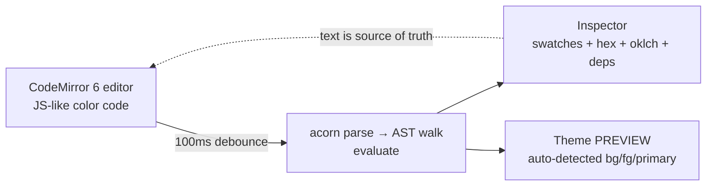

# Vision

The single canonical statement of what Chromatics **is** and **why**. Everything else in this vault — the [[DSL Spec]], the [[Unified Product Plan]], the [[Roadmap]] — is downstream of this note.

> [!note] North star
> **Chromatics is a Strudel-REPL-for-color.** A live-coding web tool where a designer or developer writes JS-like code to declare color **variables** and — the crucial part — the **relationships** between them (e.g. "foreground is the inverse lightness of background, hue rotated 180°"), and the system reactively re-evaluates the whole scheme through a **dependency graph** so that changing one base color cascades everywhere downstream. The thesis, stated identically across every planning artifact, is that **color schemes should be executable dependency graphs, not static 5-swatch palettes.**

## The core thesis

A palette in Coolors is five frozen hex codes. A Chromatics scheme is a **program**: each color is an expression over other colors' channels, and the relationships are first-class and reactive.

```ts
// from the shipped "Brand Dark" example (color-testing/test-dsl)
bg      = OKLCH(0.255, 0.0233, 230.47)
fg      = OKLCH(1 - bg.ok_l, bg.ok_c / 3, (bg.ok_h + 180) % 360)
primary = OKLCH(fg.ok_l, bg.ok_c * 3, (fg.ok_h + 72) % 360)
accent  = brand.rotate(150)
muted   = fg.lighten(0.45)
surface = bg.darken(0.04)
```

Edit `bg` and `fg`, `primary`, `muted`, `surface` all recompute. This is not a metaphor — it is implemented. The evaluator records every user-variable read on the right-hand side of an assignment (`Scope.currentDeps`) and stores it on each `Variable.deps`, rendered in the inspector as `depends on: bg`. See [[DSL Implementation Notes]].

> [!tip] One-line summary
> *Color schemes as reactive dependency graphs* is the spine of the whole project — the one feature that is **both promised everywhere and actually built**.

## The "Strudel-REPL-for-color" framing

The interaction model is borrowed directly from the [Strudel](https://strudel.cc) live-coding music REPL: **code on the left, live visual result on the right.** Editing the code instantly updates the output. In the shipped app (`src/routes/+page.svelte`) this is a two-pane layout:



The DSL deliberately **reuses JavaScript expression syntax** (assignments, arithmetic, ternaries, method chaining) rather than inventing notation — zero learning curve for the Svelte/TS-savvy author. It is parsed with `acorn` but **never executed as JS**; a custom controlled-interpreter walks a restricted AST subset. Full mechanics in [[DSL Spec]].

## The three layers

Chromatics is one product built in three layers, with the DSL as the differentiating core and the other two in support.

| Layer | What it is | State today |
|---|---|---|
| **1 — Perceptual color engine** | Canonical internal model is **OKLCH**; HSL/RGB/hex are lazily-cached projections. All color math (lighten/darken/saturate/rotate/mix/derive) happens in OKLCH space. | Shipped, wrapping **culori v4** (`src/lib/dsl/color.ts`). The bespoke `chromatics` typed class-per-model engine is aspirational — see [[Build vs Buy]], [[Library Landscape]]. |
| **2 — DSL / REPL authoring layer** | The novel core: declare variables + relationships in code; reactive dependency tracking; live two-pane REPL with CodeMirror editor + swatch inspector. | Shipped end-to-end at v0.0.1. Two-way UI↔code editing, export, and persistence are **not yet built** ([[Open Questions]]). |
| **3 — Accessibility + display/analysis** | WCAG contrast, gamut detection (sRGB displayable + Display P3), CVD simulation, real-example preview, contrast matrix. Carried over from the original static app. | Partial: WCAG contrast + gamut badges shipped; APCA, CVD sim, contrast matrix not yet on the DSL surface. See [[Accessibility]]. |

> [!decision] Delegate the math, build the differentiator
> *"The DSL is the novel contribution — the conversion math is not. Writing the 50th Oklab→XYZ converter isn't novel."* The intellectual energy goes into the relationship/REPL layer; the converters are wrapped from a battle-tested library. Recorded in [[Decision Log]] and [[Build vs Buy]]; source: `old/Chromatics - Planning.md:28,294`.

## Dual audience: developers AND designers

The tool is explicitly aimed at both:

- **Developers** get code — JS-like syntax, scriptable/reproducible themes, export to CSS variables / JSON tokens / Tailwind config (planned).
- **Designers** get the UI — swatch inspector, live preview, and (planned) two-way editing: click a swatch, pick a color, write it back into the source text.

The line `bg.ok_h` is a number; `OKLCH(...)` is a `Color`. Both audiences manipulate the same single source of truth — the text.

## The "Dynamic Theme" end goal

The product's destination is **a full, accessible, harmonious theme from one (or a few) base colors.** Drive an entire design system — `bg`, `fg`, `primary`, `secondary`, semantic `success`/`warning`/`error`/`info`, background scales `bg_lightest…bg_darkest`, harmony colors — from a single OKLCH source via relationship math, with contrast/gamut constraints baked in (`enforceContrast`). The shipped heuristic name-based theme PREVIEW (`name.includes('bg')`) is the first, brittle gesture toward this. See [[Unified Product Plan]] and [[Feature Specs]].

## What it IS

- A **live-coding REPL** for authoring color schemes as code (Strudel model: code ↔ live result).
- A system where colors are **expressions over other colors**, tracked as a reactive **dependency graph**.
- **OKLCH-native** and perceptually grounded; HSL/RGB/hex are derived views.
- **Accessibility-aware**: WCAG contrast and gamut checking are first-class.
- A distillation of a **100+-note color-science knowledge base** into a usable tool — *"the learning has already happened; the DSL is where that knowledge becomes a tool"* (`old/Chromatics - Planning.md`).
- Aimed at being, together: a **website**, an **npm color library** (`@lilbunnyrabbit/chromatics`), and a **Dynamic Theme** capability.

## What it is NOT

- **Not** a static "pick 5 colors and export" palette picker.
- **Not** an AI palette generator. The deterministic, user-in-control stance is core; *"a brand's palette is too critical to leave to an AI's guess."* (Note: this "No AI" framing is partly a pre-pivot artifact in tension with the AI-authored knowledge base — see [[Open Questions]] and [[Decision Log]].)
- **Not** (yet) a from-scratch color engine in production. The shipped engine wraps **culori**; the bespoke `chromatics` typed-array engine exists but does **not** back the running DSL ([[Build vs Buy]], [[Status & Inventory]]).
- **Not** a general-purpose programming language: no loops, functions, blocks, or object literals — each line is one assignment producing one variable; conditional logic only via ternaries.

## Why now / why nobody else does this

> [!note] The gap, in the user's own words
> *"No existing tool captures color relationships as code. Coolors, Adobe Color, Paletton — they're all 'pick 5 colors and export.' None of them let you say 'foreground is the inverse lightness of background' and have it reactively update. This is a genuine gap."* — `old/Chromatics - Planning.md:291`

| Tool | Model | What's missing |
|---|---|---|
| **Coolors** | Pick/lock/shuffle 5 swatches | No relationships; output is frozen hex |
| **Adobe Color** | Harmony-rule wheel | Rules are presets, not author-defined formulas; no cascade |
| **Paletton** | Harmony presets + preview | Same — no executable relationships, no dependency graph |
| **Chromatics** | **Code: variables + relationships, reactive DAG** | — (this *is* the differentiator) |

Why it's feasible now: the perceptual workspace (**OKLCH/Oklab**) is finally mainstream and CSS-native, browser live-coding REPLs (Strudel) have proven the UX, and battle-tested color math (culori) means the hard part — the *relationship layer* — is the only thing left to build. The defensible, durable core is **"every color has a rationale; relationships as code"** — not the No-AI slogan, and not re-deriving converters.

## Honest caveats

> [!warning] Vision vs. reality
> Three of the most-emphasized differentiators are **not yet built** in the only running artifact (`color-testing/test-dsl`):
> - **Two-way UI↔code editing** — zero code, zero supporting algorithm research.
> - **Export** (CSS vars / JSON tokens / Tailwind) — none.
> - **Persistence / sharing** (URL-hash, localStorage) — none.
>
> The project is also physically split across **two repos** (`color-testing` has the working DSL on culori; `chromatics` has the spec + an unfinished from-scratch engine). See [[Status & Inventory]], [[Architecture Decisions]], and [[Open Questions]].

## See also

- [[Project History]] — how the static contrast-matrix app pivoted into a color DSL.
- [[Unified Product Plan]] — the consolidated plan turning this vision into features.
- [[DSL Spec]] — the syntax, semantics, and grammar of the language.
- [[Decision Log]] — wrap-culori, parse-as-JS, OKLCH-canonical, drop-`$`-prefix.
- [[Roadmap]] — phased path from playground to tool.
- [[Color Knowledge Hub]] — the knowledge base this tool distills.
- [[Investigation Report]] — the full evidence synthesis behind this note.
