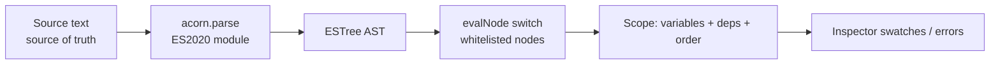
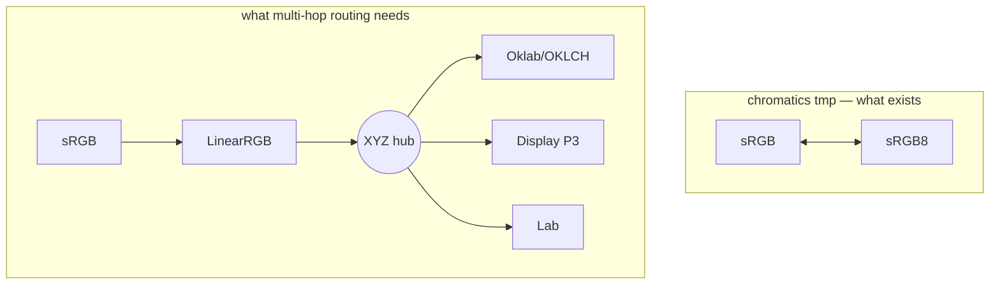

# Architecture Decisions

The settled technical conventions of Chromatics — each as **Decision / Why / Where it lives**, tagged *implemented* or *pending*. This is the "how we build it" companion to the strategic [[Decision Log]] and the build/buy fork in [[Build vs Buy]]. For the language surface these decisions serve, see [[DSL Spec]]; for the bugs they create, see [[DSL Gaps & Bugs]].

> [!note] Scope of "implemented"
> "Implemented" here means *present and wired in the one real codebase* — the `test-dsl` branch of `color-testing` (`src/lib/dsl/*`). The chromatics library on branch `tmp` is a parallel from-scratch engine that the working DSL does **not** use; decisions about it are flagged separately. See [[Status & Inventory]].

---

## 1. OKLCH is the canonical internal storage; HSL/RGB/hex are lazy cached projections

> [!decision] Implemented
> `Color` stores exactly one representation — a culori `Oklch` object — and derives every other space on demand, caching each.

- **Why.** OKLCH is perceptually uniform, so all color math (lighten, mix, rotate…) is meaningful in it; storing one canonical form avoids drift between representations and round-trip precision loss. This is a stable through-line across the planning note, `DSL.md`, and the engine research (Oklab/Oklch tagged *Critical*).
- **Where.** `src/lib/dsl/color.ts:22` `private _oklch: Oklch`. Caches at lines 25–27 (`_hsl`, `_rgb`, `_hex`), populated lazily via the `??=` getters at lines 49–81 (`hslColor`, `rgbColor`, `hex`). The constructor (line 29) converts *any* culori input through `converter('oklch')` and throws `'Invalid color'` on failure.
- **Consequence.** Every operation returns a **new** `Color` (immutability, lines 99–161) — chosen specifically to make dependency tracking reliable.

---

## 2. acorn parse + controlled-interpreter evaluator (never `eval`)

> [!decision] Implemented
> Parse user source with the real `acorn` JS parser, then walk the ESTree AST with a custom interpreter that handles only a whitelisted set of node types. Do **not** execute it as JavaScript.

- **Why.** Reusing JS syntax gives a zero-learning-curve language for a Svelte/TS author, but a custom walker (vs `with(env)+new Function()`) preserves introspection — dependency tracking and source-mapping that raw `eval` cannot offer. This strategy is identical across `DSL.md`, the planning note, and the code (zero divergence).
- **Where.** `src/lib/dsl/evaluator.ts:265` — `acorn.parse(source, { ecmaVersion: 2020, sourceType: 'module', locations: true })`. The node-type `switch` is `evalNode` at lines 117–256. Supported nodes: `Literal`, `Identifier`, `UnaryExpression`, `BinaryExpression`, `LogicalExpression`, `ConditionalExpression`, `MemberExpression`, `CallExpression`, `AssignmentExpression`, `ExpressionStatement`. Anything else hits the `default` → `throw 'Unsupported syntax: ${node.type}'` (line 254).
- **Note.** The spec's evaluator sketch omitted ternary and comparison nodes; the **code added them** (lines 161–196). The code is ahead of the spec here.

---

## 3. The TypedArray reversal

> [!decision] Pending / reversed direction
> Move color models **away from** TypedArray-backed storage toward plain `number` properties.

- **Why.** Float32 precision loss accumulates over long conversion chains (exactly the relationship-graph workload Chromatics centers on). The 2026 planning note explicitly reverses the earlier mandate; TypedArrays are kept only for batch/GPU export paths.
- **Status.** This **reverses** the older decision. Library Research v2 and the 102-note encyclopedia mandate typed-array models (`extends Float32Array` / `Uint8ClampedArray`); the existing chromatics engine code is built the now-rejected way. The shipped DSL sidesteps the issue entirely — `color.ts` stores a plain culori `Oklch` object (numbers), already consistent with the new direction.
- **Where (old way, to be retired).** chromatics `tmp` models extend typed arrays; `tmp`'s `Srgb` already shifted to a private `channels: Float32Array` rather than extending it — a half-step. See [[Build vs Buy]] and [[Open Questions]].

---

## 4. Channel naming: `ok_l/ok_c/ok_h` for OKLCH vs `h/s/l` for HSL

> [!decision] Implemented (code settled a spec contradiction)
> OKLCH channels are `ok_l`, `ok_c`, `ok_h`. HSL channels are `h`, `s`, `l`. sRGB is `r`, `g`, `b` (0–1). Hex is `hex`.

- **Why.** `DSL.md` was internally contradictory — its accessor table reserved `.l` for HSL, but *every* worked example read OKLCH as `bg.l/bg.c/bg.h`. The code resolved it cleanly with a disambiguating `ok_` prefix so OKLCH and HSL lightness never collide.
- **Where.** `color.ts:37–45` (`ok_l/ok_c/ok_h`), `52–60` (`h/s/l` via `toHsl`), `67–75` (`r/g/b` via `toRgb`), `79` (`hex`). The shipped examples use the `ok_*` form correctly, e.g. `fg = OKLCH(1 - bg.ok_l, bg.ok_c / 3, ...)`.
- **Canonical verdict.** Adopt the code's `ok_*` convention as the spec of record; `DSL.md` should be corrected to match. Tracked in [[Decision Log]] / [[Open Questions]].

| Space | Channels | Source |
|---|---|---|
| OKLCH (canonical) | `ok_l` `ok_c` `ok_h` | stored |
| HSL | `h` `s` `l` | derived |
| sRGB (0–1) | `r` `g` `b` | derived |
| hex | `hex` | derived |
| gamut | `inGamut` (sRGB) · `inP3` (Display P3) · `gamutMapped` | derived |

---

## 5. Object literals allowed **only as call arguments** (named options)

> [!decision] Resolved on paper / evaluator support PENDING
> Permit `ObjectExpression` only in argument position, with identifier keys and primitive values — enabling named-channel options like `shift({h: 30})`. The blanket "no object/array literals" rule in `DSL.md` is downgraded to "object literals allowed as call args."

- **Why.** Named options are the ergonomic, spec-intended form for partial channel edits (`shift({h: 30})` reads far better than positional `shift(0, 0, 30)`), and named clarity matters for color. It also unblocks any future named-options API.
- **Status — the gap.** `color.ts` already defines `shift(deltas: {l?,c?,h?})` (line 139) and `derive(overrides: {l?,c?,h?})` (line 149), but the evaluator has **no `ObjectExpression` case** — so calling them from the DSL throws `Unsupported syntax: ObjectExpression`. They are advertised in the API Docs and the highlighter but currently **uncallable**.
- **Fix.** Add a minimal `ObjectExpression` case (identifier keys, primitive/expression values). Update the highlighter and API Docs in the same change. Full detail in [[DSL Gaps & Bugs]].

---

## 6. Conversions delegated to culori (not the from-scratch engine)

> [!decision] Implemented
> Use culori (v4.0.2) for *all* color math: conversion, hex formatting, gamut checks, WCAG contrast, chroma clamping.

- **Why.** "The DSL is the novel contribution — the conversion math is not." Re-deriving converters is the rejected 6–12-month path; culori is proven (carried over from the master app). The intellectual energy belongs on the relationship/DSL layer.
- **Where.** `color.ts:1–15` imports `converter`, `formatHex`, `clampChroma`, `wcagContrast`, `displayable`, `inGamut`, `parse`. Usage: `gamutMapped` = `clampChroma(_oklch,'oklch')` (line 94); `contrast` = `wcagContrast` (line 160); `inGamut` = `displayable` (line 86); `inP3` = `inGamut('p3')` (line 90).
- **Tension.** This contradicts the from-scratch chromatics engine the spec named as the runtime. See [[Build vs Buy]] — the working code and planning note won; the engine is now an optional/parallel track.

---

## 7. The chromatics engine conversion graph needs an XYZ/sRGB hub + multi-hop routing

> [!warning] Pending — only direct edges exist; not used by the DSL
> The chromatics `ConversionRegistry` resolves **only directly-registered edges**. There is no graph pathfinding; multi-hop conversions are done by manual chaining (`rgb.to.RGB().to.LinearRGB().to.XYZ()`).

- **Why it matters.** A DSL runtime that lets users name arbitrary source/target models needs automatic routing through a central hub (XYZ for perceptual spaces, sRGB for display spaces). Without it, every model pair would need an explicit converter.
- **Where.** chromatics `tmp:src/packages/chromatics/conversion-registry.ts` — `register()` indexes `Map<symbol, Map<symbol, fn>>` by `from.ref`/`to.ref`; `get()` looks up a single direct edge. Currently only **sRGB ⇄ sRGB8** is wired — a catastrophic breadth regression from dev-dev's ~8 models.
- **Latent bug (verified).** In `get()`, after fetching `const conversion = fromRegistry.get(toRef)`, the guard reads `if (!fromRegistry)` instead of `if (!conversion)` — so a missing edge returns `undefined` rather than throwing. A copy-paste error.
- **Status.** Irrelevant to the shipped DSL (which uses culori), but blocking if chromatics ever backs the DSL. Tracked in [[Build vs Buy]] and [[Open Questions]].

---

## 8. Equality semantics caveat: `==` and `===` both compile to JS strict `===`

> [!warning] Implemented but surprising for colors
> `==`, `===` → JS `===`; `!=`, `!==` → JS `!==`. There is no value-equality for `Color`.

- **Why / consequence.** Because `Color` is a class instance, strict equality is **reference equality** — two structurally identical colors (`OKLCH(0.5,0.1,200) == OKLCH(0.5,0.1,200)`) are **not** equal. There is no `equals()` deep-compare in the DSL surface.
- **Where.** `evaluator.ts:169–174` — both `==`/`===` cases `return left === right`; both `!=`/`!==` cases `return left !== right`.
- **Note.** Logical `&&`/`||` short-circuit and return the **raw operand**, not a coerced boolean (lines 180–191). Detailed in [[DSL Gaps & Bugs]].

---

## Status summary

| # | Decision | State | Primary source |
|---|---|---|---|
| 1 | OKLCH storage + lazy cached projections | ✅ Implemented | `color.ts:22–95` |
| 2 | acorn parse + controlled interpreter | ✅ Implemented | `evaluator.ts:117–265` |
| 3 | TypedArray reversal (→ plain numbers) | 🔁 Reversed direction, pending in engine | planning note; `color.ts` already aligned |
| 4 | `ok_l/ok_c/ok_h` vs `h/s/l` naming | ✅ Implemented (settled a spec clash) | `color.ts:37–60` |
| 5 | Object literals only as call args | 🟡 Resolved on paper; evaluator support pending | `color.ts:139–157` vs missing `ObjectExpression` case |
| 6 | Conversions delegated to culori | ✅ Implemented | `color.ts:1–15` |
| 7 | XYZ/sRGB hub + multi-hop routing | ⛔ Pending (engine only; sRGB⇄sRGB8 today + `get()` bug) | `tmp:conversion-registry.ts` |
| 8 | `==`/`===` → JS strict `===` (reference-equal Color) | ✅ Implemented (caveat) | `evaluator.ts:169–174` |

> [!tip] Related notes
> [[DSL Spec]] · [[DSL Implementation Notes]] · [[DSL Gaps & Bugs]] · [[Build vs Buy]] · [[Decision Log]] · [[Open Questions]] · [[Status & Inventory]] · [[Color Models]]
