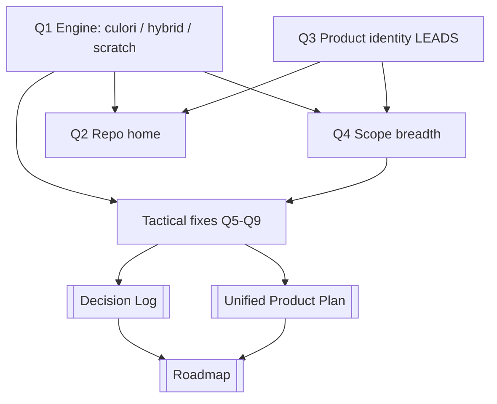

# Open Questions

What this note is: every Chromatics decision still UNDECIDED, written as actionable blocks (question -> options -> current lean). When something here gets resolved, move the verdict to the [[Decision Log]] and check the box. See [[Unified Product Plan]] for how these feed the plan and [[Roadmap]] for sequencing.

> [!note] How to read this
> Each block has a **lean** (the synthesis recommendation, grounded in the evidence) but is still OPEN — nothing here is committed. A checked box means "resolved → logged in [[Decision Log]]". The four STRATEGIC questions (engine, repo home, identity, scope) gate the smaller tactical ones.

---

## Strategic (these gate everything else)

### Q1 — Which engine backs the DSL: culori, hybrid, or from-scratch chromatics?
- [ ] Resolved

The single deepest strategic fork. The shipped DSL (`color-testing/test-dsl`, `src/lib/dsl/color.ts`) wraps **culori v4.0.2** directly (`converter`, `formatHex`, `clampChroma`, `wcagContrast`, `displayable`, `inGamut`, `parse`) and never touches the chromatics `ConversionRegistry`. Meanwhile the [[Library Landscape]] from-scratch engine (typed-array models, symbol-ref registry on chromatics `tmp`) wires only sRGB↔sRGB8 and carries a latent `get()` bug.

| Option | What it means |
|---|---|
| **A — stay on culori** | Shipped code already works end-to-end; chromatics library becomes optional/parked |
| **B — build chromatics core** | Implement Oklab/Oklch/XYZ-hub/P3 to spec, swap under the same `Color` API (6–12 mo) |
| **C — hybrid** | culori for conversions; chromatics only for model-specific methods culori lacks (`hct.tonalPalette`, `oklch.gamutMap`, `lab.deltaE`) |

> [!decision] Lean: **C, leaning A near-term**
> The 2026 planning note and the shipped code already chose "wrap culori — the conversion math is not the novel contribution." Honor that. Add chromatics' model-specific methods *on top of* culori only as the DSL surface demands. Treat the from-scratch engine as an optional learning track ("do it when you want to, not because you have to"), never a blocker. See [[Build vs Buy]], [[Architecture Decisions]].

### Q2 — Repo home: consolidate into color-testing now, or move into chromatics?
- [ ] Resolved

The project is physically split: the DSL **spec** (`DSL.md`) lives in `chromatics/tmp` and names chromatics as the engine, but the only **working** DSL lives in `color-testing/test-dsl` on top of culori. The npm package name (`@lilbunnyrabbit/chromatics`, MIT) also lives in the chromatics repo.

| Option | What it means |
|---|---|
| **A — consolidate into color-testing** | Build everything where the working DSL is; demote `DSL.md` to spec-only |
| **B — move DSL into chromatics** | Co-locate with engine + spec + package name |
| **C — keep split** | chromatics = published color library; color-testing = the REPL webapp consuming it |

> [!decision] Lean: **C as end-state, A operationally now**
> Don't disrupt momentum — the working code is in color-testing. Long-term the engine+model-methods belong in the published package and the REPL consumes it, but only once chromatics exposes a `Color` API the webapp needs. Until then, ship from color-testing and keep `DSL.md` as the (corrected) spec of record. See [[Project History]], [[Status & Inventory]].

### Q3 — Product identity: which LEADS — webapp, npm DSL library, or Dynamic-Theme package?
- [ ] Resolved

The identity oscillates across the artifacts: a 2024 note places the app inside a `WebOS`; the 2026 planning note targets a standalone static webapp; the research also frames a framework-agnostic "Dynamic Theme" npm package. All three appear as "the product."

| Candidate | State of evidence |
|---|---|
| **Webapp / REPL** | The only thing actually shipped (CodeMirror + live inspector) |
| **npm DSL library** | Package name reserved; engine not ready to publish |
| **Dynamic-Theme package** | Richly researched, zero code; the brittle name-based PREVIEW is the only gesture toward it |

> [!warning] Lean: undecided — webapp leads by default
> The webapp is the only running artifact, so it leads *operationally*. But which is the **flagship deliverable** is genuinely unresolved across the notes. Treat as a true [[Open Questions]] item until the [[Unified Product Plan]] commits one as primary and the others as derived. Do not assume.

### Q4 — Scope breadth: core models, or the 100+ encyclopedia?
- [ ] Resolved

Enormous gap between specced and shipped breadth. The encyclopedia specs **102 models/systems** (ACES, Munsell, Pantone, CAM16, broadcast/video); the running DSL exposes **4 constructors** — `HSL`, `RGB`, `OKLCH`, `hex` — over culori. The research repeatedly warns itself to "narrow scope to sRGB/HSL/Lab core + plugins," yet the encyclopedia kept expanding.

| Option | What it means |
|---|---|
| **A — core only** | sRGB/HSL/OKLCH/Lab + a plugin path; everything else stays reference-only |
| **B — encyclopedic** | Implement the full class-per-model hierarchy from the [[Color Knowledge Hub]] |

> [!decision] Lean: **A — core + plugins**
> Ship the perceptual core; keep the 102-note [[Color Knowledge Hub]] as a *reference layer and roadmap*, not a build target. Breadth follows demand from the DSL surface, not ambition. See [[Color Models]], [[Roadmap]].

---

## Tactical (verified code-level decisions)

### Q5 — Fix `shift()` / `derive()` — uncallable from the DSL today
- [ ] Resolved

> [!warning] Verified bug, not a suspicion
> `color.ts:139` `shift({l?,c?,h?})` and `color.ts:149` `derive({l?,c?,h?})` take **object literals**, but `evaluator.ts` has **no `ObjectExpression` case** (the switch jumps Literal/Identifier/Unary/Binary/Logical/Conditional/Member/Call/Assignment/ExpressionStatement). So `shift({l: 0.1})` from a script throws `Unsupported syntax: ObjectExpression`. Both methods are **dead from the DSL surface** despite being in the API Docs and highlighter.

| Option | Trade-off |
|---|---|
| **A — add `ObjectExpression`** (whitelist keys `{l,c,h}`, identifier keys + primitive values only) | Ergonomic, spec-intended `shift({h: 30})`; unblocks future named-options APIs |
| **B — positional args** `shift(dl, dc, dh)` | Simpler parser; loses named-channel clarity |
| **C — remove from API/docs/highlighter** | Honest but drops a feature |

> [!decision] Lean: **A**
> Named channels matter for color. Add a minimal restricted `ObjectExpression` case, update the highlighter + API Docs in the same change, and resolve the `DSL.md` "no object literals" rule to **"object literals allowed only as call arguments."** See [[DSL Gaps & Bugs]], [[DSL Implementation Notes]].

### Q6 — Single source of truth for the token set (evaluator vs highlighter vs autocomplete)
- [ ] Resolved

`lang.ts` (CodeMirror `StreamParser`) and `evaluator.ts`/`color.ts` maintain **two independent, manually-synced** token/identifier sets — they already drift, and some after-dot branches in `lang.ts` (METHODS/PROPERTIES) are effectively **dead** (return the same tag as the fallback). There is no manifest the autocomplete could share either.

| Option | What it means |
|---|---|
| **A — shared manifest** | Extract `CONSTRUCTORS`/`BUILTINS`/`METHODS`/`PROPERTIES` into one exported module imported by both `lang.ts` and the environment builder |
| **B — Lezer grammar** | Replace the hand-written StreamParser with a Lezer grammar (the spec's Phase 3 plan) driven by the same manifest |
| **C — leave as-is** | Accept ongoing drift |

> [!decision] Lean: **A now, B later**
> Extract the one manifest, killing the drift and the dead after-dot branches; it can also feed autocomplete. Defer Lezer (and inline gutter swatches/autocomplete) to the polish phase. See [[DSL Implementation Notes]], [[DSL Gaps & Bugs]].

### Q7 — OKLCH channel naming as canonical spec
- [ ] Resolved (code-settled; spec still needs editing)

The code already resolves cleanly: OKLCH = `ok_l`/`ok_c`/`ok_h`, HSL = `h`/`s`/`l` (`color.ts:37-60`). `DSL.md` is internally contradictory — its accessor table reserves `.l` for HSL but every worked example reads OKLCH as `bg.l`/`bg.c`/`bg.h`.

> [!tip] Lean: adopt the code's `ok_*` convention; edit `DSL.md` to match
> Option A (`ok_l/ok_c/ok_h` + `h/s/l`) avoids the `.l` collision and is what shipped examples use correctly. The only remaining action is **editing `DSL.md`** and deleting the conflicting example forms — so this is nearly closed. Track under [[DSL Gaps & Bugs]].

### Q8 — "No AI" positioning
- [ ] Resolved

`Ideas.md` is emphatic: *"No AI — User in Control,"* deterministic schemes only. But the entire current knowledge base is literally *"By Claude Code,"* the gap-analysis floats natural-language palette prompts, and the product is a live-coding REPL. The absolute stance reads as a pre-pivot artifact.

| Option | What it means |
|---|---|
| **A — keep** deterministic "No AI" as the brand | |
| **B — drop** it entirely | |
| **C — reframe** | deterministic by default; optional AI assist for naming/suggestions only |

> [!decision] Lean: **C**
> Keep the defensible, still-true core — *"every color has a rationale / relationships as code"* — and stop marketing the absolute No-AI claim. See [[Vision]].

### Q9 — Two-way UI→code editing scope
- [ ] Resolved

The headline differentiator in every planning/spec doc, with **zero code** and **zero supporting algorithm research** (nothing on graph re-serialization, cycle detection, or source-mapped edits). Source-mapping is half-present (`Variable` carries the AST `node`) but nothing consumes it.

| Option | Scope |
|---|---|
| **A — Option A only (MVP)** | Break-link-and-warn, on **literals only**: replace the expression with a literal, warn "this breaks the link" |
| **B — Option C** | Picker AND formula side-by-side (long-term) |
| **C — Option B** | Inverse-solve backwards for the base when a computed var is edited (explicitly deferred as "complex") |

> [!decision] Lean: **A as MVP, scoped deliberately**
> Park it as the explicit next-phase research item — start with break-link on literals only; do not assume the harder forms. See [[Feature Specs]], [[Roadmap]].

---

## Smaller open items (carried from gaps)

> [!note] Not yet decided, lower-stakes
> - **Gamut handling**: `lighten/darken/saturate/desaturate` don't clamp `ok_l`/`ok_c` (values can run <0 or >1); out-of-gamut is only **badged**, never auto-corrected unless `.gamutMapped` is read. Engine-research prescribes CSS Color 4 binary-chroma gamut mapping (available via culori `clampChroma`). Apply by default? → see [[Color Science & Algorithms]].
> - **Equality semantics**: `==` and `===` both compile to JS strict `===`, so two structurally-identical Colors are **not** `==` (reference equality). Spec never specified this — keep, or define value equality? → [[DSL Gaps & Bugs]].
> - **Persistence/sharing**: no URL-hash or localStorage; the REPL can't save or share a scheme. Spec's Phase 4 promised URL-hash share. → [[Feature Specs]].
> - **Export**: no CSS-vars / JSON-tokens / Tailwind export — the bridge to the "Dynamic Theme" use case. → [[Unified Product Plan]].
> - **`brand-dark.ts` acceptance gate**: the named Phase 1 success test ("rewrite brand-dark.ts as a DSL script") references a scheme that **exists on color-testing/`master`** (a 224-line OKLCH TS scheme) but was removed on `test-dsl` — so there's no DSL equivalent yet. Codify "the DSL reproduces `master`'s brand-dark" as the real gate. → [[Roadmap]].
> - **Stale README**: documents only the old static contrast-matrix app, nothing about the DSL pivot.

---

## Decision flow

## Related
- [[Decision Log]] — where resolved items land
- [[Unified Product Plan]] · [[Roadmap]] — what these decisions drive
- [[Build vs Buy]] · [[Architecture Decisions]] — Q1 deep-dive
- [[DSL Gaps & Bugs]] · [[DSL Implementation Notes]] — Q5–Q7 detail
- [[Investigation Report]] — full evidence synthesis
- Source: [DSL.md spec](../old/Chromatics%20-%20Planning.md), [Ideas / No-AI](../old/chromatics/AI/)
