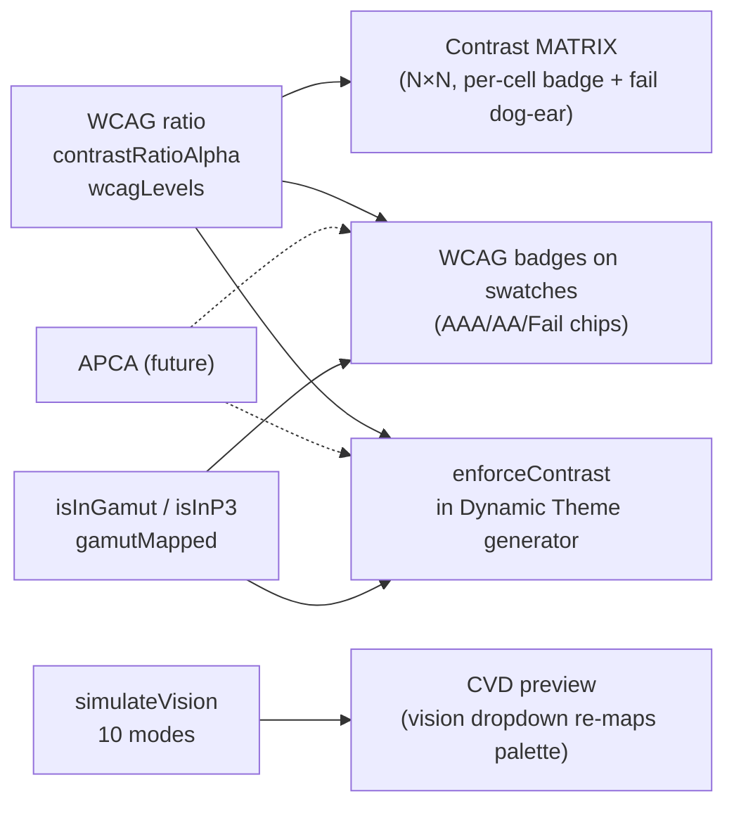

# Accessibility

The accessibility spine of Chromatics: the contrast math, color-vision-deficiency simulation, and gamut/displayability checks carried over from the original static contrast-matrix app, and how each maps onto a product surface. This is a stable through-line — accessibility framing predates the DSL pivot and survives it — though **only WCAG contrast and gamut checks actually made it into the `test-dsl` code so far**; APCA and CVD sim live only in the `master` app and the research corpus. See [[Color Science & Algorithms]] for the underlying formulas, [[Feature Specs]] / [[Unified Product Plan]] for the surfaces.

> [!note] Where the code is today
> The fully-implemented accessibility helpers are in the OLD `master` app at `color-testing/src/lib/oklch.ts` (contrast, WCAG levels, CVD sim). The new `test-dsl` REPL only carries WCAG contrast (via culori `wcagContrast`, exposed as `contrast()` and `.contrast()`) plus gamut/P3 badges. Porting `contrastRatioAlpha`, `simulateVision`, and the contrast MATRIX into the DSL app is pending work — tracked in [[Open Questions]].

## The four pillars

| Pillar | What it answers | Status in code |
|---|---|---|
| **WCAG 2.x contrast** | Is text legible on its background? | Shipped (master + test-dsl) |
| **APCA** | Same, but perceptually accurate | Researched only — not built |
| **CVD simulation** | How does this read for colorblind users? | Shipped in master; not yet in test-dsl |
| **Gamut / displayability** | Can this color actually be shown (sRGB vs P3)? | Shipped (master + test-dsl) |

---

## 1. WCAG 2.x contrast

WCAG 2.x defines a contrast **ratio** between a foreground and background, computed from relative luminance:

```
L  = 0.2126·R + 0.7152·G + 0.0722·B   (linearized sRGB channels)
ratio = (L_lighter + 0.05) / (L_darker + 0.05)
```

Ranges from 1:1 (identical) to 21:1 (pure black on pure white). In code this is delegated to culori's `wcagContrast` / `wcagLuminance` — Chromatics does not re-derive the formula. See [[Color Science & Algorithms]] and [[Library Landscape]].

### AA / AAA thresholds (load-bearing numbers)

From `oklch.ts`'s `wcagLevels(ratio)` — these exact cutoffs drive every badge:

| Text size | AA | AAA |
|---|---|---|
| **Normal** | ≥ 4.5 | ≥ 7 |
| **Large** (≥18pt / ≥14pt bold) | ≥ 3 | ≥ 4.5 |

```ts
normal: ratio >= 7 ? 'AAA' : ratio >= 4.5 ? 'AA' : 'Fail'
large:  ratio >= 4.5 ? 'AAA' : ratio >= 3 ? 'AA' : 'Fail'
```

Badge colors (`wcagColor`): AAA → `#22c55e` (green), AA → `#eab308` (yellow), Fail → `#ef4444` (red).

### Alpha-aware contrast — `contrastRatioAlpha`

A distinctive helper for translucent foregrounds (muted/disabled/hover text). Plain `wcagContrast` assumes opaque colors; semi-transparent fg over a bg needs compositing first.

```ts
contrastRatioAlpha(fg: OKLCH, bg: OKLCH, alpha: number): number
//  alpha >= 1  → plain contrastRatio(fg, bg)
//  else        → blend([bg, {...fg, alpha}], 'normal', 'lrgb')  // composite fg-over-bg
//                then wcagContrast(blended, bg)
```

The blend is done in **linear-RGB** space (`'lrgb'`) — the correct space for alpha compositing. This powers every opacity slider in the app (matrix fg-opacity, the demo's muted 0.65 / disabled 0.38 / hover 0.85 / active 0.70 tiers). Source: [oklch.ts](../old/...) lines 56–58, harvested in `harvest-master-app.md`.

> [!tip] Why this matters
> Real UIs lean on `opacity` for muted/disabled text. Auditing contrast against the *nominal* fg color over-reports legibility. `contrastRatioAlpha` audits the actually-rendered composited pixel.

---

## 2. APCA — the perceptual successor

**APCA** (Accessible Perceptual Contrast Algorithm) is the candidate contrast model for WCAG 3.x. It is **more perceptual** than WCAG 2.x: it accounts for spatial frequency (text weight/size), polarity (light-on-dark vs dark-on-light behave differently — WCAG 2.x is symmetric and wrong about this), and uses a perceptual lightness curve rather than a naive luminance ratio. Its output is a signed **Lc** value (≈ −108…+106), not a ratio.

> [!warning] Not yet adopted
> APCA appears only in the research corpus (engine-research specs "WCAG + APCA"; the encyclopedia lists `contrastAPCA` as an inherited method on the RGB model). **No Chromatics code computes APCA.** Future adoption would add an APCA reading alongside the WCAG badge on swatches and matrix cells. Tracked as a decision in [[Open Questions]]; see [[Color Science & Algorithms]] for the algorithm detail.

---

## 3. CVD — color-vision-deficiency simulation

Simulating how a palette reads for colorblind and low-vision users. Implemented in the `master` app's `oklch.ts` via culori's deficiency/adjustment filters.

### `simulateVision`

```ts
simulateVision(color: OKLCH, sim: VisionSimulation): OKLCH
//  filter === null → color unchanged
//  else → toOklch(filter(color.culpiOklch)) → new OKLCH (preserves name + description, h ?? 0)
```

Each mode maps to a culori filter; the **intensity arguments are load-bearing** (changing them changes the simulation):

| Mode (`value`) | Label | culori filter |
|---|---|---|
| `none` | Normal vision | `null` |
| `protanopia` | Protanopia (no red) | `filterDeficiencyProt(1)` |
| `deuteranopia` | Deuteranopia (no green) | `filterDeficiencyDeuter(1)` |
| `tritanopia` | Tritanopia (no blue) | `filterDeficiencyTrit(1)` |
| `grayscale` | Grayscale | `filterGrayscale(1)` |
| `low-contrast` | Low contrast | `filterContrast(0.5)` |
| `high-contrast` | High contrast | `filterContrast(1.8)` |
| `low-brightness` | Low brightness | `filterBrightness(0.5)` |
| `high-saturation` | High saturation | `filterSaturate(2)` |
| `low-saturation` | Low saturation | `filterSaturate(0.3)` |

Ten modes total: three true dichromacies (protan/deuteran/tritan), grayscale, plus six contrast/brightness/saturation stress tests. The `visionSimulations: {value,label}[]` array fixes both order and labels for the dropdown. Source: `harvest-master-app.md` §(a).

> [!note] Research notes a more accurate CVD model
> The engine-research specs **Brettel** CVD simulation (the gold-standard physiological model) rather than culori's filters. A future port could swap `filterDeficiency*` for a Brettel implementation. For now culori's filters are the shipped approximation.

---

## 4. Gamut / displayability — sRGB vs P3

OKLCH is a much larger space than any display can show, so transforms (especially `saturate`/chroma boosts) can produce colors outside the renderable gamut. Chromatics distinguishes three states per color:

| Accessor | Engine call | Meaning |
|---|---|---|
| `isInGamut` / `inGamut` | culori `displayable()` | fits **sRGB** |
| `isInP3` / `inP3` | culori `inGamut('p3')()` | fits **Display P3** (wider) |
| `gamutMapped` | culori `clampChroma(..., 'oklch', 'rgb')` | nearest in-gamut color (reduces chroma, preserves L & H) |

`gamutMapped` returns `this` when already displayable; otherwise it clamps chroma into sRGB — the perceptually-correct mapping (hold lightness and hue, pull chroma in). The DSL `Color` exposes all three (`color.ts` getters). Source: `harvest-master-app.md`, investigation digest #1.

> [!warning] Gamut is flagged, not enforced
> In `test-dsl`, `lighten`/`darken`/`saturate`/`desaturate` do **not** clamp — `ok_l`/`ok_c` can run < 0 or > 1, and out-of-gamut is only *badged*, never auto-corrected unless `.gamutMapped` is explicitly read. The engine-research prescribes CSS Color 4 binary-chroma gamut mapping as the default. Applying it automatically is recommended near-term work — see [[DSL Gaps & Bugs]] and [[Open Questions]].

---

## Pillars → product surfaces

How each accessibility primitive powers a feature. Detailed in [[Feature Specs]]; the consolidated roadmap is in [[Unified Product Plan]].



### The contrast MATRIX
An N×N grid (fg down × bg across) where every cell shows the `contrastRatioAlpha` ratio, a WCAG level badge, and a mini type specimen rendered in fg-on-bg. Failing pairs (`levels.normal === 'Fail'`) get a 20px diagonal "dog-ear" clip so failures are visible at a glance. An fg-opacity slider (debounced 150ms) feeds `fgAlpha` into every cell; a vision dropdown re-maps the whole palette through `simulateVision`. Lives in `master:src/routes/+page.svelte`; **not yet ported to the DSL app**. Full anatomy in `harvest-master-app.md` §(b).

### WCAG badges on swatches
The Scheme Info dialog and (future) DSL inspector tag each color with AAA/AA/Fail chips colored via `wcagColor`, plus gamut tags (`out of sRGB (mapped: …)` in red, or `P3` in blue). The DSL inspector currently shows hex + `oklch()` + an out-of-gamut badge + dependency list; richer WCAG badges per pair are a port target.

### The CVD preview
Driven entirely by the `visionSim` state + `simulateVision`. Both the matrix and the `demo/` realistic previews pass every rendered color through the active filter, so a designer can flip to Deuteranopia and watch the whole themed Landing/Dashboard/Blog re-render. This is the surface that makes CVD a first-class review step, not an afterthought.

### `enforceContrast` in the Dynamic Theme generator
The aspirational **Dynamic Theme** capability (generate a complete accessible theme from one or a few base colors via OKLCH math) bakes contrast in: `enforceContrast` would nudge a derived token's lightness until it clears an AA/AAA threshold against its paired surface. This is **researched, not built** — the DSL's heuristic name-based PREVIEW is the only theme-generation code that exists today. See [[Unified Product Plan]] and [[Open Questions]].

---

## Open threads

> [!decision] Accessibility port is the near-term bridge
> The `master` app's contrast MATRIX + `contrastRatioAlpha` + `simulateVision`/`visionSimulations` are the donor patterns the DSL app should absorb. They are proven, shared helpers (`contrastRatio`, `contrastRatioAlpha`, `wcagLevels`, `wcagColor`, `simulateVision`, `fmtOklch`) — porting them turns the REPL from a playground into an audit tool.

- **APCA adoption** — add alongside WCAG, not instead of. → [[Open Questions]]
- **Auto gamut-mapping** vs. badge-only in the DSL. → [[DSL Gaps & Bugs]]
- **Brettel CVD** vs culori's `filterDeficiency*`. → [[Color Science & Algorithms]]
- **`enforceContrast`** spec for the Dynamic Theme generator. → [[Feature Specs]], [[Unified Product Plan]]

Related: [[Color Knowledge Hub]] · [[Color Models]] · [[Color Science & Algorithms]] · [[Feature Specs]] · [[Unified Product Plan]] · [[Investigation Report]]
