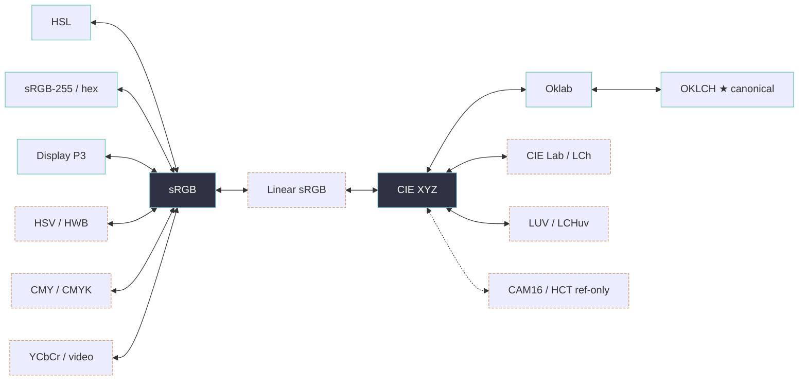

---
tags:
  - color-models
  - color-science
  - knowledge
  - oklch
  - srgb
  - taxonomy
status: living
updated: 2026-06-24
---

# Color Models

> What this note is: a tiered digest of the color-model taxonomy for Chromatics — which models actually matter, what their parameters are, where each lives in the engine and DSL, and how the **hub-and-spoke conversion graph** routes between them. Distilled from the 102-note research base in [old/](../old/) and the [research checklist](#sources).

See also: [[Color Science & Algorithms]] (the math behind the conversions), [[Architecture Decisions]] (the registry that wires models together), [[Color Knowledge Hub]] (index of the whole knowledge base), [[DSL Implementation Notes]] (how OKLCH became canonical in the running tool).

---

## TL;DR

- **Canonical model in the running tool is OKLCH** — `color-testing/test-dsl` stores every `Color` internally as a culori `Oklch` and derives HSL/RGB/hex lazily. All color math happens in OKLCH space. (See [[DSL Implementation Notes]].)
- **sRGB is the conversion hub** — the research graph routes almost everything through sRGB, with **Linear sRGB → CIE XYZ** as the bridge into the perceptual family (Oklab/OKLCH, Lab/LCh, LUV).
- The 100+-note research base enumerates **~60 models**; only a handful are CORE. The rest are **plugin** (on-demand) or **reference-only** (documented, not implemented).
- Today's reality vs. the plan: the running DSL gets all of this from **culori**. The bespoke `chromatics` library has only implemented `sRGB / RGB255 / HSL / HSV / HSI / HWB / CMY / CMYK` and partial `YCbCr` — and notably **not yet OKLCH**, the one the DSL centers on. See [[Status & Inventory]].

> [!note] Two engines, one taxonomy
> This note describes the *target* model taxonomy. The DSL ships on culori; the from-scratch `chromatics` registry is the long-term home for it. Don't confuse the aspirational graph below with what's wired today — see [[Build vs Buy]] and [[Open Questions]].

---

## Tiers

A pragmatic triage of the [research model checklist](#sources). The driving question: *what does a relationship-first color DSL with an accessibility spine actually need?*

| Tier | Meaning | Models |
|---|---|---|
| **CORE** | Must support; first-class in engine + DSL | sRGB (0–1), sRGB-255 / hex, HSL, **OKLCH / Oklab**, Display P3, **CIE XYZ (the hub)** |
| **SECONDARY / plugin** | On-demand; useful but not load-bearing | Lab / LCh, HSV / HWB, CMYK (+ CMY), common video (YCbCr / YPbPr / YUV), Linear sRGB |
| **REFERENCE-ONLY** | Documented in the knowledge base, not implemented | ACES family (ACEScc/cct/cg), CAM16 / CAM16-UCS / HCT, CIECAM02, JzAzBz / JzCzHz, IPT, HSLuv / HPLuv, Munsell / NCS / RAL, exotic/broadcast (xvYCC, ICtCp, YIQ, YCgCo, TSL, Coloroid, …) |

---

## CORE models

For each: parameters, role in the engine/DSL, and conversion role.

### sRGB (normalized 0–1)
- **Parameters:** `r, g, b ∈ [0,1]` (+ optional alpha). The web/device default color space.
- **Engine/DSL:** DSL constructor `RGB(r,g,b)` → `{mode:'rgb'}` (culori). Channels exposed as `.r .g .b` (0–1). The **gamut reference**: `.inGamut` is culori `displayable()` (is it inside sRGB?).
- **Conversion role:** **The hub.** In the research graph every hue model, every print model, and most others connect *directly* to sRGB. Implemented status: `partial` in the research diagram (the hub everything routes through).

### sRGB-255 / hex
- **Parameters:** `r, g, b ∈ [0,255]` (integer), or a `#rrggbb` / `#rgb` hex string.
- **Engine/DSL:** DSL constructor `hex("#6c5ce7")` via culori `parse()` (throws `Invalid hex color` on failure). `.hex` getter is culori `formatHex()` (fallback `#000000`). This is the **primary I/O format** — what users paste in and what swatches render.
- **Conversion role:** A re-quantization of sRGB (`sRGB <--> RGB255` is a direct edge). In `chromatics`, `RGB255 extends Uint8ClampedArray` (clamps on write); normalized RGB extends `Float32Array`.

### HSL
- **Parameters:** `h ∈ [0,360)`, `s ∈ [0,1]`, `l ∈ [0,1]`.
- **Engine/DSL:** DSL constructor `HSL(h,s,l)`. Channels `.h .s .l`. A cylindrical, designer-friendly re-projection of sRGB (intuitive but **not perceptually uniform** — equal numeric steps ≠ equal perceived steps; this is exactly why OKLCH was chosen as canonical).
- **Conversion role:** `HSL <--> sRGB` direct edge. In `chromatics`, all hue models (HSL/HSV/HSI/HWB) funnel through a shared `HueHelper` (`rgbToChroma` / `chromaToRGB`) so each only computes its own chroma/offset parameterization.

### OKLCH / Oklab — *the canonical model*
- **Parameters:** OKLCH = `l ∈ [0,1]`, `c ∈ [0,~0.4]` (chroma), `h ∈ [0,360)`. Oklab = `L, a, b` (rectangular form of the same space).
- **Engine/DSL:** **The internal representation of every `Color`.** Constructor `OKLCH(l,c,h)` → `{mode:'oklch'}`. Channels `.ok_l .ok_c .ok_h`. *All* transforms compute here: `lighten/darken` adjust `ok_l`; `saturate/desaturate` adjust `ok_c`; `rotate/invert/complement` adjust `ok_h`; `mix/shift/derive` interpolate/offset channels. (See [[DSL Spec]] for the full method list.)
- **Why canonical:** perceptually uniform → lightness/chroma/hue math behaves predictably, which is what makes *relationship-first* authoring (`fg = OKLCH(1 - bg.ok_l, bg.ok_c/3, (bg.ok_h+180)%360)`) produce sane results.
- **Conversion role:** `CIEXYZ <--> Oklab <--> Oklch`. OKLCH reaches the hub via XYZ, never directly to sRGB in the graph.

> [!warning] Channel-naming collision (unresolved)
> The DSL spec's accessor table reserves `.l/.c/.h`, yet the canonical OKLCH channels are `ok_l/ok_c/ok_h` in the running code — while older spec *examples* read OKLCH lightness as `bg.l`. The running `test-dsl` code uses `ok_*`; the spec text hasn't caught up. Tracked in [[Open Questions]] / [[DSL Gaps & Bugs]].

### Display P3
- **Parameters:** wide-gamut RGB primaries (`r,g,b` over the DCI-P3 chromaticities, sRGB transfer). ~25% larger gamut than sRGB.
- **Engine/DSL:** Surfaced as a **gamut check**, not a constructor: `.inP3` = culori `inGamut('p3')`. Lets the inspector flag colors that are displayable on modern (P3) screens but out-of-sRGB.
- **Conversion role:** `Display_P3 <--> sRGB` direct edge (both are RGB spaces sharing a hub).

### CIE XYZ — *the perceptual hub*
- **Parameters:** `X, Y, Z` tristimulus values (device-independent; `Y` = luminance). Tied to a white point / observer.
- **Engine/DSL:** Not user-facing in the DSL; it's the **internal pivot** for the perceptual family. In `chromatics` it's a `xyz.converter.ts` reached from Linear sRGB.
- **Conversion role:** The **second hub**. Everything perceptual hangs off XYZ: `Linear_sRGB <--> CIEXYZ`, then `CIEXYZ <-->` {`CIELab`, `LUV`, `Oklab`, `CIECAM02`, …}. sRGB is the *device* hub; XYZ is the *perceptual* hub, bridged by Linear sRGB.

---

## The XYZ / sRGB hub idea & multi-hop routing

The conversion engine is deliberately **not** a fully-connected mesh. Direct conversions are registered only along the spokes of two hubs; anything else is a **multi-hop chain**.

- **Device hub = sRGB.** Hue models (HSL/HSV/HSI/HWB), print models (CMY/CMYK), other RGB spaces (P3, Adobe, BT.2020), and most video models connect directly to sRGB.
- **Perceptual hub = CIE XYZ.** The whole perceptual family (Lab/LCh, LUV/LCHuv, Oklab/OKLCH, CAM16, IPT) connects through XYZ.
- **The bridge = Linear sRGB.** `sRGB <--> Linear sRGB <--> CIE XYZ` (the gamma/transfer step is isolated in Linear sRGB; the matrix multiply lives in the XYZ converter).

> [!decision] No pathfinding — manual chaining (today)
> The `chromatics` `ConversionRegistry` stores only **directly-registered edges** (`Map<symbol, Map<symbol, fn>>` keyed by each model's static `ref = Symbol(name)`). There is **no graph/BFS pathfinding**; multi-hop conversions are done by chaining, e.g. `hsl → sRGB → Linear sRGB → XYZ → Oklab → OKLCH`. An auto-router over the spoke graph is a future want — see [[Architecture Decisions]] and [[Open Questions]].

So, to go HSL → OKLCH today you traverse:

```
HSL → sRGB → Linear sRGB → CIE XYZ → Oklab → OKLCH
```

(Note the running DSL sidesteps all of this by delegating to culori, which has its own internal conversion graph. The hub model above is the *bespoke-engine* design — see [[Build vs Buy]].)

### Simplified hub graph



> [!tip] Recreated & simplified
> The full 60-node graph lives in [old/research/conversions.md](../old/research/conversions.md) (and `_old/research/TODO.md`'s `# Conversions` mermaid block). The version above keeps only CORE/SECONDARY models and the two hubs. ★ marks the DSL's canonical model.

---

## Plugin (SECONDARY) models

Implement when a concrete need appears; route them off a hub.

- **CIE Lab / LCh** — perceptual, off XYZ (`CIEXYZ <--> CIELab <--> LCHab`; `CIELCh <--> CIELab`). The classic perceptual pair before Oklab; useful for ΔE color-difference work. See [[Color Science & Algorithms]].
- **HSV / HWB** — alternative cylindrical projections of sRGB (artist/picker ergonomics). Already implemented in `chromatics` via the shared `HueHelper`.
- **CMYK (+ CMY)** — subtractive print model; `CMY <--> sRGB`, `CMYK <--> sRGB`, `CMY <--> CMYK`. Implemented in `chromatics`; only relevant if Chromatics ever exports for print.
- **Common video — YCbCr / YPbPr / YUV** — luma + chroma-difference; `sRGB <--> YCbCr <--> {YPbPr, YUV}`. `YCbCr255` is `partial` in `chromatics`.
- **Linear sRGB** — not a user model; the gamma-removed bridge between sRGB and XYZ (see hub section).

---

## Reference-only models

Documented in [old/research/deep/color-models.md](../old/research/deep/color-models.md) and on the [research checklist](#sources), but **out of scope to implement** for the foreseeable product. Listed so we don't re-litigate them.

- **ACES family** — ACES, ACEScc, ACEScct, ACEScg (film/VFX scene-linear pipelines). Off Linear sRGB. Overkill for a web color tool.
- **CAM16 / CAM16-UCS / CIECAM02 / HCT** — color-appearance models accounting for viewing conditions; HCT (Material You's tone system) is the most product-relevant and a *maybe-someday* (`HCT <--> sRGB` in the checklist).
- **JzAzBz / JzCzHz, IPT, OSA-UCS** — research perceptual spaces, HDR-oriented.
- **HSLuv / HPLuv** — perceptually-tuned HSL variants off LUV.
- **Print/standard catalogs** — Munsell, NCS, RAL (named-color systems off Lab/sRGB).
- **Exotic / broadcast** — xvYCC, ICtCp, YIQ, sYCC, YCgCo, ANSI, GL, TSL, ISO-CIE encodings, SCOTDIC, Coloroid.

> [!note] The checklist's own status
> In `_old/research/TODO.md`, only `RGB255` and `Normalized RGB` are checked `[x]`; everything else (including sRGB, Lab, XYZ, Oklab, Oklch) is unchecked. The `chromatics` library has since implemented the hue + print families and partial video, but **the perceptual family — including OKLCH — remains unbuilt in the bespoke engine.** This is the central [[Build vs Buy]] tension.

---

## Where this lives in code

| Concern | Running DSL (`color-testing/test-dsl`) | Bespoke engine (`chromatics`) |
|---|---|---|
| Canonical model | OKLCH (culori `Oklch`), `src/lib/dsl/color.ts` | *not yet implemented* |
| Conversion | culori `converter()` | `ConversionRegistry` (symbol-ref, direct edges only) |
| Gamut checks | culori `displayable` / `inGamut('p3')` / `clampChroma` | — |
| Models present | (all via culori) | sRGB, RGB255, HSL, HSV, HSI, HWB, CMY, CMYK, partial YCbCr |

The earlier static app also had a hand-rolled `OKLCH` class (`master:src/lib/oklch.ts`) wrapping culori with `derive`/`shift` helpers — the direct ancestor of the DSL's `Color`. See [[Project History]].

---

## Open questions

- Auto-routing over the spoke graph vs. manual chaining — see [[Architecture Decisions]], [[Open Questions]].
- OKLCH channel naming (`ok_*` vs `.l/.c/.h`) — see [[DSL Gaps & Bugs]].
- Whether the bespoke engine ever gets a perceptual family (and thus OKLCH) — the [[Investigation Report]] recommendation is to keep shipping on culori and treat `chromatics` as a reference layer, *not* a blocker.

---

## Sources

- **Model checklist + conversions mermaid:** `chromatics` branch `origin/research`, `_old/research/TODO.md` (the `# TODO` model list and `# Conversions` graph).
- **Full conversion graph (status-colored):** `_old/research/conversions.md` → [old/research/conversions.md](../old/research/conversions.md).
- **Per-model deep descriptions + usages:** `_old/research/deep/color-models.md` → [old/research/deep/color-models.md](../old/research/deep/color-models.md).
- **Running engine:** `color-testing` branch `test-dsl`, `src/lib/dsl/color.ts`; ancestor `master:src/lib/oklch.ts`.
- **Bespoke registry:** `chromatics` branch `tmp`, `src/packages/chromatics/` (ConversionRegistry, srgb/srgb8 models, HueHelper).

Related: [[Color Knowledge Hub]] · [[Color Science & Algorithms]] · [[Accessibility]] · [[Library Landscape]] · [[Architecture Decisions]] · [[Status & Inventory]]
