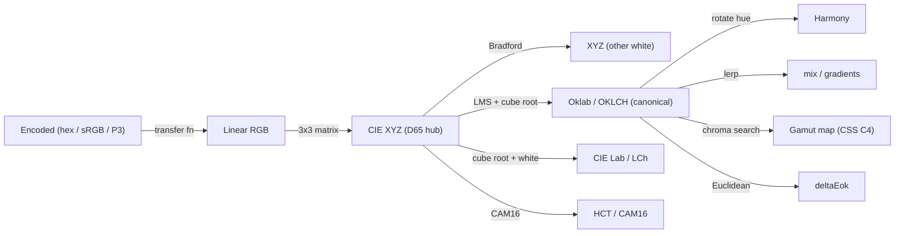

---
tags:
  - color-science
  - algorithms
  - oklch
  - gamut-mapping
  - color-difference
  - harmony
  - interpolation
  - knowledge
status: living
updated: 2026-06-24
---

# Color Science & Algorithms

What this note is: the algorithmic building blocks the Chromatics engine/DSL expose, each mapped to a concrete DSL feature or engine module, with the research-favored default and an honest note on whether it is *built* or *still planned*.

> [!note] Two layers, one source of truth
> The research (`old/chromatics/Research/`, "By Claude Code", Apr 8 2026) splits color algorithms into **engine internals** (conversion, transfer functions, chromatic adaptation, gamut mapping) and **DSL-exposed algorithms** (color difference, harmony, interpolation, contrast, tonal palettes). The *favored defaults* below come from those research notes; the *built* status comes from the running `test-dsl` code (`src/lib/dsl/color.ts`), which today wraps [culori](../old/chromatics/AI/) v4.0.2.

See [[Color Models]] for the spaces themselves, [[DSL Spec]] for the surface syntax, [[Feature Specs]] for product-level features, and [[Accessibility]] for the WCAG/APCA/CVD spine. Anything marked unresolved links [[Open Questions]].

---

## Status map at a glance

| Algorithm | Research-favored default | In `test-dsl` code today? | DSL / engine surface |
|---|---|---|---|
| Conversion pipeline | XYZ hub; encoded→linear→XYZ→perceptual | Delegated to culori `converter()` | every channel getter on `Color` |
| Chromatic adaptation | **Bradford** (ICC default) | Inside culori; not exposed | (engine internal) |
| Gamut mapping | **CSS Color 4** binary chroma search in OKLCH | ❌ only `clampChroma` (clamp); **out-of-gamut is BADGED, not mapped** | `.inGamut` / `.inP3` / `.gamutMapped` |
| Color difference | **deltaEok** default; CIEDE2000 gold standard | ❌ not implemented | (planned) |
| Color harmony | hue rotation in OKLCH | ✅ `.rotate()` / `.complement()` | `.rotate(deg)`, `.complement()` |
| Interpolation | **Oklab** default space; shortest-arc hue | ✅ partial — OKLCH linear `mix` | `mix(a,b,t)`, `.mix(other,t)` |
| Tonal palettes | **HCT** 13-tone (Material) | ❌ not implemented | (planned) |

---

## 1. Conversion pipeline

**What it is.** The chain that takes an encoded color and lands it in a perceptual space: `Encoded → Linear (transfer function) → XYZ (3×3 matrix) → perceptual (Lab / Oklab)`.

**Favored approach.** CIE XYZ (D65) as the **universal hub** — "Implement XYZ as your internal hub; every space converts to/from XYZ" — with direct shortcuts for hot paths (sRGB↔Oklab, sRGB↔HSL), lazy conversion (compute only the target space), linear-RGB caching, and Float64 intermediates. The **transfer function is kept separate** from the primaries/matrix (Conversion Pipeline.md, Transfer Functions.md). sRGB uses the piecewise curve (decode threshold `0.04045`, slope `12.92`, `1.055·C^(1/2.4) − 0.055`); Display P3 reuses the **sRGB curve, not gamma 2.6** — a common trap called out explicitly.

**Where it plugs in.** Today this is entirely **culori's** job: `color.ts` builds `converter('oklch')`, `converter('hsl')`, `converter('rgb')` and the `Color` class lazily projects/caches HSL, RGB and hex from its canonical `_oklch` (`color.ts:13-15, 49-81`). The bespoke `chromatics` library aspires to own this pipeline (its `ConversionRegistry` is the lazy-conversion mechanism), but the OKLCH model needed for the DSL is **not yet implemented** there — see [[Color Models]] and [[Open Questions]].

```ts
// color.ts — culori does the math; Color caches the projections
const toOklch = converter('oklch');
get hex(): string { return (this._hex ??= formatHex(this._oklch) ?? '#000000'); }
```

---

## 2. Chromatic adaptation

**What it is.** Re-expressing a color under a different reference white (e.g. D50↔D65) so it looks consistent across illuminants.

**Favored approach.** **Bradford** as the default transform (it is the ICC default); CAT16 only if/when CAM16 or HCT are implemented. The general form (Chromatic Adaptation.md):

```
XYZ_adapted = M⁻¹ · diag(M·white_dest / M·white_src) · M · XYZ_src
```

The research supplies Bradford / CAT16 / Von Kries matrices and a white-point table (A/D50/D55/D65/D75/E/F2/F11), and recommends pre-computing the combined D65↔D50 matrix and caching `M⁻¹`.

**Where it plugs in.** Purely an **engine internal** — it sits underneath wide-gamut and ProPhoto conversions (which need a D50↔D65 Bradford step). It is **not surfaced in the DSL** and, in `test-dsl`, lives invisibly inside culori. No standalone implementation exists yet.

---

## 3. Gamut mapping

> [!warning] Biggest known gap: the DSL *badges* out-of-gamut, it does not *map* it
> Operations like `.lighten`/`.saturate` do **not clamp** `ok_l`/`ok_c` (`color.ts:99-113`), so values can leave sRGB. The Inspector only renders an **out-of-gamut badge** via the `.inGamut` (sRGB `displayable`) and `.inP3` getters. The only *correction* is opt-in `.gamutMapped`, and it uses culori `clampChroma` — the **clamp** strategy — *not* the research-favored CSS Color 4 binary search. Tracked in [[DSL Gaps & Bugs]] and [[Open Questions]].

**What it is.** Pulling an out-of-gamut color back into a displayable gamut while distorting it as little as possible.

**Favored approach.** **CSS Color 4 binary chroma reduction in OKLCH**: convert to OKLCH, **preserve L and h**, and binary-search chroma between min/max until in-gamut (ε ≈ `0.02` on C, in-gamut tolerance ≈ `0.001`, ~10–20 iterations). Expose `clamp` / `css` / `perceptual` as strategy choices and cache the sRGB boundary in OKLCH (Gamut Mapping.md). culori already ships this as the recommended path.

**Where it plugs in.**

```ts
// color.ts:85-95 — flag, flag, then clamp (not CSS Color 4)
get inGamut(): boolean { return displayable(this._oklch); }      // sRGB
get inP3(): boolean    { return inGamut('p3')(this._oklch); }    // Display P3
get gamutMapped(): Color { return new Color(clampChroma(this._oklch, 'oklch')); }
```

The synthesis recommendation is explicit: swap `gamutMapped` to **CSS Color 4 chroma reduction** (already available as a culori option) and/or auto-map on display.

---

## 4. Color difference (ΔE)

**What it is.** A scalar distance between two colors; ΔE ≈ 1.0 is roughly one JND (just-noticeable difference).

**Favored approach.** **deltaEok** (Euclidean distance in Oklab) as the default for fast on-screen comparison, and **CIEDE2000** as the general-purpose gold standard (with CMC 2:1 reserved for textiles). Color Difference Formulas.md gives the full family — ΔE76, ΔE94, ΔECMC, CIEDE2000 (note the `25⁷ = 6103515625` term), ΔEok — plus a context-selection table.

**Where it plugs in.** **Not yet implemented** in `test-dsl` — `color.ts` exposes no `deltaE`/difference method. This is a planned DSL/engine surface (culori provides `differenceEuclidean`/`differenceCie76`/`differenceCiede2000` to wrap on demand). Relevant to "find the nearest named color" / palette-dedup use cases. See [[Feature Specs]] and [[Open Questions]].

---

## 5. Color harmony

**What it is.** Generating related hues (complementary, analogous, triadic, split-complementary, tetradic, square) from a base color.

**Favored approach.** Compute harmonies as **hue rotations in a perceptually uniform space (OKLCH)** — *never* HSL. Standard rotations (Color Harmony Algorithms.md):

| Scheme | Hue offsets |
|---|---|
| Complementary | +180 |
| Split-complementary | +150 / +210 |
| Analogous | ±30 (extend ±60) |
| Triadic | +120 / +240 |
| Tetradic | +60 / +180 / +240 |
| Square | +90 / +180 / +270 |

**Where it plugs in.** The primitive **exists**: `.rotate(degrees)` rotates `ok_h` (with hue wrap `((h % 360)+360)%360`) and `.complement()` is `rotate(180)` (`color.ts:115-125`). Named harmony helpers (`triadic()`, `analogous()`, …) are *not* built — they are one-liners over `.rotate()` and are demonstrated directly in the example scripts (e.g. `accent = brand.rotate(150)`). So harmony is **expressible in the DSL today**, just not packaged as dedicated functions.

```ts
rotate(degrees: number): Color {
  return new Color(makeOklch(this.ok_l, this.ok_c, ((this.ok_h + degrees) % 360 + 360) % 360));
}
complement(): Color { return this.rotate(180); }
```

---

## 6. Interpolation

**What it is.** Blending two (or more) colors, the basis of `mix()`, gradients and tint/shade ramps.

**Favored approach.** Interpolate in **Oklab by default** (matches CSS `color-mix(in oklab …)`); for cylindrical spaces use **shortest-path hue** lerp with CSS `shorter`/`longer`/`increasing`/`decreasing` rules and `none`-hue handling; premultiply alpha (premultiply → lerp → un-premultiply, guarding `alpha == 0`); and **linearize before any RGB blending** — naive gamma-space blending produces the dark-band artifact (`0.5^2.2 ≈ 0.22`) (Color Interpolation.md).

**Where it plugs in.** Implemented as `mix` — both the free function `mix(a,b,ratio)` and the method `.mix(other, ratio=0.5)`. It linearly interpolates `ok_l` and `ok_c` and takes the **shortest-arc** hue path (`color.ts:127-137`). Note this mixes in **OKLCH**, while the research default is **Oklab**; for chroma-varying mixes the two differ slightly. Multi-stop gradients / Catmull-Rom / B-spline ramps are research-described but **not built**.

```ts
mix(other: Color, ratio = 0.5): Color {
  const l = this.ok_l*(1-ratio) + other.ok_l*ratio;
  const c = this.ok_c*(1-ratio) + other.ok_c*ratio;
  let diff = other.ok_h - this.ok_h;        // shortest-arc hue
  if (diff > 180) diff -= 360;
  if (diff < -180) diff += 360;
  const h = ((this.ok_h + diff*ratio) % 360 + 360) % 360;
  return new Color(makeOklch(l, c, h));
}
```

---

## 7. Tonal palettes (HCT)

**What it is.** Material Design's **HCT** (Hue–Chroma–Tone) tonal palette — a 13-tone ramp at fixed hue/chroma, the backbone of Material theming.

**Favored approach.** Generate a Material **13-tone tonal palette** in HCT, alongside a Tailwind **50→950** OKLCH lightness scale, for systematic, accessibility-aware ramps. HCT requires **CAM16 + CAT16 chromatic adaptation** under the hood (Color Harmony Algorithms.md, Color Model Conversions.md).

**Where it plugs in.** **Not implemented anywhere yet.** HCT/CAM16 are on the unimplemented side of the conversion-graph tracker, and `test-dsl` has no tonal-palette function. This is the most ambitious of the "model-specific" differentiators the encyclopedia specs (see [[Color Models]]); it is firmly **future work**. See [[Open Questions]].

---

## Pipeline overview



---

## Open threads

> [!decision] Adopt the research defaults as the DSL grows
> The code already converged on **OKLCH canonical + culori-delegated math**. The open algorithmic upgrades, in rough priority, are: (1) replace `clampChroma` clamp with **CSS Color 4 chroma reduction** and auto-map on display; (2) add **deltaEok / CIEDE2000** difference; (3) package **harmony helpers** over `.rotate()`; (4) add **HCT tonal palettes** and the Tailwind L-scale. See the recommendation in [[Investigation Report]] and the running list in [[DSL Gaps & Bugs]].

Related: [[Accessibility]] (WCAG/APCA contrast + CVD share this pipeline), [[Color Models]], [[DSL Spec]], [[Feature Specs]], [[Library Landscape]], [[Open Questions]].

Source archive: [Conversion Pipeline](../old/chromatics/Research/Conversion%20Pipeline.md), [Transfer Functions](../old/chromatics/Research/Transfer%20Functions.md), [Chromatic Adaptation](../old/chromatics/Research/Chromatic%20Adaptation.md), [Gamut Mapping](../old/chromatics/Research/Gamut%20Mapping.md), [Color Difference Formulas](../old/chromatics/Research/Color%20Difference%20Formulas.md), [Color Harmony Algorithms](../old/chromatics/Research/Color%20Harmony%20Algorithms.md), [Color Interpolation](../old/chromatics/Research/Color%20Interpolation.md).
