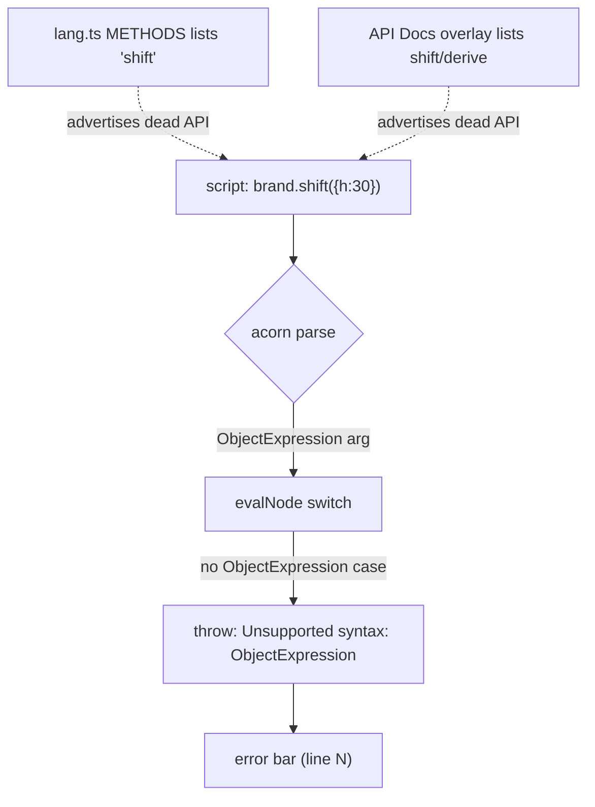

# DSL Gaps & Bugs

What this note is: a prioritized defect/gap register for the **only working DSL implementation** — `color-testing` branch `test-dsl`, files under `src/lib/dsl/`. Every entry has evidence (file + what is wrong) and a concrete fix. See [[DSL Spec]] for intent, [[DSL Implementation Notes]] for how it works today, [[Roadmap]] for sequencing, and [[Architecture Decisions]] / [[Open Questions]] for unresolved strategy.

> [!note] Scope
> This covers the shipped code. The chromatics-repo `DSL.md` spec has its *own* internal contradictions (channel naming, missing evaluator nodes) — those are tracked in [[DSL Spec]] and [[Open Questions]], and noted here only where the code inherited them.

## Priority summary

| # | Defect | File(s) | Pri | Type |
|---|--------|---------|-----|------|
| 1 | `shift()` / `derive()` are uncallable | `evaluator.ts`, `color.ts` | **P0** | Bug (dead API) |
| 2 | Highlighter ↔ evaluator token drift; dead after-dot branches | `lang.ts` vs `evaluator.ts`/`color.ts` | **P1** | Maintainability |
| 3 | No clamping / no auto gamut-mapping | `color.ts` | **P1** | Correctness |
| 4 | Stale README describes the old static app | `README.md` | **P1** | Docs |
| 5 | `brand-dark.ts` gate has no DSL equivalent yet (original preserved on `master`) | (spec ref) | **P1** | Acceptance gate |
| 6 | No persistence / no export | `+page.svelte` | **P1/P2** | Missing feature |
| 7 | No two-way editing | `+page.svelte` | **P2** | Missing feature |
| 8 | Color equality is reference `===` | `evaluator.ts` | **P2** | Foot-gun |

---

## P0 — `shift()` and `derive()` are UNCALLABLE

The single hard bug. Both methods are advertised in the API Docs overlay **and** highlighted by the editor, but **cannot be invoked from any DSL script**.

**Evidence.** `color.ts:139-157` defines them taking an **object literal**:

```ts
shift(deltas: { l?: number; c?: number; h?: number }): Color { ... }
derive(overrides: { l?: number; c?: number; h?: number }): Color { ... }
```

But the evaluator (`evaluator.ts:117-255`) has **no `ObjectExpression` case**. Its switch handles only `Literal, Identifier, UnaryExpression, BinaryExpression, LogicalExpression, ConditionalExpression, MemberExpression, CallExpression, AssignmentExpression, ExpressionStatement` — anything else hits the catch-all at line 254:

```ts
default:
    throw new Error(`Unsupported syntax: ${node.type}`);
```

So a script line like `accent = brand.shift({h: 30})` parses fine in acorn, but evaluating the argument `{h:30}` throws **`Unsupported syntax: ObjectExpression`** (caught per-statement, surfaced in the error bar with its line number). The methods are reachable in TS but **dead from the DSL surface**.

`lang.ts:6-9` even lists both in `METHODS`, and they appear in the API Docs — so the UI actively advertises functions that always error.

> [!decision] Fix (choose one)
> - **A — add `ObjectExpression` support** to `evalNode`, ideally with a property-name whitelist (`l`,`c`,`h`) so it stays a *color-delta* literal, not general JS objects. Cheapest, keeps the ergonomic `{h:30}` call site. Requires also handling `Property` nodes / computed keys.
> - **B — make the methods positional**: `shift(dl, dc, dh)` / `derive(l, c, h)` with `undefined`-passthrough. Avoids touching the evaluator at all and keeps the "no object literals" rule intact.
> The spec ([[DSL Spec]]) lists object literals as *rejected at the AST level* "unless needed later" — so option B is more faithful to the original intent, while A is more faithful to the existing `color.ts` signatures. Resolve in [[Open Questions]].

---

## P1 — Highlighter ↔ evaluator token drift (two sources of truth)

`lang.ts` is a **separate hand-written CodeMirror `StreamParser`**, not acorn. It re-declares the entire token surface independently of the evaluator/`color.ts`:

```ts
const CONSTRUCTORS = new Set(['HSL', 'RGB', 'OKLCH']);
const BUILTINS     = new Set(['hex','mix','contrast','clamp','abs','min','max','round','floor','ceil']);
const METHODS      = new Set(['lighten','darken','saturate','desaturate','rotate',
                              'invert','complement','mix','shift','derive','contrast']);
const PROPERTIES   = new Set(['ok_l','ok_c','ok_h','h','s','l','r','g','b',
                              'hex','inGamut','inP3','gamutMapped']);
```

The real behavior lives elsewhere: constructors/globals in `createEnvironment()` (`evaluator.ts:31-64`), methods/getters in `class Color` (`color.ts`). **There is no single source of truth** — adding one DSL feature means editing two files, and they *will* drift (e.g. `METHODS` advertises the broken `shift`/`derive` from P0; nothing stops a future method from existing in `color.ts` but never being highlighted).

> [!warning] Dead after-dot branches
> The post-dot identifier logic in `lang.ts:61-70` is partly inert. Both arms of the method check return the **same** tag:
> ```ts
> if (METHODS.has(word)) return tags.function(tags.propertyName).toString();
> return tags.function(tags.propertyName).toString();   // identical
> ```
> and likewise `PROPERTIES.has(word)` returns `tags.propertyName` — the same as the fallback. So **after a dot, the `METHODS` and `PROPERTIES` sets currently have zero effect on highlighting** (only the `(`-lookahead distinguishes method vs property). The sets are cosmetic there.

**Fix.** Export the canonical token lists from one module (e.g. a `tokens.ts` enumerating constructors/builtins from the env and method/getter names from `Color`) and have both the evaluator's env builder and the highlighter consume them. At minimum, delete the duplicate-return dead branches. Longer term this is also the seam where [[Architecture Decisions]] about a Lezer grammar (per the spec) vs the current `StreamParser` get decided.

---

## P1 — No clamping / no auto gamut-mapping

Channel operations do **not** clamp, and out-of-gamut color is only *badged*, never *mapped*.

**Evidence (`color.ts`).** `lighten`/`darken` adjust `ok_l` and `saturate`/`desaturate` adjust `ok_c` with raw arithmetic and no bounds:

```ts
lighten(a) { return new Color(makeOklch(this.ok_l + a, this.ok_c, this.ok_h)); }  // can exceed 1 or go < 0
saturate(a){ return new Color(makeOklch(this.ok_l, this.ok_c + a, this.ok_h)); }  // can exceed the ~0.4 chroma ceiling
```

Only `rotate`/`invert`/`shift` wrap **hue** (`((h % 360) + 360) % 360`). Lightness and chroma are free to leave `0..1` / the displayable range. Out-of-gamut is surfaced only as a UI badge via the `inGamut` (culori `displayable`, sRGB) and `inP3` getters; mapping happens **only if the user explicitly reads `.gamutMapped`** (`color.ts:93-95`, `clampChroma(this._oklch, 'oklch')`). The API Docs even *document* the intended ranges (`OKLCH l:0-1, c:0-0.4, h:0-360`) that the code does not enforce.

> [!tip] Fix
> Decide a gamut policy (see [[Color Science & Algorithms]] / [[Accessibility]]):
> - clamp `ok_l` to `0..1` (and optionally `ok_c >= 0`) inside the operations, **and/or**
> - apply CSS Color 4 gamut mapping (culori `clampChroma` / `toGamut`) automatically at render — so swatches show the *displayable* color, with the badge meaning "was mapped" rather than "is broken".
> Keep `.gamutMapped` as an explicit escape hatch regardless.

---

## P1 — Stale README

`README.md` still markets **only the old static contrast-matrix app** — it never mentions the DSL pivot on this branch.

**Evidence.** The README opens *"A vibed-out playground project for testing color schemes… Visualize color combinations as a contrast matrix"*, lists features like *"Color vision deficiency simulation"*, *"Markdown table export"*, and an **"Adding a color scheme"** section pointing at `src/lib/schemes/` (`ocean.ts`, `catppuccin-mocha.ts`) — a directory that **does not exist on `test-dsl`**. Meanwhile the actual product title in `+page.svelte` is `Chromatics DSL`.

**Fix.** Rewrite the README around the DSL REPL (acorn evaluator, OKLCH/culori Color model, CodeMirror inspector). Pull copy from [[Vision]] / [[Unified Product Plan]]. Low effort, high signal — it is the first thing any reader sees.

---

## P1 — The `brand-dark.ts` acceptance gate has no DSL equivalent yet

The DSL spec's **Phase 1 success criterion** is literally *"Test by rewriting `brand-dark.ts` relationships as DSL"* (see [[DSL Spec]]). The original scheme **still exists** — a hand-written 224-line OKLCH TypeScript scheme at `src/lib/schemes/brand-dark.ts` on color-testing/`master` — but it was **deleted on `test-dsl`** during the DSL pivot. So there is no DSL-script equivalent and no codified gate yet. This is a before/after you can diff, not a lost file.

> [!tip] Load-bearing, and recoverable
> The spec's whole motivation — "remove the TypeScript boilerplate that `brand-dark.ts` drowns the relationships in" — cites a file that is **preserved on `master`**. The "Brand Dark" built-in **example script** in `test-dsl`'s `+page.svelte` is the closest DSL-side artifact, but it is not yet a checked acceptance gate. The fix: codify "the DSL reproduces `master`'s brand-dark" as a real test. Track in [[Roadmap]].

**Fix.** Either (a) bring `master`'s `brand-dark.ts` (under `src/lib/schemes/`) back as a reference fixture and codify "the DSL reproduces it" as a real test, or (b) retire the criterion and promote the in-repo "Brand Dark" example to the canonical fixture. Track in [[Roadmap]].

---

## P1/P2 — No persistence, no export

The Strudel-like REPL **cannot save or share a scheme**, and **cannot emit output** for downstream use.

- **Persistence (P1).** `+page.svelte` holds `source` purely in `$state`; there is no URL-hash encoding and no `localStorage`. Reloading loses the script. The spec's Phase 4 promised URL-hash sharing — unbuilt.
- **Export (P2→P1 for the product).** No export to CSS variables, JSON design tokens, or Tailwind config — all three promised by the spec/planning as the bridge to the "Dynamic Theme" use case. Today the only outputs are the on-screen swatches.

**Fix.** Persistence is cheap and high-leverage: serialize `source` to the URL hash (and/or `localStorage`) on change, hydrate on load. Export is a focused feature: walk `result.order` → emit `--var: oklch(...)` / token JSON / `tailwind.config` theme. See [[Feature Specs]] and [[Roadmap]].

---

## P2 — No two-way editing

There is no UI→code path: you cannot click a swatch, pick a color, and have it written back into the source. The spec calls this "the hard part" and scopes an MVP (Option A: break the relationship, replace the expression with a literal, warn) — none of it exists yet. The infrastructure is *present* (each `Variable` stores its AST `node` and `loc.start.line`, `evaluator.ts:243-244`), so the source-mapping groundwork is done; the editing surface is not. Track design in [[Feature Specs]] / [[Open Questions]].

---

## P2 — Color equality is reference `===` (foot-gun)

In `evaluator.ts:169-174`, `==`, `===`, `!=`, `!==` **all** reduce to JS `===` / `!==` on the raw values:

```ts
case '==':
case '===':
    return left === right;
```

For numbers/strings/booleans that is fine. For `Color` it means **reference equality**: two structurally identical colors (e.g. `OKLCH(0.5,0.1,200) == OKLCH(0.5,0.1,200)`) compare **false**, because they are distinct objects. Given `Color` immutability (every op returns a *new* instance), this is surprising and effectively useless for colors.

**Fix.** Special-case `Color` operands in the equality ops to compare OKLCH channels (with an epsilon), or document explicitly that `Color` is not comparable and surface a clearer error/no-op. Low severity (no example relies on it) but it is a latent trap.

---

## Defect flow at a glance



## Related notes

[[DSL Spec]] · [[DSL Implementation Notes]] · [[Roadmap]] · [[Open Questions]] · [[Architecture Decisions]] · [[Color Science & Algorithms]] · [[Accessibility]] · [[Feature Specs]] · [[Status & Inventory]]
