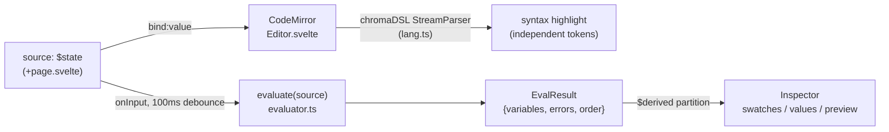
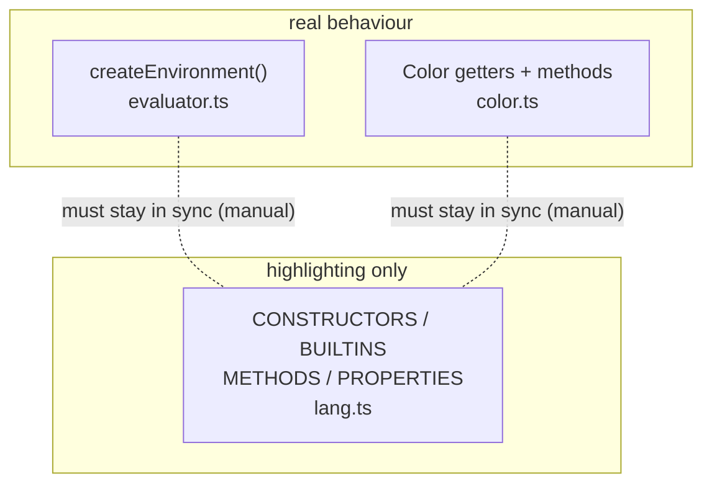

# DSL Implementation Notes

What this note is: a file-by-file account of how the **working** Chromatics DSL is actually built, as it exists on the `test-dsl` branch of `color-testing`. This is the real, end-to-end-wired prototype — distinct from the aspirational [[DSL Spec]] (which is a design doc with zero code on `chromatics/tmp`). Known divergences and rough edges are catalogued in [[DSL Gaps & Bugs]]; the product framing lives in [[Product Architecture]].

> [!note] Scope
> Five files, all on branch `test-dsl` (checked out): `src/lib/dsl/evaluator.ts`, `src/lib/dsl/color.ts`, `src/lib/dsl/lang.ts`, `src/lib/Editor.svelte`, `src/routes/+page.svelte`. The `dsl/` directory contains **only** those three `.ts` files. Project version is `0.0.1`; the README still documents the OLD static contrast-matrix app and never mentions the DSL — see [[Project History]].

## Data flow at a glance



Two facts to keep front of mind:

1. **The evaluator and the highlighter tokenize independently.** `evaluator.ts` walks an acorn AST; `lang.ts` is a separate hand-written `StreamParser`. They share no source of truth and *will* drift (see [Two independent token sets](#two-independent-token-sets-the-core-drift)).
2. **Nothing executes as JavaScript.** acorn only *parses*; a custom `evalNode` interprets a restricted subset.

---

## `evaluator.ts` — the interpreter

The whole language is a sandboxed subset of JS. `evaluate(source)` parses the *entire* source with acorn and walks the ESTree `program.body` itself.

### Parse config

```ts
acorn.parse(source, {
  ecmaVersion: 2020,
  sourceType: 'module',
  locations: true   // gives node.loc.start.line for error + Variable line numbers
});
```

A parse failure is caught and pushed as a single `EvalError`, with the trailing `(line:col)` stripped from acorn's message (`evaluator.ts:273`) and `err.loc?.line ?? 1`. On parse failure it returns an empty `EvalResult` immediately — no statements run.

### Per-statement try/catch

`program.body` is iterated and each statement runs in its own `try/catch` (`evaluator.ts:280-291`), so one bad line does not kill the rest — errors accumulate into `errors[]` with `loc?.start.line ?? 1`. This is what makes the live REPL forgiving: a half-typed line surfaces an error bar while the other variables still render.

### The node-type switch (`evalNode`)

Supported node types (anything else throws `` `Unsupported syntax: ${node.type}` ``, `evaluator.ts:254`):

| Node | Behaviour |
|---|---|
| `Literal` | returns `node.value` (number / string / boolean) |
| `Identifier` | `scope.get(name)` |
| `UnaryExpression` | `-` `+` (via `num`), `!` (raw JS truthiness) |
| `BinaryExpression` | see operator table below |
| `LogicalExpression` | `&&` `||` short-circuit, return the **raw operand** (not a coerced boolean) |
| `ConditionalExpression` | ternary `test ? a : b` |
| `MemberExpression` | `Color`-only special-casing (below) |
| `CallExpression` | evaluate callee → must be `function` else `Not a function`; map args |
| `AssignmentExpression` | `=` only; LHS must be `Identifier`; records deps |
| `ExpressionStatement` | unwraps to its `.expression` |

> [!warning] Equality is reference equality
> Both `==` and `===` compile to JS `===` (`evaluator.ts:169-171`); `!=`/`!==` both to `!==`. For `Color` operands this is **identity** comparison — two structurally identical colors are not equal. Comparison ops (`< > <= >=`) coerce both sides via `num()`. Logged in [[DSL Gaps & Bugs]].

Operators implemented in `BinaryExpression`: `+ - * / % **` (all `num`-coerced), `< > <= >=` (num), `== === != !==` (strict identity).

### `Scope` and dependency tracking

`Scope` (`evaluator.ts:85-115`) holds:

- `variables: Map<string, Variable>` — `Variable = { name, value, deps, line, node }`
- `order: string[]` — first-definition order; reassignment updates the value but **keeps the original order position**
- `env` — the built-in environment (constructors + utilities)
- `currentDeps: Set<string>`

The dependency trick: in `AssignmentExpression`, `currentDeps` is reset to a fresh `Set`, the RHS is evaluated, then `deps = Array.from(scope.currentDeps)` is snapshotted (`evaluator.ts:240-242`). `Scope.get(name)` adds to `currentDeps` **only for user variables** (`evaluator.ts:99`) — built-in env reads are *not* recorded as deps. The inspector renders this as `depends on: a, b`. This is the live realization of the [[DSL Spec]]'s "scope read interception" idea.

### Member access: the `instanceof Color` special-case

`MemberExpression` (`evaluator.ts:198-219`) is the only place properties/methods resolve, and it gates on `obj instanceof Color`:

```ts
if (obj instanceof Color && typeof prop === 'string') {
  const val = (obj as any)[prop];
  if (typeof val === 'function')
    return ((...args) => (val as any).call(obj, ...args)) as DSLFunction; // bound wrapper
  if (val === undefined) throw new Error(`Color has no property: ${prop}`);
  return val as DSLValue; // getter value
}
throw new Error(`Cannot access property '${prop}' on ${typeof obj}`);
```

So methods become bound `DSLFunction`s and getters return their value. Member access on anything that isn't a `Color` throws. `computed` member access (`obj[expr]`) is handled syntactically but only `Color` + string prop succeeds.

### Coercion helpers

Three guards enforce runtime types (`evaluator.ts:68-81`), each throwing `` `Expected <kind>, got ${typeof v}` ``:

- `num(v)` — requires `number`
- `str(v)` — requires `string` (used by `hex(...)`)
- `color(v)` — requires `instanceof Color` (used by free-function `mix`/`contrast`)

### Built-in environment (`createEnvironment`)

| Group | Entries |
|---|---|
| Constructors | `HSL(h,s,l)`, `RGB(r,g,b)`, `OKLCH(l,c,h)`, `hex(str)` |
| Color utils | `mix(a,b,ratio)`, `contrast(a,b)` |
| Math | `abs`, `min(...)`, `max(...)`, `round`, `floor`, `ceil`, `clamp(val,lo,hi)` |

Note `clamp` arg order is `clamp(val, min, max)` (`evaluator.ts:59-61`); `min`/`max` are variadic. `EvalResult = { variables, errors, order }`.

---

## `color.ts` — the `Color` class

One first-class domain value. Canonical internal representation is **OKLCH**; everything else is a lazily-cached projection. See [[Color Models]] and [[Color Science & Algorithms]] for the why.

### Storage + lazy caches

```ts
private _oklch: Oklch;        // culori Oklch, the source of truth
private _hsl?, _rgb?, _hex?;  // lazily computed, cached
```

The constructor takes *any* culori `Color` and converts via `converter('oklch')`, throwing `Invalid color` on failure (`color.ts:29-33`). HSL/RGB/hex are derived on first access through private getters (`hslColor`, `rgbColor`) using `??=` memoization (`color.ts:49-51`, `64-66`, `79-81`).

### culori imports used

`converter`, `formatHex`, `clampChroma`, `wcagContrast`, `displayable`, `inGamut`, `parse` (culori **v4.0.2**). Three module-level converters: `toOklch`, `toHsl`, `toRgb`.

### Channels (getters)

- OKLCH: `ok_l`, `ok_c`, `ok_h` (each `?? 0`)
- HSL: `h`, `s`, `l` (via `toHsl`)
- RGB (0–1): `r`, `g`, `b` (via `toRgb`)
- `hex` → `formatHex(_oklch) ?? '#000000'`
- `inGamut` → `displayable(_oklch)` (sRGB)
- `inP3` → `inGamut('p3')(_oklch)`
- `gamutMapped` → `new Color(clampChroma(_oklch, 'oklch'))`

### Operations — all computed in OKLCH, all return a new `Color`

| Method | Implementation (`color.ts`) |
|---|---|
| `lighten(a)` | `ok_l + a` (no clamp) |
| `darken(a)` | `ok_l - a` (no clamp) |
| `saturate(a)` | `ok_c + a` (no clamp) |
| `desaturate(a)` | `ok_c - a` (no clamp) |
| `rotate(deg)` | `((ok_h + deg) % 360 + 360) % 360` |
| `invert()` | `(1 - ok_l, ok_c, ok_h + 180 wrapped)` |
| `complement()` | `rotate(180)` |
| `mix(other, ratio=0.5)` | linear interp of `l`,`c`; **shortest-arc** hue interp |
| `shift({l?,c?,h?})` | adds deltas to channels |
| `derive({l?,c?,h?})` | replaces channels, falling back to current |
| `contrast(other)` | `wcagContrast(this._oklch, other._oklch)` → number |

> [!warning] No clamping on lighten/darken/saturate/desaturate
> Only hue is wrapped. `ok_l`/`ok_c` can go below 0 or above 1; out-of-gamut is *flagged* (`inGamut`) but only corrected if you explicitly call `.gamutMapped`. See [[DSL Gaps & Bugs]].

The repeated hue-wrap idiom is `((h % 360) + 360) % 360`. `mix` shortest path: `diff = h2 - h1; if (diff > 180) diff -= 360; if (diff < -180) diff += 360;` then wrap `h1 + diff*ratio` (`color.ts:127-137`).

Static constructors `Color.HSL`/`RGB`/`OKLCH`/`hex` (`color.ts:169-185`) are what the environment wires up; `hex` runs culori `parse` and throws `` `Invalid hex color: ${str}` `` on miss.

> [!note] Object-literal args that the language can't express
> `shift`/`derive` take `{l,c,h}` object literals — but the evaluator has **no `ObjectExpression` case**, so these methods are currently uncallable from DSL source even though they exist on the class and are documented in the API overlay. Tracked in [[DSL Gaps & Bugs]].

---

## `lang.ts` — the CodeMirror highlighter (separate token impl)

`chromaDSL = StreamLanguage.define(parser)` where `parser` is a hand-written `StreamParser<State>`. The **only** state it carries is `afterDot: boolean` (`lang.ts:16-18`), used to distinguish a property/method (just after `.`) from a plain identifier.

Token rules, in order (`lang.ts:25-99`): whitespace → `//` line comments (`skipToEnd`) → strings (`"..."`/`'...'`) → numbers (`/^-?\d+\.?\d*/`) → `.` (sets `afterDot`, tagged punctuation) → identifiers (`/^[a-zA-Z_]\w*/`) → operators (`/^[+\-*/%=<>!&|?:]+/`) → brackets → skip-unknown.

It hardcodes four token sets:

```ts
CONSTRUCTORS = {HSL, RGB, OKLCH}
BUILTINS     = {hex, mix, contrast, clamp, abs, min, max, round, floor, ceil}
METHODS      = {lighten, darken, saturate, desaturate, rotate, invert,
                complement, mix, shift, derive, contrast}
PROPERTIES   = {ok_l, ok_c, ok_h, h, s, l, r, g, b, hex, inGamut, inP3, gamutMapped}
```

> [!warning] The METHODS / PROPERTIES sets are effectively dead
> After a dot, the method branch returns `tags.function(tags.propertyName)` in **both** the `METHODS.has(word)` case and the fallback (`lang.ts:65-66`); likewise the property branch returns `tags.propertyName` whether or not `PROPERTIES.has(word)` (`lang.ts:68-69`). So those two lookups don't change the emitted tag — coloring after a `.` depends only on whether `(` follows. The `CONSTRUCTORS`/`BUILTINS` lookups *do* matter (typeName vs function-variable). Logged in [[DSL Gaps & Bugs]].

---

## `Editor.svelte` — CodeMirror wiring

A thin Svelte 5 wrapper around a CodeMirror 6 `EditorView` (`Editor.svelte`).

- **Props:** `value = $bindable('')` and optional `onchange`.
- **Extensions** (`onMount`, `Editor.svelte:91-103`): `lineNumbers`, `history`, `drawSelection`, `bracketMatching`, `highlightActiveLine` + `highlightActiveLineGutter`, `keymap.of([...defaultKeymap, ...historyKeymap])`, the `chromaDSL` language, a dark `theme`, the `highlight` `HighlightStyle`, and an `updateListener`.
- **No custom run/eval hotkey** — only the default JS keymap. Evaluation is driven by the parent's debounce, not a keypress.
- **Write-back:** `updateListener` (`Editor.svelte:79-85`) writes `doc.toString()` into the bindable `value` and calls `onchange` on every `docChanged`.
- **External-sync:** an `$effect` (`Editor.svelte:112-118`) pushes external `value` changes back into the doc (used by the example selector).

The `HighlightStyle` maps the tags emitted by `lang.ts` to concrete colors — e.g. `variableName #c8c8d0`, `function(variableName) #b4a0e5`, `typeName #e5c07b`, `propertyName #7ec8e3`, `function(propertyName) #61c9a8`, `number #d19a66`, `string #98c379`, `operator #8888a0`, `lineComment #555566 italic` (`Editor.svelte:63-77`). Theme is 13px `ui-monospace`, dark.

> [!note] `@codemirror/lang-javascript` is installed but never imported here
> The editor uses the custom `chromaDSL` `StreamLanguage` instead — a likely leftover from trying JS language support first. Possible dead dependency; see [[DSL Gaps & Bugs]].

---

## `+page.svelte` — the REPL shell

Two-pane layout: left EDITOR, right INSPECTOR. `<title>` is **Chromatics DSL**.

### State + reactivity

```ts
let currentExample = $state(exampleNames[0]);
let source = $state(EXAMPLES[currentExample]);
let result: EvalResult = $state(evaluate(source));
```

`onInput()` (`+page.svelte:57-62`) clears and re-arms a **100ms** `setTimeout` that calls `result = evaluate(source)`. The example `<select>` re-evaluates synchronously on change (`+page.svelte:118-121`). Two `$derived` partitions split `result.order` → variables into **colorVars** and **nonColorVars** on `value instanceof Color` (`+page.svelte:83-93`).

### Inspector rendering

- **Swatches:** each color renders `c.hex` background, label text colored via `textColor` (`#1a1a1a` if `ok_l > 0.6` else `#f0f0f0`), the `formatOklch` string (`oklch(l 3dp, c 4dp, h 2dp)`), an `out of gamut` badge when `!c.inGamut`, and `depends on: …` from `v.deps`.
- **VALUES section:** non-color vars via `formatValue` (Color→hex; number rounded to 4dp; else `String`).
- **Error bar:** lists `line N: message` per `EvalError`; an error count badge sits in the editor header.

### Heuristic name-based PREVIEW

Only renders when `colorVars.length >= 2` **and** both a `bg` and `fg` are found by name substring (`+page.svelte:342-351`):

- `bg`: `name.includes('bg') || name === 'background'`
- `fg`: `name.includes('fg') || name === 'foreground' || name === 'muted'`
- primary: `name === 'primary' || name === 'accent'`

Chips = colorVars excluding the bg/fg/background/foreground/muted names. This is a fragile, undocumented mapping (e.g. `muted` is silently treated as foreground) — not a semantic model. Tracked in [[DSL Gaps & Bugs]].

### API Docs overlay + examples

A `showDocs` overlay (Esc to close) documents the whole surface, including intended ranges that act as product guidance — `OKLCH(l: 0-1, c: 0-0.4, h: 0-360)`, `.ok_c chroma 0-0.4`. Two hardcoded `EXAMPLES`: **Simple** (`brand = hex("#6c5ce7")`, a small theme) and **Brand Dark** (a full theme — bg → fg → primary/secondary/accent, a `bg_lightest…bg_darkest` scale, semantic success/warning/error/info, and triad/split harmony colors — all from one OKLCH source).

---

## Two independent token sets (the core drift)

> [!decision] There is no single source of truth for the language surface
> The **evaluator** (`evaluator.ts` env + `color.ts` getters/methods) defines *real behaviour*. The **highlighter** (`lang.ts`) re-declares overlapping `CONSTRUCTORS`/`BUILTINS`/`METHODS`/`PROPERTIES` sets purely for coloring. Adding a DSL feature requires editing **both** places by hand, and they can silently disagree. Combined with the dead METHODS/PROPERTIES branches above, the highlighter's identifier sets are largely cosmetic today. Full divergence list in [[DSL Gaps & Bugs]].



---

## See also

- [[DSL Spec]] — the design-doc intent this implementation partially realizes (and where it diverges).
- [[DSL Gaps & Bugs]] — every rough edge referenced above, consolidated.
- [[Product Architecture]] — how the REPL fits the broader Chromatics product.
- [[Color Models]] · [[Color Science & Algorithms]] — the OKLCH-canonical model and the math behind the operations.
- Source archive: [DSL.md design doc](../old/) and the original [knowledge base](../old/).
