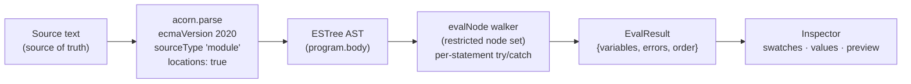
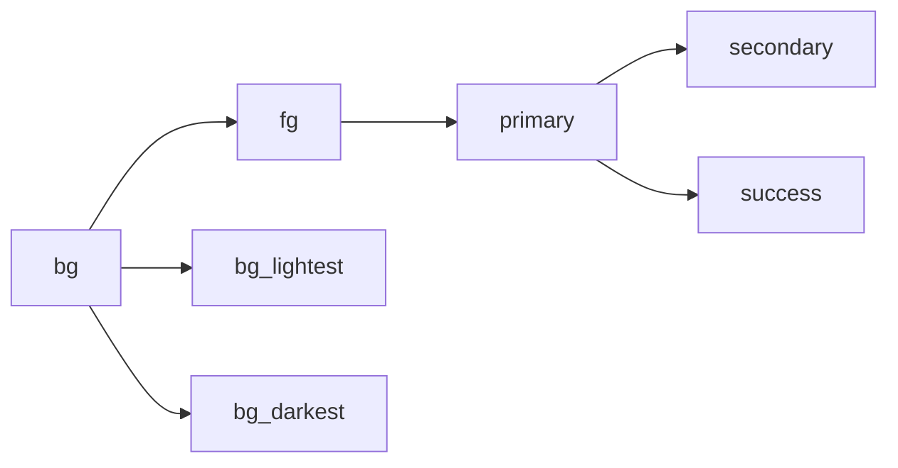

# DSL Spec

The canonical, corrected specification of the Chromatics color DSL. This note is the single source of truth — it **supersedes** the old design document (`tmp:DSL.md` in the chromatics repo) and resolves its three internal contradictions against the *real* implementation on the `test-dsl` branch of `color-testing` (`src/lib/dsl/{lang,evaluator,color}.ts`).

> [!note] Two artifacts, one language
> The DSL exists in two forms: (1) a thorough **design document** (`tmp:DSL.md`, ~15.7 KB, zero code) and (2) a **working prototype** (`color-testing@test-dsl`, end-to-end functional). Where they disagree, the working code wins, and the disagreements are flagged below as `> [!decision]`. See [[DSL Implementation Notes]] for the build, [[DSL Gaps & Bugs]] for the rough edges, [[Project History]] for how we got here.

---

## 1. Purpose & Strudel inspiration

Chromatics is a **relationship-first color authoring** language: you declare color variables as formulas over *other* colors' channels, so changing one base color cascades through an entire theme. The design doc's framing: existing tools can't capture *relationships* between colors; the old `brand-dark.ts` scheme already encoded these patterns but drowned them in TypeScript boilerplate.

The named inspiration is the **Strudel REPL** ("a music language exposing a light JS-like environment in the browser") — a live-coding, two-pane editor+inspector where editing code instantly updates a visual result. Chromatics applies that loop to color: code on the left, live swatches/preview on the right (see [[Feature Specs]], [[Product Architecture]]).

Design choices that flow from this (see [[Architecture Decisions]]):

- **No `$` sigil** on variables — `bg` not `$bg`. The DSL context makes it unambiguous.
- **Familiar syntax** — reuse JavaScript expression syntax for zero learning curve, rather than inventing notation.
- **Immutability** — every `Color` operation returns a *new* `Color`, chosen specifically to make dependency tracking reliable.

---

## 2. Execution model

The DSL is **not a hand-written language**. It is a sandboxed subset of JavaScript: source is parsed by the `acorn` JS parser and then *interpreted* by a custom AST walker. It is **never executed as JavaScript** — there is no `eval`, no `new Function`, no `with(env)`.



Concrete behavior (`evaluator.ts:258`–`294`):

1. **Parse once.** `acorn.parse(source, { ecmaVersion: 2020, sourceType: 'module', locations: true })`. A parse error is caught, stripped of its `(line:col)` suffix, and returned as a single `EvalError` with a line number — it does **not** throw to the UI.
2. **Walk per statement.** Each top-level node in `program.body` is evaluated in its **own `try/catch`** (`evaluator.ts:280`), so one bad line doesn't kill the rest; its error is collected with `loc.start.line`.
3. **Restricted node set.** `evalNode` is a `switch` over node `type`. Any node type outside the supported set throws `Unsupported syntax: <type>` (`evaluator.ts:254`).

> [!tip] Why an interpreter, not raw eval
> Raw `eval` gives "almost no introspection" — you can't track dependencies or map a UI color-pick back to a source line. The custom walker is what makes dependency tracking and (eventually) two-way editing possible. See [[Architecture Decisions]].

### Supported AST node types

`Literal`, `Identifier`, `UnaryExpression`, `BinaryExpression`, `LogicalExpression`, `ConditionalExpression`, `MemberExpression`, `CallExpression`, `AssignmentExpression`, `ExpressionStatement`.

---

## 3. Supported syntax

A **program** is a sequence of statements. A **statement** is either an assignment or a bare expression.

| Form | Example | Notes |
|---|---|---|
| Assignment | `bg = OKLCH(0.25, 0.02, 230)` | `=` only. LHS must be an `Identifier`. |
| Bare expression | `contrast(bg, fg)` | Evaluated; not stored as a variable. |
| Line comment | `// source color` | Handled by acorn. |

Within expressions:

| Construct | Example | Implemented? |
|---|---|---|
| Number / string / boolean literal | `0.4`, `"#6c5ce7"`, `true` | ✅ |
| Identifier | `brand` | ✅ |
| Unary `-` `+` `!` | `-bg.ok_l`, `!flag` | ✅ |
| Binary arithmetic `+ - * / % **` | `bg.ok_h + 180` | ✅ |
| Comparison `< > <= >=` | `bg.ok_l < 0.5` | ✅ |
| Equality `== === != !==` | `mode == "dark"` | ✅ (see caveat §8) |
| Logical `&& \|\|` | `a && b` | ✅ (short-circuit, returns raw operand) |
| Ternary `? :` | `bg.ok_l < 0.5 ? bg.lighten(0.05) : bg.darken(0.05)` | ✅ |
| Member access `.prop` / `.method()` | `bg.ok_h`, `bg.rotate(150)` | ✅ (only on `Color`) |
| Call `f(args)` | `OKLCH(0.5, 0.1, 230)` | ✅ |
| Grouping `( )` | `(bg.ok_h + 72) % 360` | ✅ (acorn-level) |
| Object literal `{l, c, h}` | `bg.shift({ l: 0.1 })` | ⚠️ **NOT** — no `ObjectExpression` case → dead. See §4 + [[DSL Gaps & Bugs]] |

### Explicitly UNSUPPORTED

Anything that parses but isn't in the node set throws `Unsupported syntax: <type>`:

- **Object & array literals** (`{...}`, `[...]`) — no `ObjectExpression`/`ArrayExpression` case.
- **Functions / arrow functions / blocks** — no user-defined functions; flat global scope only.
- **Loops** (`for`, `while`), **`if/else`** statements (use ternaries instead).
- **`import` / `require` / `eval`**, **`this` / `new`**, template literals, spread.
- **Compound assignment** (`+=`, `-=`, …) — `evaluator.ts:233` rejects anything but `=` with `Only = assignment is supported`.
- **Assigning to a non-identifier** — `Can only assign to variables` (`evaluator.ts:237`).

---

## 4. Resolved contradictions

The old `DSL.md` had three unresolved internal contradictions. The working code resolves all three; the corrected positions are below.

> [!decision] Adopt `ok_l` / `ok_c` / `ok_h` for OKLCH channels
> The doc's accessor table said OKLCH = `ok_l`/`ok_c`/`ok_h` while *every worked example* read OKLCH via `.l`/`.c`/`.h` — colliding with HSL's `.l`. **Resolution (matches `color.ts`):** OKLCH channels are `ok_l`/`ok_c`/`ok_h`; `.h`/`.s`/`.l` are **HSL** (lazily derived). All examples were rewritten accordingly (e.g. `OKLCH(1 - bg.ok_l, bg.ok_c / 3, (bg.ok_h + 180) % 360)`).
>
> **Superseded by the A+C engine — bare channels are now model-local.** The collision above only existed because `color.ts` had *one* canonical space, so a bare `.l` had to belong to somebody. `models/value.ts` stores a color in **its own** model, so `member()` resolves the color's own model's `localKey` **before** the flat channel index: an OKLCH color answers `.l`/`.c`/`.h` with its own coordinates, a Lab color's `.b` is Lab *b* (not sRGB blue), an HSL color is unchanged. This makes channels behave exactly like methods already did ("ops live on the model the color is already in"). `ok_l`/`ok_c`/`ok_h` and every other namespaced key still work verbatim — they are now the **cross-model** read (`hslColor.ok_l`), and the flat `h`/`s`/`l` + `r`/`g`/`b` keys remain the fallback for models that have no local channel of that name (`hex("#3366cc").l` is still HSL lightness). Tested in `tests/native-channels.test.ts`.

> [!decision] Object literals are allowed *as call arguments* — eventually
> The doc both forbade object literals and required `shift({l,c,h})` / `derive({l,c,h})`. **Resolution:** object literals should be permitted **only as call arguments** (never as standalone expressions). This is the intended spec so `shift`/`derive` work.
> ⚠️ **Currently NOT implemented:** the evaluator has no `ObjectExpression` case, so calling `bg.shift({ l: 0.1 })` throws `Unsupported syntax: ObjectExpression`. The methods exist in `color.ts:139`–`157` and are documented in the API Docs overlay, but are **dead** until the evaluator gains an `ObjectExpression` arm. Tracked in [[DSL Gaps & Bugs]].

> [!decision] Ternary and comparison operators ARE supported
> The doc's evaluator sketch omitted `ConditionalExpression` and comparison ops even though examples used them. **Resolution (confirmed in code):** `ConditionalExpression` (`evaluator.ts:193`) and `< > <= >=` (`evaluator.ts:161`–`168`) are fully implemented. `surface = bg.ok_l < 0.5 ? ... : ...` works today.

---

## 5. Value types

```ts
type DSLValue   = number | string | boolean | Color | DSLFunction;
type DSLFunction = (...args: DSLValue[]) => DSLValue;
```

Types are **strict — no implicit coercion**. Runtime guards `num()` / `str()` / `color()` throw `Expected number/string/color, got <typeof>` on mismatch (`evaluator.ts:68`–`81`). `300` is a number, `HSL(300, 0.4, 0.5)` is a `Color`, `bg.ok_h + 180` is a number.

---

## 6. The Color model

The single first-class domain value. Defined in `color.ts:21`.

> [!note] Canonical representation = OKLCH
> A `Color` stores a private `_oklch: Oklch` (culori). HSL / RGB / hex are **lazily derived projections**, cached on first access (`_hsl`, `_rgb`, `_hex`). **All** color math is computed in OKLCH space. See [[Color Models]], [[Color Science & Algorithms]].

### Accessors (getters)

| Accessor | Space | Range / notes | Source |
|---|---|---|---|
| `ok_l` `ok_c` `ok_h` | OKLCH | l 0–1, c 0–0.4, h 0–360; default `0` if undefined | `color.ts:37` |
| `h` `s` `l` | HSL | derived via `toHsl` | `color.ts:52` |
| `r` `g` `b` | sRGB | 0–1, derived via `toRgb` | `color.ts:67` |
| `hex` | — | `formatHex`, fallback `#000000` | `color.ts:79` |
| `inGamut` | sRGB | `displayable()` boolean | `color.ts:85` |
| `inP3` | Display P3 | `inGamut('p3')()` boolean | `color.ts:89` |
| `gamutMapped` | — | new `Color` via `clampChroma(_oklch, 'oklch')` | `color.ts:93` |

> [!warning] No clamping on construction or adjustment
> `lighten`/`darken`/`saturate`/`desaturate` do **not** clamp `ok_l`/`ok_c`, so values can go `<0` or `>1`. Out-of-gamut is only *flagged* (`inGamut`/`inP3`), never auto-corrected unless you call `.gamutMapped`. Only `rotate` wraps its channel (hue). See [[DSL Gaps & Bugs]], [[Accessibility]].

### Constructors (global functions)

| Constructor | Signature | Maps to |
|---|---|---|
| `OKLCH(l, c, h)` | l 0–1, c 0–0.4, h 0–360 | `color.ts:177` |
| `HSL(h, s, l)` | h 0–360, s/l 0–1 | `color.ts:169` |
| `RGB(r, g, b)` | r/g/b 0–1 | `color.ts:173` |
| `hex(str)` | parses any culori-parseable string; throws `Invalid hex color: <str>` | `color.ts:181` |

All four return the **same** `Color` type — the constructor name only determines how inputs are interpreted, not the runtime type.

### Methods

All return a **new** `Color` except `contrast` (returns a number). Source: `color.ts:99`–`161`.

| Method | Behavior | Implemented? |
|---|---|---|
| `lighten(a)` | `ok_l + a` | ✅ |
| `darken(a)` | `ok_l - a` | ✅ |
| `saturate(a)` | `ok_c + a` | ✅ |
| `desaturate(a)` | `ok_c - a` | ✅ |
| `rotate(deg)` | hue + deg, wrapped `[0,360)` | ✅ |
| `invert()` | `(1 - ok_l, ok_c, ok_h + 180)` | ✅ |
| `complement()` | `rotate(180)` | ✅ |
| `mix(other, ratio = 0.5)` | interp l, c linearly; **shortest-arc** hue interp | ✅ |
| `shift({ l?, c?, h? })` | **adds** deltas to channels | ⚠️ Spec-defined but **DEAD** (no `ObjectExpression`) |
| `derive({ l?, c?, h? })` | **replaces** channels (falls back to current) | ⚠️ Spec-defined but **DEAD** (no `ObjectExpression`) |
| `contrast(other)` | WCAG ratio via `wcagContrast` → number | ✅ |

Hue wrap formula used throughout: `((h % 360) + 360) % 360`. Shortest-arc mix: `diff = h2 - h1; if (diff > 180) diff -= 360; if (diff < -180) diff += 360`.

### Global utilities

`createEnvironment()` (`evaluator.ts:31`) provides, alongside the constructors:

| Function | Behavior | Source |
|---|---|---|
| `mix(a, b, ratio)` | `color(a).mix(color(b), num(ratio))` | `evaluator.ts:47` |
| `contrast(a, b)` | `color(a).contrast(color(b))` → number | `evaluator.ts:50` |
| `abs(n)` `round(n)` `floor(n)` `ceil(n)` | 1-arg `Math.*` | `evaluator.ts:53` |
| `min(...n)` `max(...n)` | variadic, `args.map(num)` | `evaluator.ts:54` |
| `clamp(val, lo, hi)` | `Math.max(lo, Math.min(hi, val))` — **note arg order** `(val, min, max)` | `evaluator.ts:59` |

---

## 7. Dependency-tracking semantics

The feature that makes Chromatics *reactive*. When evaluating an assignment's RHS, every read of a **user variable** registers a dependency.



Mechanism (`evaluator.ts`):

1. On `AssignmentExpression`, `scope.currentDeps` is reset to a fresh `Set` (`:240`).
2. The RHS is evaluated; each `scope.get(name)` for a **user** variable does `currentDeps.add(name)` (`:99`) — built-ins are *not* recorded.
3. After evaluation, `deps = Array.from(scope.currentDeps)` is snapshotted into the stored `Variable` (`:242`).

Each `Variable` carries `{ name, value, deps, line, node }`. The inspector renders `depends on: x, y`. The stored AST `node` is the hook for future source-mapping / two-way editing (see [[Feature Specs]]). `EvalResult.order` preserves *first-definition* order; reassigning a variable updates its value but not its order position.

---

## 8. Caveats

> [!warning] Color equality is by reference
> `==` / `===` both compile to JS strict `===` on the underlying values (`evaluator.ts:169`–`171`); `!=` / `!==` both → `!==`. For numbers/strings/booleans this is intuitive, but **two structurally-identical `Color` objects are not equal** — they're distinct object references. There is no value-equality comparison for colors. See [[Open Questions]].

> [!note] Logical operators return operands, not booleans
> `a && b` returns `a` if falsy else `b`; `a || b` returns `a` if truthy else `b` (`evaluator.ts:184`). Short-circuit, raw-operand semantics — same as JS.

> [!note] Highlighter ≠ evaluator
> The CodeMirror syntax highlighter (`lang.ts`) is a *separate*, hand-written `StreamParser` with its own hardcoded token sets — independent of the real evaluator. The two can drift. Details in [[DSL Implementation Notes]] and [[DSL Gaps & Bugs]].

---

## 9. Worked examples

### A. "Simple" — a brand theme from one hex

```ts
brand = hex("#6c5ce7")

bg     = OKLCH(0.97, brand.ok_c * 0.15, brand.ok_h)  // tint surface from brand chroma/hue
fg     = HSL(brand.h, 0.12, 0.18)                     // dark text in brand hue family
muted  = fg.lighten(0.45)
surface = bg.darken(0.04)

accent  = brand.rotate(150)
error   = hex("#e74c3c")
success = HSL(155, 0.6, 0.38)
```

Edit `brand` and `bg`, `fg`, `muted`, `accent` all recompute — that's the dependency DAG in action.

### B. "Brand Dark" — a full design system from one OKLCH source

```ts
// ── Source ──
bg = OKLCH(0.255, 0.0233, 230.47)

// ── Core ──
fg        = OKLCH(1 - bg.ok_l, bg.ok_c / 3, (bg.ok_h + 180) % 360)
primary   = OKLCH(fg.ok_l, bg.ok_c * 3, (fg.ok_h + 72) % 360)
secondary = OKLCH(primary.ok_l, primary.ok_c, (primary.ok_h + 180) % 360)
accent    = OKLCH(primary.ok_l, primary.ok_c, fg.ok_h)

// ── Background scale ──
bg_lightest = bg.lighten(0.11)
bg_lighter  = bg.lighten(0.073)
bg_light    = bg.lighten(0.037)
bg_dark     = bg.darken(0.037)
bg_darker   = bg.darken(0.073)
bg_darkest  = bg.darken(0.11)

// ── Semantic ──
success = OKLCH(primary.ok_l, primary.ok_c * 2, 140)
warning = OKLCH(primary.ok_l, primary.ok_c * 2, 70)
error   = OKLCH(primary.ok_l, primary.ok_c * 2, 30)
info    = OKLCH(primary.ok_l, primary.ok_c * 2, 240)

// ── Harmony ──
triad_a = primary.rotate(-120)
triad_b = primary.rotate(120)
split_a = primary.rotate(150)
split_b = primary.rotate(210)
```

Both scripts are shipped verbatim as the built-in examples in `+page.svelte:6`–`46`.

### C. Conditional surface (ternary + comparison)

```ts
bg      = OKLCH(0.5, 0.05, 230)
surface = bg.ok_l < 0.5 ? bg.lighten(0.05) : bg.darken(0.05)  // auto light/dark surface
overlay = bg.mix(primary, 0.1)
```

This is the pattern the old doc *described* but its evaluator sketch couldn't run — it works in the real implementation today.

---

## See also

- [[DSL Implementation Notes]] — how the evaluator, scope, editor and highlighter are actually built.
- [[DSL Gaps & Bugs]] — dead `shift`/`derive`, no clamping, highlighter drift, reference-equality surprises.
- [[Feature Specs]] — inspector, preview, export, two-way editing, sharing.
- [[Architecture Decisions]] — parse-as-JS, OKLCH-canonical, immutability, no-sigil.
- [[Open Questions]] — undecided behaviors (color equality, persistence, two-way editing).
- Source design doc archived at [old DSL.md](old/chromatics/AI/) and synthesized in [[Investigation Report]].
