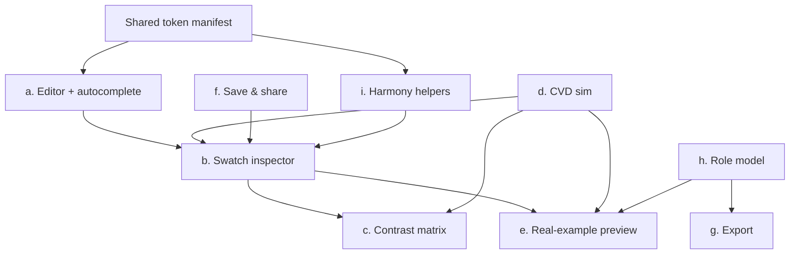

# Feature Specs

Per-feature detailed specs for the unified Chromatics product (the [[Unified Product Plan]] decomposed into buildable units). Each feature lists **Description, Behavior, UI, Data, Acceptance, Priority,** and the **Source** it is adapted from. See [[Product Architecture]] for how these slot together, [[Roadmap]] for sequencing, [[DSL Spec]] for the language surface, and [[Accessibility]] for the contrast/CVD substrate.

> [!note] How to read priorities
> **P0** = required for the unified product to be coherent and shippable (the working REPL + the analysis surfaces it pivoted away from). **P1** = converts the playground into a usable tool (persistence, export, semantic model). **P2** = differentiation / later polish (harmony helpers, two-way editing). Priorities follow the [[Investigation Report]] recommendation: ship the working DSL, then add export + persistence, then layer model-specific helpers.

> [!warning] Grounding
> Features (a)(b)(h) describe *what exists today* in `color-testing/test-dsl` (verified in `src/lib/dsl/color.ts`, `evaluator.ts`, `+page.svelte`) plus the gaps to close. Features (c)(d)(e) are *ports* of the old static app on `master` (`src/routes/+page.svelte`, `demo/+page.svelte`, `src/lib/oklch.ts`). Features (f)(g)(i) are *unbuilt* — specced from [[DSL Spec]] Phase 4 and the research layer. Where a behavior is undecided, it links [[Open Questions]].

---

## Feature index

| # | Feature | Priority | State today |
|---|---|---|---|
| a | DSL editor with autocomplete / IntelliSense | P0 | Highlight-only; no completions yet |
| b | Live preview of exposed variables (swatch inspector) | P0 | Built (read-only) |
| c | Contrast matrix (fg × bg) | P0 | Built on `master`; needs port |
| d | CVD / vision simulation preview | P1 | Built on `master`; needs port |
| e | Real-example preview (landing + dashboard) | P1 | Built on `master` (3 demos); needs port |
| f | Save & share (URL-hash + localStorage + named) | P1 | Unbuilt |
| g | Export (CSS vars / JSON tokens / Tailwind) | P1 | Unbuilt |
| h | Scheme & semantic-role model | P1 | Heuristic only today |
| i | Harmony / tonal-palette helpers | P2 | Unbuilt |

---

## (a) DSL editor with autocomplete / IntelliSense

> [!info] Description
> A CodeMirror 6 editor for the Chromatics DSL with **syntax highlighting** (exists) plus **completions, hover docs, and signature help** (to build). Completions cover constructors (`HSL`/`RGB`/`OKLCH`/`hex`), global functions, color methods/properties, and **user-defined variables in scope**. This is the [[DSL Spec]] Phase 3 polish; the inline gutter swatches and Lezer grammar are the longer-term part.

**Behavior**

- Editor evaluates on input, debounced **100ms** (`onInput()` in `+page.svelte`), no run hotkey.
- Highlighting today is a hand-written CodeMirror `StreamParser` (`chromaDSL` in `src/lib/dsl/lang.ts`) tokenizing identifiers via an `afterDot` flag and four hardcoded sets: `CONSTRUCTORS {HSL,RGB,OKLCH}`, `BUILTINS {hex,mix,contrast,clamp,abs,min,max,round,floor,ceil}`, `METHODS {lighten,darken,saturate,desaturate,rotate,invert,complement,mix,shift,derive,contrast}`, `PROPERTIES {ok_l,ok_c,ok_h,h,s,l,r,g,b,hex,inGamut,inP3,gamutMapped}`.
- **To build — completion source:** trigger on identifier start and after `.`. Before a `.` → constructors + globals + in-scope user vars (read from the live `EvalResult.variables` map). After `obj.` where `obj` is known to be a `Color` → the method/property set. Hover over any token → its doc card (ranges + one-line description, mirroring the existing API Docs overlay).
- **Single source of truth (decision):** the highlighter and the evaluator currently maintain **two independent, manually-synced token lists** that already drift — some after-dot highlighter branches are effectively dead (return the same tag as the fallback). Both completions *and* highlighting must be driven by **one shared token manifest** consumed by `lang.ts`, the completion source, and the environment builder. See [[DSL Gaps & Bugs]] (token-set drift) and [[Open Questions]].

**UI**

- Left pane of the two-pane REPL. Dark theme, 13px `ui-monospace`, line numbers, bracket matching, active-line highlight, default JS keymap + history (`Editor.svelte`).
- Completion popup: CodeMirror `autocomplete` extension; each entry shows name, kind icon (constructor / fn / method / property / variable), and signature/range hint. Hover tooltip = `hoverTooltip` extension rendering the same doc card.

**Data**

- **Token manifest** (new, shared): `{ constructors, globals, methods, properties }`, each entry `{ name, kind, signature, doc, range? }`. Hover/completion docs come from here.
- **Live scope** for variable completions: the `Map<string, Variable>` from `evaluate(source)`; partition by `value instanceof Color` to tag color vs scalar variables.
- Highlight token colors are already defined (`HighlightStyle` in `lang.ts`): variableName `#c8c8d0`, function `#b4a0e5`, typeName `#e5c07b`, propertyName `#7ec8e3`, number `#d19a66`, string `#98c379`, operator `#8888a0`, comment `#555566` italic.

**Acceptance**

- Typing `OK` suggests `OKLCH`; accepting inserts a call with signature `OKLCH(l, c, h)`.
- After `bg.` (where `bg` is a `Color`), completions list `ok_l … gamutMapped` + the color methods; selecting `lighten` shows `lighten(amount)`.
- A user variable defined on line 1 appears in completions on line 3.
- Adding a new method to `color.ts` makes it appear in *both* highlighting and completions **without** editing a second list (manifest-driven).
- Hovering `OKLCH` shows `OKLCH(l: 0-1, c: 0-0.4, h: 0-360) → Color`.

**Priority: P0** (highlighting exists; completions/hover are the headline editor upgrade).
**Source:** `test-dsl` `Editor.svelte` + `lang.ts` (highlighting, built); [[DSL Spec]] Phase 3 (autocomplete/hover/gutter swatches); `@codemirror/lang-javascript` is installed but unused — a leftover from an earlier approach (treat as dead dep, see [[DSL Gaps & Bugs]]).

---

## (b) Live preview of exposed variables — swatch inspector

> [!info] Description
> The right pane: a read-only **Inspector** that re-evaluates on every (debounced) edit and renders each exposed variable. For colors: a swatch, the **hex**, the **`oklch(…)`** string, **gamut / P3 badges**, and a **"depends on:"** dependency list. For scalars: a VALUES section. This is the live half of the Strudel-REPL model and it **exists today**.

**Behavior**

- `result: EvalResult = evaluate(source)`; `colorVars`/`nonColorVars` are `$derived` by mapping `result.order` → variables and partitioning on `value instanceof Color`.
- Each color renders: swatch (`background-color: c.hex`), `formatValue` (Color→hex), `formatOklch` → `` `oklch(<l 3dp>, <c 4dp>, <h 2dp>)` ``, an **out-of-gamut badge** when not `inGamut` (sRGB `displayable`), a **P3 badge** when `inP3`, and `depends on: a, b` from `Variable.deps`.
- **Dependency tracking** is the project's core novelty and is real: `Scope.currentDeps: Set<string>` records every *user* variable read during an assignment's RHS; snapshotted into `Variable.deps`. See [[DSL Spec]] and [[DSL Implementation Notes]].
- Swatch label auto-contrast: `textColor` = `#1a1a1a` if `ok_l > 0.6` else `#f0f0f0`.
- Errors (parse + per-statement runtime) are collected with line numbers and shown in an error bar — never thrown to the UI.

**UI**

- Sections: color swatches (grid), VALUES (scalars), and a heuristic theme PREVIEW (see (h)). An **API Docs overlay** documents the full surface; an **example selector** loads built-in scripts (`Simple`, `Brand Dark`).
- **To add:** click-to-copy hex/oklch; a "computed vs literal" tag per variable (only literals are safely color-pickable later — prerequisite for two-way editing, see [[Open Questions]]).

**Data**

- `EvalResult = { variables: Map<string,Variable>, errors: {message,line}[], order: string[] }`. `order` preserves first-definition order.
- `Variable = { name, value, deps: string[], line, node }`. The `node` (AST ref) is stored for future source-mapping but **nothing consumes it yet** (the half-built hook for two-way editing).

**Acceptance**

- Defining `brand = hex("#6c5ce7")` shows a swatch, `#6c5ce7`, its `oklch(…)`, and (if applicable) a gamut/P3 badge.
- `fg = OKLCH(1 - bg.ok_l, bg.ok_c / 3, (bg.ok_h + 180) % 360)` shows `depends on: bg`.
- A scalar like `ratio = contrast(fg, bg)` appears under VALUES rounded to 4dp, not as a swatch.
- An out-of-gamut color (e.g. `OKLCH(0.7, 0.35, 30)`) renders the out-of-gamut badge.

**Priority: P0** (built; remaining work is copy-to-clipboard + computed/literal tagging).
**Source:** `test-dsl` `+page.svelte` Inspector + `color.ts` getters (`inGamut`/`inP3`/`gamutMapped`).

---

## (c) Contrast matrix — fg × bg grid

> [!info] Description
> An **N×N grid** of every color against every other: fg DOWN × bg ACROSS, each cell a WCAG verdict (**AA / AAA / Fail**) for the fg-on-bg pair, **alpha-aware**, with a click-through detail dialog. Ported from the old static app (`master:src/routes/+page.svelte`). This is the primary analysis surface the DSL pivoted away from and must merge back. See [[Accessibility]].

**Behavior**

- For each (fg, bg) pair compute `ratio = contrastRatioAlpha(fg, bg, fgAlpha)` and `levels = wcagLevels(ratio)`.
- **Alpha-aware:** if `alpha >= 1` → plain `wcagContrast`; else composite fg-over-bg via culori `blend([bg, {...fg, alpha}], 'normal', 'lrgb')` then contrast vs bg. Driven by a global **fg-opacity slider** (0–100, debounced 150ms).
- **WCAG thresholds (load-bearing):** normal text AAA ≥ 7, AA ≥ 4.5; large text AAA ≥ 4.5, AA ≥ 3.
- Diagonal cells (fg == bg) render a plain swatch, no verdict. Failing cells get a 20px diagonal "dog-ear" notch (`clip-path`) in addition to the badge.
- Clicking a cell opens a **detail dialog** (selection dialog): a big `ratio:1`, Normal/Large badges colored by level (`#22c55e` AAA / `#eab308` AA / `#ef4444` Fail), and a fg-on-bg **preview** stress-testing the pair (9 font weights, 11 font sizes, text styles, buttons, shapes, opacity blocks at 1.0 / 0.65 muted / 0.38 disabled).

**UI**

- Single CSS grid (`width: max-content`), sticky row/col headers, 6px gap between color groups, per-cell mini type/shape specimen (heading / body / caption, line rule, dot / ring / bar).
- Header chrome: scheme select, color count, fg-opacity range with live `%`, vision `<select>` (see (d)).
- Native `<dialog>` (900px) with backdrop.

**Data**

- Flat `colors[]` index space shared by both axes (`groups.flatMap(g => g.colors)`).
- Helpers to reuse from `master:src/lib/oklch.ts`: `contrastRatio`, `contrastRatioAlpha`, `wcagLevels`, `wcagColor`, `fmtOklch`.
- **Input bridge:** DSL output is the live `Color` variables; the old app consumed `ResolvedColorGroup[]`. The exposed DSL colors feed the matrix as one flat group (see [[Product Architecture]] for the adapter).

**Acceptance**

- An M-color scheme renders an M×M grid (diagonal blanked).
- Each non-diagonal cell shows `ratio.toFixed(2)` + Normal-text level; failing pairs show the notch.
- Dragging fg-opacity to 50% recomputes every ratio via alpha compositing and re-badges live.
- Clicking a cell opens the detail dialog with the matching ratio/badges/preview.

**Priority: P0** (the core accessibility tool; already fully built on `master`).
**Source:** `master:src/routes/+page.svelte` (matrix + detail dialog) and `master:src/lib/oklch.ts` (WCAG helpers).

---

## (d) CVD / vision simulation preview

> [!info] Description
> A dropdown that re-renders every swatch (and the matrix / real-example previews) through a **color-vision-deficiency or visual-stress filter** — protanopia, deuteranopia, tritanopia, grayscale, and contrast/brightness/saturation stressors. Ported from `master`. See [[Accessibility]].

**Behavior**

- `simulateVision(color, sim)`: `null` filter → unchanged; else `toOklch(filter(color.culpiOklch))` → new color (preserves name).
- Filters (culori, **intensities load-bearing**): protanopia `filterDeficiencyProt(1)`, deuteranopia `filterDeficiencyDeuter(1)`, tritanopia `filterDeficiencyTrit(1)`, grayscale `filterGrayscale(1)`, low-contrast `filterContrast(0.5)`, high-contrast `filterContrast(1.8)`, low-brightness `filterBrightness(0.5)`, high-saturation `filterSaturate(2)`, low-saturation `filterSaturate(0.3)`.
- When `sim ≠ none`, all rendered colors pass through `simulateVision` before display; contrast math runs on the *simulated* colors.

**UI**

- A `<select>` over `visionSimulations` (10 entries; exact labels, e.g. `Protanopia (no red)`, `Normal vision`). Shared by the inspector, matrix, and real-example previews.

**Data**

- `type VisionSimulation = 'none' | 'protanopia' | 'deuteranopia' | 'tritanopia' | 'grayscale' | 'low-contrast' | 'high-contrast' | 'low-brightness' | 'high-saturation' | 'low-saturation'`.
- `simFilters: Record<VisionSimulation, ((c: Oklch) => Rgb) | null>`.

**Acceptance**

- Selecting Deuteranopia recolors every swatch via `filterDeficiencyDeuter(1)`.
- `none` is an exact passthrough (identity).
- The matrix's verdicts recompute against simulated colors when a sim is active.

> [!tip] Research alignment
> The engine research prescribes Brettel (1997) for *accurate* CVD and Vienot matrices for the fast path, shipping protan+deutan as the 95%+ case. The `master` app uses culori's built-in deficiency filters (Machado/Vienot-style) at full intensity — adequate today; the Brettel upgrade is a [[Color Science & Algorithms]] item.

**Priority: P1** (built on `master`; high value, ports cleanly).
**Source:** `master:src/lib/oklch.ts` `simulateVision` / `visionSimulations` / `simFilters`.

---

## (e) Real-example preview — landing page + dashboard themed by the scheme

> [!info] Description
> Realistic UI mockups (**Landing Page, Dashboard, Blog**) re-themed live by mapping scheme colors onto semantic roles and pushing them through `--*` CSS variables. Ported from `master:src/routes/demo/+page.svelte`. (The old app has **three** demos, not two.)

**Behavior**

- A **role mapper** binds flat `colors[]` indices to roles (see (h)); a `$derived` `vars` string emits `--bg --fg --primary --primary-fg --secondary … --surface --border --op-muted --op-hover …` applied to `.demo`. The entire markup is styled *only* through these vars, so swapping a role re-themes everything live.
- Fallback chain: secondary→primary, tertiary→secondary, accent→primary, surface→bg, border→fg, all `*Fg`→fg.
- Colors emitted via `OKLCH.toCSS()` and passed through `simulateVision` when a vision mode is active.
- A live **audit panel** computes ~21 real-world pairs (Body text, Muted @0.65, Disabled @0.38, Primary btn, Nav active, etc.) with `contrastRatio` / `contrastRatioAlpha`, showing `{fails}/{total} failing`.

**UI**

- Three-pane: left sidebar (scheme / demo / vision selects + 12 role `<select>`s + foreground-opacity sliders), center demo, right collapsible audit panel.
- Demos: **Landing** ("Acme" — nav, hero, 3 feature cards, stats banner, testimonials, CTA, footer); **Dashboard** (sidebar nav, 4 stat cards, recent-orders table, activity feed, bar chart); **Blog** ("The Journal" — article + sidebar, quote, callout, tags, author card).

**Data**

- `interface Roles { bg, fg, primary, secondary, tertiary, accent, surface, border, primaryFg, secondaryFg, tertiaryFg, accentFg }` (each an index into `colors[]`; `-1` = None).
- `opacities = { muted: 0.65, disabled: 0.38, hover: 0.85, active: 0.70 }`.
- Persistence on `master`: per-scheme `sessionStorage` under `demo-roles` / `demo-opacities`. In the unified product this should merge with (f) and persist alongside the script.

**Acceptance**

- Picking a scheme themes all three demos through CSS vars with no per-demo color literals.
- Changing the `primary` role re-tints buttons/cards live.
- The audit panel updates fail count as roles change.
- Vision sim recolors the whole demo.

**Priority: P1** ("does it look good in a real product?" — the payoff view; built on `master`).
**Source:** `master:src/routes/demo/+page.svelte` (3 demos + role mapper + CSS-var bridge + audit). Note the heuristic theme PREVIEW in `test-dsl` is a minimal placeholder for this.

---

## (f) Save & share — URL-hash + localStorage + named schemes

> [!info] Description
> Persist and share a script. **Unbuilt** — the Strudel-like REPL currently cannot save or share. This is [[DSL Spec]] Phase 4 ("encode script in URL hash"). See [[Open Questions]] (no persistence today).

**Behavior**

- **URL hash:** encode the full source into `location.hash` (compress, e.g. base64/LZ); on load, hydrate `source` from the hash. Editing updates the hash (debounced) so the URL is always shareable.
- **localStorage:** autosave the current draft so a reload restores work.
- **Named schemes:** save the current source under a name into a local library; list / load / rename / delete. Built-in examples (`Simple`, `Brand Dark`) become read-only library entries.

**UI**

- Toolbar: "Share" (copies URL to clipboard), "Save as…" (name prompt), and a scheme-library dropdown alongside the existing example selector.

**Data**

- `localStorage` key e.g. `chromatics:schemes` → `{ [name]: { source, savedAt } }`, plus `chromatics:draft` for the live autosave. Hash payload = compressed `source` string (single source of truth — everything derives from the text, per [[DSL Spec]]).

**Acceptance**

- Editing the script changes the URL; opening that URL elsewhere restores the exact script.
- Reloading the page restores the last draft from localStorage.
- A saved named scheme reappears in the library after reload.

**Priority: P1** (cheap, high-leverage; makes the REPL actually usable/shareable).
**Source:** [[DSL Spec]] Phase 4 (URL-hash share); per-scheme `sessionStorage` precedent in `master:demo/+page.svelte`.

---

## (g) Export — CSS variables, JSON design tokens, Tailwind config

> [!info] Description
> Emit the exposed variables as **CSS custom properties**, a **JSON design-token** file, and a **Tailwind config** fragment. **Unbuilt** — this is the bridge from playground to design-system tool and the wiring into the "Dynamic Theme" use case. [[DSL Spec]] Phase 4; strongly justified by the research layer.

**Behavior**

- Operate over the exposed (named, top-level) DSL variables that resolve to `Color`. Scalars may be excluded or emitted as raw values.
- **CSS:** `:root { --<name>: <oklch() or hex>; … }`; offer oklch() (modern) vs hex (legacy) output, and an optional gamut-mapped variant (see (h)/clamping).
- **JSON tokens:** W3C-ish design-token shape, e.g. `{ "<name>": { "$type": "color", "$value": "#…" } }`; preserve dependency provenance as metadata where useful.
- **Tailwind:** `theme.extend.colors` map keyed by variable name.

**UI**

- Toolbar "Export" → dialog with format tabs (CSS / JSON / Tailwind), a syntax-highlighted preview, and copy / download. Mirrors the old app's "Copy Markdown" affordance (which can be retained as a 4th format).

**Data**

- Source = the live `EvalResult.variables` filtered to `Color`. Format functions reuse `Color.hex` and a `formatOklch`-style emitter; CSS-string output mirrors `OKLCH.toCSS()` from `master`.

**Acceptance**

- Exporting a 5-color scheme yields valid `:root{…}` CSS that pastes into a stylesheet and reproduces the swatches.
- The JSON export validates as design tokens and round-trips names.
- The Tailwind export drops into `tailwind.config` `extend.colors`.

**Priority: P1** (the adoption bridge; what makes relationship-graph output reusable).
**Source:** [[DSL Spec]] Phase 4 export targets; markdown-table export precedent in `master:src/routes/+page.svelte` (`markdownTable` / `copyMarkdown`).

---

## (h) Scheme & semantic-role model (bg / fg / primary / …)

> [!info] Description
> A real **semantic-role mapping** from exposed colors to roles (bg, fg, primary, secondary, tertiary, accent, surface, border, + their `*Fg` pairs), replacing the brittle name-substring heuristic. This model feeds the real-example preview (e), export (g), and the audit. See [[Product Architecture]].

**Behavior**

- **Today (heuristic, brittle):** the `test-dsl` PREVIEW guesses roles by name substring — `bg` ← `includes('bg')`/`background`; `fg` ← `includes('fg')`/`foreground`/`muted`; `primary` ← name `=== 'primary'`/`'accent'`. Renders only if ≥2 colors and both bg+fg found. The `master` demo uses a similar `autoAssign`. Both are documented foot-guns (see [[DSL Gaps & Bugs]] / [[Open Questions]]).
- **Target:** explicit role assignment (the `Roles` interface from (e)) with `autoAssign` as a *first guess* the user can override via the role `<select>`s; `-1` = None for optional roles; sensible fallbacks (secondary→primary, etc.).
- **Optional DSL-level roles:** allow the script to declare roles directly (e.g. a `role:` annotation or reserved variable names) so a scheme carries its own semantics rather than relying on UI mapping. **Undecided** — see [[Open Questions]].

**UI**

- 12 role rows (swatch + `<select>` over all exposed colors), persisted with the scheme (merge with (f)).

**Data**

- `Roles` (12 numeric indices, `-1` = None) + `opacities { muted, disabled, hover, active }`. The `--*` CSS-var bridge is the consumer.

**Acceptance**

- A scheme with sensibly-named colors auto-assigns roles correctly; any role can be manually overridden.
- Role assignments persist across reload and drive (e) and (g) consistently.
- Removing the name-substring guessing does not break a scheme that uses explicit assignment.

**Priority: P1** (the heuristic exists; the real model unblocks (e)/(g) and removes a known foot-gun).
**Source:** `test-dsl` heuristic PREVIEW (`+page.svelte`) + `master:demo/+page.svelte` `Roles`/`autoAssign`; the seed pattern is `master:src/lib/schemes/brand-dark.ts` (bg ramp / core / semantic / harmony groups).

> [!note] Gamut handling belongs here
> Today `lighten/darken/saturate/desaturate` do **not** clamp `ok_l`/`ok_c`, so values can run <0 or >1; out-of-gamut is only *badged*, never corrected unless `.gamutMapped` is read. The research prescribes CSS Color 4 binary-chroma gamut mapping as the default — already available via culori `clampChroma`. The role/export layer should offer a "gamut-mapped" toggle. See [[Color Science & Algorithms]] and [[DSL Gaps & Bugs]].

---

## (i) Harmony / tonal-palette helpers (later)

> [!info] Description
> Higher-level generators: harmony sets (complementary, split-comp, analogous, triadic, tetradic, square) and **tonal-palette / ramp** helpers (tint/shade/tone, Tailwind 50–950 L-scale, Material **HCT** tonal palette). **Unbuilt.** These are the model-specific methods the encyclopedia specs — the genuine differentiator layered *on top of* culori, not a converter rewrite. See [[Color Knowledge Hub]] and [[Color Science & Algorithms]].

**Behavior**

- Harmony = **hue rotations in a perceptually uniform space** (never HSL): complementary +180, split-comp +150/+210, analogous ±30 (extend ±60), triadic +120/+240, tetradic +60/+180/+240, square +90/+180/+270. The DSL already exposes `rotate(deg)` / `complement()`; harmony helpers would return *sets* (which the line-by-line model needs a way to bind — open).
- Tonal palette: a Tailwind 50–950 OKLCH L-scale and a Material HCT 13-tone generator.
- **Constraint (line-by-line model):** the DSL today is one-assignment-per-line with a flat scope. A helper returning multiple colors (e.g. `triad(primary)`) needs either array support (not yet in the evaluator — no `ArrayExpression`) or N named outputs. **Design open** — see [[DSL Gaps & Bugs]] and [[Open Questions]].

**UI**

- Exposed as DSL functions/methods + inspector grouping; possibly a "generate palette" affordance that inserts the helper call.

**Data**

- New global/method functions added to the **shared token manifest** (a) so highlighting + completions pick them up automatically. Built on culori (rotation, `clampChroma`) plus HCT (a Critical-tier [[Color Models]] entry, **not yet implemented** — see [[Open Questions]]).

**Acceptance**

- `complement()` / `rotate(120)` produce perceptually-correct hues in OKLCH (works today).
- A tonal-palette helper yields a 50–950 ramp with monotonic lightness.

**Priority: P2** (differentiation; deliberately deferred per the [[Investigation Report]]).
**Source:** engine research harmony/ramp recommendations; encyclopedia `## Chromatics API` blocks (`analogous`/`triadic`/`tetradic`, `tonalPalette`); existing `rotate`/`complement` in `color.ts`.

---

## Dependencies between features

> [!decision] Build order (see [[Roadmap]])
> 1. **P0 foundation:** finish (a) autocomplete behind a shared manifest; keep (b) as-is + copy/clipboard; **port (c)** matrix.
> 2. **P1 tool:** (f) save/share, (g) export, (h) real role model — these turn it into a usable design-system tool; **port (d)/(e)** alongside.
> 3. **P2 differentiation:** (i) harmony/tonal helpers as model-specific methods on top of culori.

## Related notes

[[Unified Product Plan]] · [[Product Architecture]] · [[Roadmap]] · [[DSL Spec]] · [[DSL Implementation Notes]] · [[DSL Gaps & Bugs]] · [[Accessibility]] · [[Color Science & Algorithms]] · [[Color Models]] · [[Color Knowledge Hub]] · [[Open Questions]] · [[Investigation Report]]
