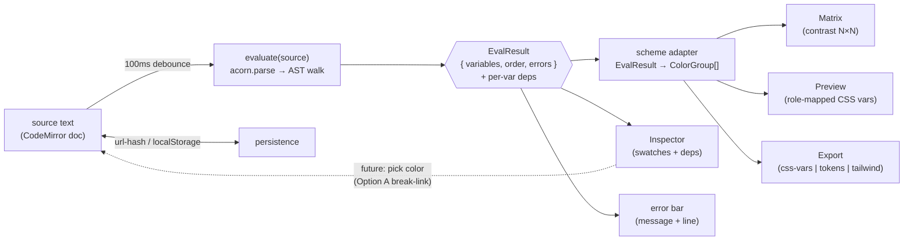
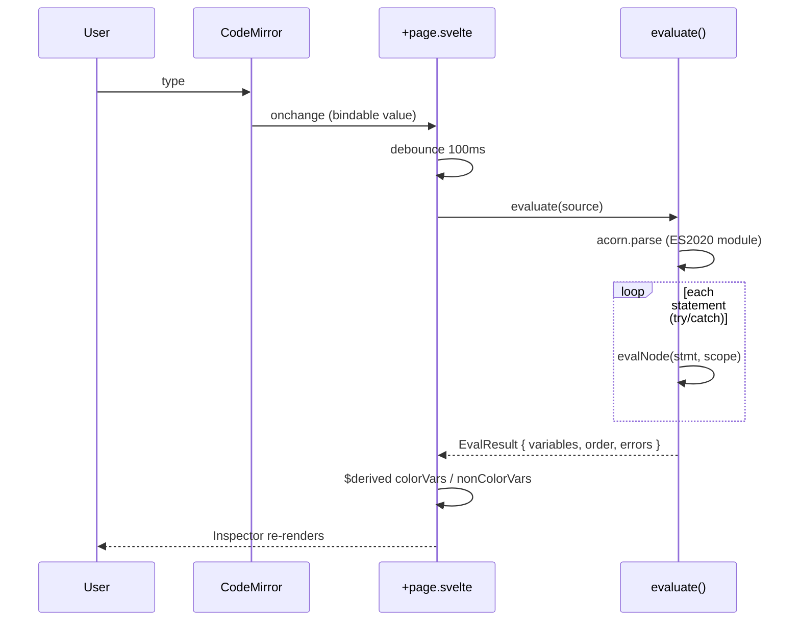
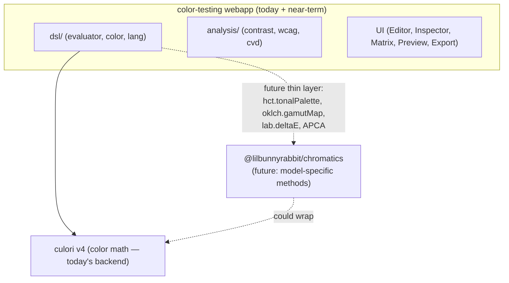

# Product Architecture

How the unified Chromatics app is built — the stack, a proposed module layout, the evaluate-driven data flow, and where the future `chromatics` package slots in. Reads from the working `test-dsl` branch of `color-testing` and the master analysis app. For *what to build* see [[Unified Product Plan]] and [[Feature Specs]]; for *why these choices* see [[Architecture Decisions]]; for DSL internals see [[DSL Implementation Notes]].

> [!note] Grounding
> Everything marked "today" is verified in `color-testing/test-dsl` (checked out). Everything marked "proposed" is a layout recommendation, not yet built. The merge target is: the working DSL REPL (`test-dsl`) + the analysis surfaces (contrast matrix, role-mapped previews, audit) from `master`. See [[Status & Inventory]].

---

## Stack (today)

| Layer | Choice | Evidence |
|---|---|---|
| Framework | SvelteKit 2, **Svelte 5 runes** (`$state`/`$derived`/`$effect`/`$bindable`) | `src/routes/+page.svelte`, `Editor.svelte` |
| Styling | Tailwind CSS v4 (`@import 'tailwindcss'`) | `+layout.svelte` |
| Editor | **CodeMirror 6** — `StreamLanguage` parser today, Lezer grammar later | `Editor.svelte`, `src/lib/dsl/lang.ts` |
| Parser | **acorn** v8.16 (ES2020 module, `locations:true`) → ESTree AST, walked by a controlled interpreter | `evaluator.ts:265` |
| Color math | **culori** v4.0.2 (convert, `formatHex`, `clampChroma`, `wcagContrast`, `displayable`, `inGamut`, `parse`) | `color.ts` |
| Build/deploy | Vite + Bun, `adapter-static`, GitHub Pages | `package.json`, master deploy |

> [!decision] Wrap culori, don't reimplement
> The DSL is the novel contribution; the conversion math is not. The shipped code wraps culori and never touches the from-scratch `chromatics` engine. This honors the 2026 planning note. See [[Build vs Buy]] and [[Architecture Decisions]].

---

## Proposed module layout

The `test-dsl` branch ships a flat `src/lib/dsl/` (`lang.ts`, `evaluator.ts`, `color.ts`) plus `Editor.svelte` and `+page.svelte`. To absorb the master analysis app and the spec's Phase-4 features, factor into domain folders:

```
src/lib/
├── dsl/
│   ├── lang.ts          # CodeMirror StreamLanguage (→ Lezer later)
│   ├── evaluator.ts     # acorn parse + AST walker + Scope + dep tracking
│   ├── color.ts         # unified immutable Color (OKLCH-canonical, culori-backed)
│   └── token-manifest.ts # NEW: single source of CONSTRUCTORS/BUILTINS/METHODS/PROPERTIES
├── analysis/
│   ├── contrast.ts      # contrastRatio, contrastRatioAlpha (alpha-composited)
│   ├── wcag.ts          # wcagLevels (AAA≥7/AA≥4.5 normal; ≥4.5/≥3 large), wcagColor
│   └── cvd.ts           # simulateVision + visionSimulations (Brettel/culori filters)
├── scheme/
│   ├── model.ts         # Scheme / ColorGroup / ColorInput (ported from master oklch.ts)
│   └── adapter.ts       # DSL EvalResult → ColorGroup[] (the bridge)
├── export/
│   ├── css-vars.ts      # --token: oklch(...) bundle
│   ├── tokens.ts        # JSON design tokens
│   └── tailwind.ts      # tailwind.config color block
├── persistence/
│   ├── url-hash.ts      # encode/decode script in location.hash (share)
│   └── local-storage.ts # autosave + roles/opacities per scheme
└── (UI components, below)
```

> [!tip] token-manifest as the single source of truth
> Today `lang.ts` and `evaluator.ts`/`color.ts` maintain **two independent, manually-synced** token sets that already drift — some after-dot highlighter branches are dead. Extract `CONSTRUCTORS` (`HSL`/`RGB`/`OKLCH`/`hex`), `BUILTINS` (`mix`/`contrast`/`clamp`/`abs`/`min`/`max`/`round`/`floor`/`ceil`), `METHODS`, `PROPERTIES` into one manifest imported by the highlighter, the environment builder, and a future autocomplete extension. This kills the drift. See [[DSL Gaps & Bugs]].

### UI components

| Component | Role | Source |
|---|---|---|
| `Editor` | CodeMirror 6 host — lineNumbers, history, bracketMatching, `chromaDSL` highlighter, dark theme; writes back to `$bindable` value | `Editor.svelte` (exists) |
| `Inspector` | Live swatches: hex + `oklch(l,c,h)` + out-of-gamut badge + `depends on:` list; VALUES for non-color vars | `+page.svelte` (exists, inline) |
| `Matrix` | N×N contrast matrix, per-cell type specimen, WCAG badge, fail "dog-ear", opacity slider, vision sim, detail/info dialogs | port from `master:+page.svelte` |
| `Preview` | Role-mapped realistic templates (Landing/Dashboard/Blog) themed purely via `--*` CSS vars | port from `master:demo/+page.svelte` |
| `ExportPanel` | CSS vars / JSON tokens / Tailwind emit + copy | new (Phase 4) |

The current heuristic name-based PREVIEW (`name.includes('bg')`) is a placeholder for the master app's explicit **role mapper** (`autoAssign` + 12 role `<select>`s) — replace it. See [[Feature Specs]].

---

## Data flow

Text is the single source of truth; everything derives from re-parse → re-evaluate.



`evaluate()` returns `{ variables: Map<string,Variable>, errors: EvalError[], order: string[] }` (`evaluator.ts:23-27`). Each `Variable` carries `{ name, value, deps, line, node }` — `deps` is the live dependency edge set (`evaluator.ts:10-16`), `node` is the AST source-map anchor for future two-way editing (currently stored, **unconsumed**).

### Dependency tracking (the spine)

`Scope.get(name)` records reads into `currentDeps` only for user variables (`evaluator.ts:95-107`); `AssignmentExpression` resets `currentDeps`, evaluates the RHS, then snapshots `deps` (`evaluator.ts:240-244`). This is the project's one genuinely novel, *built* feature — color schemes as reactive dependency graphs. See [[DSL Spec]].

### The scheme adapter (the missing bridge)

`EvalResult` → `ColorGroup[]` is the seam that lets one evaluated script feed the matrix, preview, and export. The master app's `resolveColor` already accepts an `OKLCH`, a CSS string, or a `[name, css]` tuple — a convenient target. Today no adapter exists; the Inspector reads `EvalResult` directly. Defining `scheme/adapter.ts` is what unifies the two apps. See [[Product Architecture]] ↔ [[Unified Product Plan]].

---

## Evaluation pipeline (detail)



Statement-level `try/catch` (`evaluator.ts:280-291`) means one bad line never kills the rest — errors collect with line numbers for the error bar. Supported AST nodes only (`evaluator.ts:118-254`); anything else throws `Unsupported syntax: <type>`.

> [!warning] Known structural gaps to carry into the layout
> - `shift()`/`derive()` take object literals but the evaluator has **no `ObjectExpression` case** → they throw from any script. Fix needs a whitelisted-key `ObjectExpression` case.
> - No clamping on `lighten`/`darken`/`saturate`/`desaturate`; out-of-gamut is only badged. Apply CSS Color 4 gamut mapping (`clampChroma`) in `color.ts`.
> - `==`/`===` both compile to JS `===` → Colors compare by reference.
>
> Full list in [[DSL Gaps & Bugs]].

---

## Build & deploy

- **Build**: Vite + Bun, SvelteKit `adapter-static` → fully prerendered static output.
- **Deploy**: GitHub Pages (as the master app does today). No server, no runtime backend — the entire app is the editor + evaluator + culori in the browser.
- **Implication**: persistence must be client-side — URL-hash for sharing, `localStorage`/`sessionStorage` for autosave + per-scheme role/opacity state (the master `demo` route already uses `sessionStorage` keys `demo-roles`/`demo-opacities`).

---

## Where the `chromatics` package slots in



The published `@lilbunnyrabbit/chromatics` package is **not** the conversion backend (that stays culori — re-deriving converters is the rejected 6–12-month path). Its role is a **thin layer of model-specific utility methods** culori doesn't expose well — added on top of culori only as the DSL surface demands them. The `Color` class in `color.ts` is the stable seam: its public API (`ok_l`/`ok_c`/`ok_h`, `lighten`/`mix`/`contrast`, `gamutMapped`) can be re-backed without touching the evaluator or UI. End-state per [[Build vs Buy]]: chromatics = published library, color-testing = the REPL webapp consuming it — but only once chromatics exposes an API the app needs.

---

## Related

[[Unified Product Plan]] · [[Feature Specs]] · [[DSL Implementation Notes]] · [[DSL Spec]] · [[DSL Gaps & Bugs]] · [[Architecture Decisions]] · [[Build vs Buy]] · [[Status & Inventory]] · [[Open Questions]] · [[Roadmap]]
