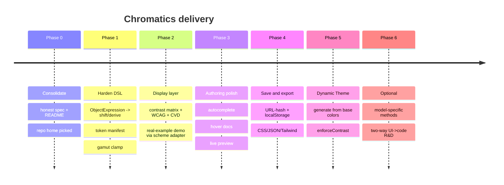

# Roadmap

What this note is: the phased, sequenced delivery plan for Chromatics, with explicit **acceptance gates** per phase. It operationalizes [[Investigation Report]]'s `recommendation` into a build order. The grounding decision is fixed: **ship the DSL you already have, from `color-testing/test-dsl`, on top of culori — and stop treating the from-scratch chromatics engine as a blocker.** See [[Unified Product Plan]] for the product vision this sequences, [[Decision Log]] for the choices baked in, and [[DSL Gaps & Bugs]] for the verified defects Phases 0–1 close.

> [!decision] Sequencing principle
> Each phase ends with a concrete, runnable **acceptance gate** — not a vibe. Don't start phase N+1 until phase N's gate passes. The order front-loads *honesty* (fix the lying spec/README) and *correctness* (the dead `shift`/`derive`, gamut clamping), then *capability* (display layer, export, persistence), then *differentiation* (dynamic theme, two-way editing).

---

## At a glance

| Phase | Name | Goal | Acceptance gate |
|---|---|---|---|
| **0** | Consolidate | Make the artifacts honest; pick a home | Spec + README + repo-home decision all match the shipped code |
| **1** | Harden the DSL | Close verified correctness gaps | `shift({h:30})` runs; one token manifest; no out-of-gamut color renders unclamped |
| **2** | Merge the display layer | Port contrast matrix + WCAG + CVD + real-example demo | **Rebuild `brand-dark` as a DSL script and render its full N×N contrast matrix** |
| **3** | Authoring polish | Autocomplete, hover docs, live-preview refinement | Type `bg.` → completion list from the manifest; hover a method → its doc |
| **4** | Save & export | URL-hash + localStorage; export CSS / JSON / Tailwind | Reload restores the script; export produces valid `:root{--…}` |
| **5** | Dynamic Theme | Generate a full accessible theme from base colors | `enforceContrast` raises every body/UI pair to AA or reports why not |
| **6** | *(optional)* | Model-specific methods; two-way UI→code R&D | Edit a literal swatch in the UI → source updates with break-link warning |

---

## Phase 0 — Consolidate

> [!note] Goal
> Stop the artifacts from contradicting each other. Today the README markets the *old* static app, `DSL.md` is self-contradictory, and the code already settled questions the spec left open. Make the spec/docs *trail the code* (the code is the source of truth), and decide where the project lives.

**Key tasks**

- **Fix the stale README.** It currently documents only the pre-pivot contrast-matrix app (schemes/, CVD, markdown export) and says nothing about the DSL. Rewrite it to describe the Chromatics DSL REPL.
- **Correct `DSL.md`** (`chromatics` branch `tmp`) to match the shipped code:
  - OKLCH channels are `ok_l`/`ok_c`/`ok_h`; HSL is `h`/`s`/`l`. Delete the conflicting `bg.l`-for-OKLCH example forms. (Code already does this — `color.ts` getters.)
  - Ternary + comparison nodes **are** implemented — remove the spec's claim that the evaluator omits them.
  - Change the "no object/array literals" rule to **"object literals allowed only as call arguments"** (unblocks Phase 1's `shift`/`derive` fix).
- **Pick the repo home.** Per [[Decision Log]] / [[Open Questions]]: operationally **stay in `color-testing/test-dsl`** (where the only working DSL lives); end-state is the split in option C (chromatics = published library, color-testing = the REPL webapp consuming it). Record the decision; don't act on the migration yet.

> [!tip] Acceptance gate
> A reader of the README, `DSL.md`, and `color.ts` finds **no contradiction** on: channel naming, which AST nodes are supported, and object-literal rules. The repo-home decision is written into [[Decision Log]].

Related: [[DSL Spec]], [[DSL Implementation Notes]], [[Status & Inventory]].

---

## Phase 1 — Harden the DSL

> [!warning] Goal
> Close the *verified* correctness gaps in the running code. These are confirmed defects, not speculation — see [[DSL Gaps & Bugs]].

**Key tasks**

1. **Add `ObjectExpression` → revive `shift`/`derive`.** `color.ts` defines `shift({l,c,h})` and `derive({l,c,h})`, but `evaluator.ts` has **no `ObjectExpression` case**, so `shift({h:30})` throws `Unsupported syntax: ObjectExpression`. Both methods are currently **dead from the DSL surface** despite being in the API Docs and highlighter. Add a minimal `ObjectExpression` handler restricted to **identifier keys** and primitive/expression values (whitelist `{l, c, h}`). This also unblocks future named-options APIs.
2. **Unify the token set behind one manifest.** `lang.ts` (CodeMirror `StreamParser`) and `evaluator.ts`/`color.ts` maintain **two independent, hand-synced** sets of `CONSTRUCTORS`/`BUILTINS`/`METHODS`/`PROPERTIES`. They already drift, and the after-dot `METHODS`/`PROPERTIES` highlighter branches are effectively **dead** (return the same tag as the fallback). Extract one exported manifest both `lang.ts` and the environment builder import. (Defer the Lezer-grammar migration to Phase 3.)
3. **Apply gamut clamping.** `lighten`/`darken`/`saturate`/`desaturate` don't clamp `ok_l`/`ok_c`, so values run `<0` or `>1`; out-of-gamut is only *badged*, never corrected. Apply CSS Color 4 binary-search gamut mapping — already prescribed in the engine research and already available as **`culori clampChroma`** — when rendering, instead of (or alongside) the badge.

> [!tip] Acceptance gate
> - `shift({h: 30})` and `derive({l: 0.2})` evaluate to a `Color` (no `Unsupported syntax` error).
> - Adding a new builtin requires editing **one** file (the manifest).
> - A deliberately out-of-gamut script (e.g. `OKLCH(0.5, 0.9, 30)`) renders a clamped, displayable swatch.

Related: [[DSL Gaps & Bugs]], [[Color Science & Algorithms]] (gamut mapping), [[Open Questions]].

---

## Phase 2 — Merge the display layer

> [!note] Goal
> Bring the *analysis* half of the old static app into the REPL, so a DSL-authored scheme can be stress-tested for contrast/accessibility immediately. The bridge is a **scheme adapter**: the DSL emits `Color`s; the old display surfaces consume `OKLCH` + `ColorGroup[]`. `resolveGroups` already accepts `OKLCH`, plain CSS strings, or `[name, css]` tuples — a convenient adapter target.

**Key tasks**

- **Port the contrast matrix** (`master:src/routes/+page.svelte`): N×N fg×bg grid, per-cell type/shape specimen, WCAG `AAA/AA/Fail` badge, fail "dog-ear" notch, fg-opacity slider (alpha-composited contrast via `contrastRatioAlpha`), detail + scheme-info dialogs.
- **Port WCAG + CVD** (`master:src/lib/oklch.ts`): `contrastRatio`, `contrastRatioAlpha`, `wcagLevels` (thresholds: normal AAA≥7/AA≥4.5; large AAA≥4.5/AA≥3), `wcagColor`, the 10-mode `simulateVision` / `visionSimulations` set, `fmtOklch`.
- **Port the real-example demo** (`master:src/routes/demo/+page.svelte`): Landing / Dashboard / Blog templated purely through `--*` CSS vars + the role mapper + the live audit panel (~21 real-world pairs).
- **Build the scheme adapter**: map DSL `order`/`variables` → `ColorGroup[]` so all three surfaces work on DSL output unchanged.

> [!decision] Acceptance gate (the load-bearing one)
> **Rebuild `brand-dark` as a DSL script and render its full contrast matrix.** This is the project's long-stated Phase-1 success test, made concrete here. The setup is favorable: the original `brand-dark.ts` is **preserved on color-testing/`master`** (a 224-line OKLCH TS scheme) and was only removed on `test-dsl` — so "rebuild" means *re-derive its relationships as DSL formulas* (background seed → foreground inverse → primary → semantic/triad/hue groups), feed the result through the scheme adapter, and confirm the matrix + audit render every group — ideally **diffing the DSL output against `master`'s** to prove fidelity. Passing this proves the DSL, the adapter, and the display layer all compose.

Related: [[Accessibility]], [[Feature Specs]], [[Product Architecture]], `old/` scheme harvest.

---

## Phase 3 — Authoring polish

> [!note] Goal
> Make the editor feel like a real authoring environment, not a highlight-only textarea.

**Key tasks**

- **Autocomplete** driven by the Phase-1 manifest (constructors, builtins; after-dot → methods/properties when the receiver is a `Color`).
- **Hover docs** — surface the API Docs overlay content inline as CodeMirror hover tooltips, keyed off the same manifest.
- **Live-preview refinements** — replace the brittle name-substring `PREVIEW` heuristic (`name.includes('bg')`, `'muted'` treated as fg) with an explicit role mapping (reuse the demo's `Roles` mechanism from Phase 2).
- *(Optional within phase)* migrate the hand-written `StreamParser` to a **Lezer grammar** + inline gutter swatches, driven by the same manifest. This is the spec's stated Phase-3 plan; defer if it threatens momentum.

> [!tip] Acceptance gate
> Typing `bg.` produces a completion list sourced from the manifest; hovering a method name shows its documented signature. The theme preview maps roles explicitly, not by name-substring guessing.

Related: [[DSL Implementation Notes]], [[Feature Specs]].

---

## Phase 4 — Save & export

> [!note] Goal
> Convert the playground into a tool: the relationship-graph output must be **shareable** and **consumable** by the dual developer+designer audience. The research most strongly justifies these two features as the bridge to real design-system adoption.

**Key tasks**

- **Persistence**: encode the script in the **URL hash** (Strudel-style share links) + **localStorage** autosave/restore.
- **Export**: emit **CSS custom properties** (`:root { --bg: oklch(…); … }`), **JSON design tokens**, and **Tailwind config**. Reuse the role/name mapping from Phases 2–3.
- *(Stretch)* import from existing CSS variables (round-trips with export).

> [!tip] Acceptance gate
> Reloading the page (or opening a shared URL) restores the exact script and inspector state; "Export CSS" produces a valid, paste-ready `:root{ --… }` block whose values match the inspector swatches.

Related: [[Unified Product Plan]], [[Feature Specs]], [[Open Questions]].

---

## Phase 5 — Dynamic Theme

> [!note] Goal
> Realize the richly-researched but un-coded "Dynamic Theme" capability: generate a **full, accessible, harmonious theme** from one or a few base colors via OKLCH math, with `enforceContrast` baked in.

**Key tasks**

- A theme generator that, from a base color (or few), derives the full role set (bg/fg/primary/secondary/accent, semantic success/warning/error/info, surface/border, background scales) using the OKLCH relationship patterns already proven in the `brand-dark` rebuild.
- **`enforceContrast`**: post-process derived pairs so body/UI text meets at least AA, nudging `ok_l` until the WCAG ratio clears the threshold (or reporting which pair can't and why).
- Wire generation output through the Phase-2 display layer and Phase-4 export.

> [!tip] Acceptance gate
> Feeding a single base color yields a complete theme in which **every** body-text and primary-UI pair from the audit panel reaches AA (or the panel explains the unavoidable failures). Export produces a usable token set.

Related: [[Accessibility]], [[Color Science & Algorithms]], [[Unified Product Plan]].

---

## Phase 6 — Optional / R&D

> [!warning] Goal
> The two genuinely hard, genuinely differentiating directions. Both are *vision, not yet designed* — scope them deliberately, don't assume them.

**Key tasks**

- **Model-specific chromatics methods** — add a thin layer on top of culori for the utilities culori doesn't expose well: `hct.tonalPalette`, `oklch.gamutMap`, `lab.deltaE`, APCA contrast, Brettel CVD. This is the encyclopedia's genuine differentiator and requires **re-deriving zero converters**. (See [[Build vs Buy]] / [[Architecture Decisions]]: do *not* let the from-scratch engine rewrite block this.)
- **Two-way UI→code editing R&D** — the headline differentiator everywhere in the planning/spec, with **zero supporting algorithm design and zero code** today. Source-mapping is half-present (`Variable` carries its AST `node`) but nothing consumes it. **Start with the spec's Option A: break-link-and-warn** — editing a *literal* swatch in the UI replaces its expression with a literal and shows "This will break the link to `bg`." Defer Option C (formula + picker side-by-side); skip Option B (inverse-solve) entirely.
  - **Superseded — see [[#CD-15 — Visual ↔ code round-trip]].** The "break-link-and-warn" start is replaced by **span-preserving in-place rewrite**: edit the authored literal/arg rather than flattening the expression, so relationships survive. Feasible now because the source-mapping it depends on is no longer half-present.

> [!tip] Acceptance gate
> Picking a new color on a swatch backed by a **literal** rewrites that line's source to the new literal and surfaces a break-link warning; computed (formula-backed) swatches remain read-only until a later phase.

> [!info] Depth for the niche (proposed ADRs)
> Beyond two-way editing, the post-MVP "depth" directions now have recorded decisions in the [[Decision Log]], all resting on one shared foundation: **[[#CD-12 — Shared spine: pure scheme derivation + a validated source-rewrite layer]]** (build first) → **[[#CD-13 — Design-system mode as a first-class flow]]** (roles → light/dark → components → tokens) · **[[#CD-14 — Scheme diff & versioning]]** (snapshot, diff, shareable/embeddable) · **[[#CD-15 — Visual ↔ code round-trip]]**.

Related: [[Open Questions]], [[Architecture Decisions]], [[Build vs Buy]], [[Decision Log]].

---

## Out of scope (parked, with rationale)

> [!note] Not on this roadmap — and why
> - **Migrating the DSL onto the from-scratch chromatics engine.** The active `tmp` branch wires only sRGB↔sRGB8 (plus a latent `get()` bug). Re-deriving culori's conversion math is the rejected 6–12-month path. Treat the engine as an *optional learning track*, per the planning note's "do it when you want to, not because you have to." See [[Build vs Buy]].
> - **The 102-model/system encyclopedic engine.** Valuable as a reference layer ([[Color Knowledge Hub]]); not a delivery dependency.
> - **Absolute "No AI" positioning.** A pre-pivot artifact; the live differentiator is "relationships as code," not the No-AI stance. See [[Open Questions]].

---

## See also

[[Unified Product Plan]] · [[Feature Specs]] · [[Product Architecture]] · [[Decision Log]] · [[Open Questions]] · [[DSL Gaps & Bugs]] · [[DSL Spec]] · [[Status & Inventory]] · [[Investigation Report]]
