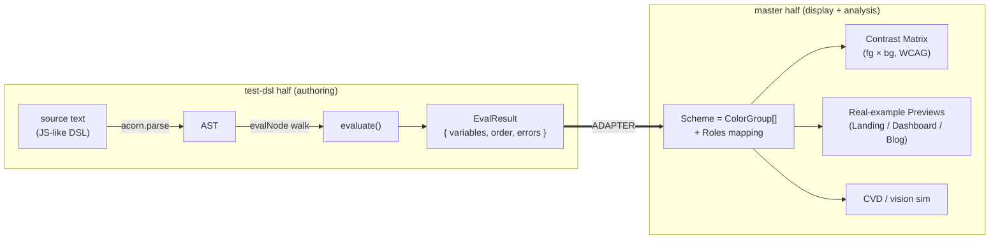
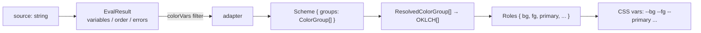

# Unified Product Plan

> What this note is: the plan for the latest idea — **one** web app that joins `color-testing/master` (the display + analysis surfaces) with `color-testing/test-dsl` (the DSL authoring REPL) into a single relationship-first color tool. This is the centerpiece [[Vision]] made concrete and buildable, against real identifiers in both branches.

See also: [[Feature Specs]] · [[Product Architecture]] · [[Roadmap]] · [[DSL Spec]] · [[DSL Implementation Notes]] · [[Accessibility]] · [[Open Questions]] · [[Status & Inventory]].

---

## 1. Product concept (one paragraph)

You **author a color scheme as DSL code** in a CodeMirror editor with syntax highlighting (and, planned, autocomplete + inline swatches), watching a **live inspector** redraw every exposed variable as a swatch — hex, `oklch(...)`, out-of-gamut badge, and its `depends on:` list — as you type. You **save/share** that scheme (URL-hash encode + `localStorage`), and you **inspect** it through a full analysis surface ported from the old app: an fg × bg **contrast matrix** with per-cell WCAG badges, a **CVD preview** (protan/deuter/tritan + brightness/contrast/saturation filters), and **real-example previews** — a landing page and a dashboard themed live by the scheme. The single thesis tying it together (from [[Vision]]): a scheme is an executable **dependency graph** of color relationships, not a static 5-swatch palette — change one base color and everything downstream cascades, then gets audited for accessibility on real UI.

> [!note] Two real codebases, one product
> Both halves already exist and ship today as separate apps on separate branches of the **same repo** (`color-testing`). This plan does not invent a new engine — it **wires the working DSL output into the working analysis surfaces**. The only genuinely new code is the *adapter* in §2 plus persistence/export.

---

## 2. The two halves & the merge seam



### 2a. The authoring half — `color-testing/test-dsl`

The DSL is a **sandboxed JavaScript subset**, not a bespoke grammar. `evaluate(source)` (`src/lib/dsl/evaluator.ts:258`) calls `acorn.parse(source, { ecmaVersion: 2020, sourceType: 'module', locations: true })`, then walks the ESTree AST with `evalNode` over a restricted node set (Literal, Identifier, Unary/Binary/Logical/Conditional, Member, Call, Assignment, ExpressionStatement); anything else throws `Unsupported syntax: <type>`. Each top-level statement runs in its own try/catch so one error doesn't kill the rest. Output:

```ts
interface EvalResult {
  variables: Map<string, Variable>; // { name, value, deps, line, node }
  errors: EvalError[];              // { message, line }
  order: string[];                  // first-definition order
}
```

The first-class domain value is `Color` (`src/lib/dsl/color.ts`), stored canonically in **OKLCH** (a culori `Oklch`), with HSL/RGB/hex lazily derived + cached. The **dependency graph** is captured for free: `Scope.currentDeps` (a `Set<string>`) records every user-variable read during a RHS evaluation, snapshotted into `Variable.deps` per assignment (`evaluator.ts:240-244`). This is the project's one genuinely novel, already-built feature — see [[DSL Implementation Notes]].

### 2b. The analysis half — `color-testing/master`

Read via `git -C … show master:…`. Its whole data contract is `OKLCH` (immutable, culori-backed, `src/lib/oklch.ts`) + `ColorGroup[]`:

```ts
type ColorInput = OKLCH | string | [name: string, color: string];
interface ColorGroup         { label: string; colors: ColorInput[] }
interface ResolvedColorGroup { label: string; colors: OKLCH[] }
resolveGroups(groups: ColorGroup[]): ResolvedColorGroup[]
```

Schemes today are auto-discovered TS files (`import.meta.glob('../lib/schemes/*.ts')`), each `default`-exporting `ColorGroup[]` (e.g. `master:src/lib/schemes/brand-dark.ts`). The two analysis surfaces are `master:src/routes/+page.svelte` (the N×N contrast matrix) and `master:src/routes/demo/+page.svelte` (the role-mapped Landing/Dashboard/Blog previews + live WCAG audit). Shared helpers: `contrastRatio`, `contrastRatioAlpha`, `wcagLevels`, `wcagColor`, `simulateVision`/`visionSimulations`, `fmtOklch`.

### 2c. THE MERGE SEAM — the adapter (the key integration)

The two halves speak **two different color types** — `Color` (test-dsl) vs `OKLCH` (master) — and two different shapes (`EvalResult` vs `ColorGroup[]`). The single new module that joins them is a **`schemeFromEvalResult` adapter**. It is the heart of this plan.

> [!decision] The adapter is the integration point, not a rewrite
> Do **not** port the matrix/demo to consume `Color`, and do **not** rewrite the DSL to emit `OKLCH`. Both engines wrap the *same* culori OKLCH representation, so the adapter is a thin, lossless mapping. Keep both halves on their existing types and bridge once.

What the adapter must do:

1. **Type bridge `Color → OKLCH`.** Both are culori-OKLCH wrappers. `Color.ok_l/ok_c/ok_h` (color.ts:37-45) map directly to `new OKLCH(name, l, c, h)`. The DSL variable `name` becomes the `OKLCH.name`; the source line / formula can populate `OKLCH.description` (master uses `description` to hold the human formula — exactly what `Variable.node`/source text carries).
2. **Shape bridge `EvalResult → Scheme`.** Filter `result.order` → `variables` to the color-valued vars (the same `v.value instanceof Color` partition `+page.svelte:83-87` already does), and emit a `Scheme { groups: ColorGroup[] }`. Grouping options: a single "Scheme" group; or group by **role/prefix** (e.g. `bg*` → Background, `success/warning/error/info` → Semantic) reproducing `brand-dark.ts`'s group structure.
3. **Carry non-color values + errors through untouched** so the inspector keeps showing the `VALUES` section and the error bar.

> [!warning] Don't lose the dependency graph at the seam
> `OKLCH`/`ColorGroup[]` have **no notion of `deps`**. The adapter must preserve `Variable.deps` and `Variable.node` on a side-channel (e.g. a parallel `Map<name, { deps, line }>` or an extended scheme type), because the dependency graph is the product's differentiator and the matrix/demo would otherwise discard it. Tracked in [[Open Questions]].

---

## 3. Core user flows

```mermaid
flowchart TD
  A["Write/edit DSL code"] -->|100ms debounce, evaluate()| B["Live inspector:<br/>swatches + oklch + deps + gamut badge"]
  B --> C{"Looks right?"}
  C -->|tweak| A
  C -->|yes| D["Open Matrix:<br/>all fg/bg WCAG pairings"]
  D --> E["Preview on real UI:<br/>Landing / Dashboard"]
  E --> F["Toggle CVD / vision sim"]
  F --> G["Save (URL hash + localStorage)"]
  G --> H["Export: CSS vars / JSON tokens / Tailwind"]
```

1. **Write code → live swatches + dep graph.** Type `bg = OKLCH(0.255, 0.0233, 230.47)` then `fg = OKLCH(1 - bg.ok_l, bg.ok_c / 3, (bg.ok_h + 180) % 360)`; the inspector redraws on a 100ms debounce (`+page.svelte:57-62`) and shows `fg` with `depends on: bg`.
2. **Open the matrix → check every fg/bg pairing.** Each non-diagonal cell computes `contrastRatioAlpha(fg, bg, fgAlpha)` + `wcagLevels(ratio)`, renders the AAA/AA/Fail badge, and clips a 20px "dog-ear" on failures. Confirms the *whole* scheme is accessible, not just hand-picked pairs.
3. **Preview on real UI.** The same scheme drives the Landing/Dashboard demos via the role mapper (§4); a right-hand **audit panel** recomputes ~21 real-world pairs (body text, muted @0.65, disabled @0.38, primary button, nav-active, …) and shows `{fails}/{total} failing`.
4. **Toggle CVD.** `simulateVision(color, sim)` re-maps every color through a culori deficiency/filter (protanopia/deuteranopia/tritanopia/grayscale/low-contrast/…); the matrix and previews update live.
5. **Save / export.** Encode the *source text* (single source of truth) to the URL hash + `localStorage`; export the resolved scheme to CSS variables / JSON design tokens / Tailwind config.

---

## 4. Screens / information architecture

A persistent **top bar** (scheme name, example picker, Save/Share, Export, vision-sim select) over a body that switches between **Author** and **Analyze** layouts but shares one piece of state: `source: string` → `EvalResult` → adapted `Scheme`.

| Screen | From | Role | Shared state in |
|---|---|---|---|
| **Editor pane** | test-dsl `Editor.svelte` (CodeMirror 6) | Author DSL code | writes `source` |
| **Inspector pane** | test-dsl `+page.svelte` right pane | Exposed variables: swatch, `oklch()`, gamut badge, `depends on:` | reads `EvalResult` |
| **Matrix view** | master `+page.svelte` | fg × bg WCAG grid + detail dialog | reads `Scheme` (via adapter) |
| **Real-example Preview** | master `demo/+page.svelte` | Landing / Dashboard / Blog, themed live + audit panel | reads `Scheme` + `Roles` |
| **Export panel** | NEW | CSS vars / JSON tokens / Tailwind | reads resolved `Scheme` |

> [!tip] Recommended layout
> Default to a **two-pane Author view** (Editor left, Inspector right — the shipped test-dsl REPL), with the Matrix / Preview / Export as full-width **tabs or a right-rail toggle** that consume the *same* `source`. The MVP can literally be: keep the test-dsl page, add a "Matrix" and "Preview" tab that feed the adapter output into the ported master components.

State is unidirectional: **text is the source of truth** (carried over from [[DSL Spec]]). The editor's `updateListener` writes `value` back; `evaluate()` reruns; the adapter re-derives the `Scheme`; matrix/demo/export all recompute via Svelte `$derived`. No screen mutates the scheme directly (two-way edit is deferred — see §8 and [[Open Questions]]).

---

## 5. Data model

The pipeline is **one source text → one `EvalResult` → one `Scheme` → many views**, with a **role overlay** mapping semantic slots onto the flat color list.



### DSL output → Scheme

- `EvalResult.variables: Map<string, Variable>` where `Variable = { name, value: DSLValue, deps: string[], line, node }`.
- Partition on `value instanceof Color` (color vars vs `VALUES`).
- Each color var → `OKLCH(name, ok_l, ok_c, ok_h, formula?)`; collect into `ColorGroup[]` → `Scheme`.
- `resolveGroups()` then yields `ResolvedColorGroup[]` of `OKLCH[]`, and `colors = groups.flatMap(g => g.colors)` is the **flat index space** both matrix axes use.

### Scheme → semantic roles

The demo's `Roles` interface is the semantic layer the previews need. It holds **indices into the flat `colors[]`** (`-1` = None):

```ts
interface Roles {
  bg, fg, primary, secondary, tertiary, accent,
  surface, border,
  primaryFg, secondaryFg, tertiaryFg, accentFg: number
}
```

`autoAssign(colors)` is a **name-based heuristic** today: `bg ← "background"/"bg"`, `fg ← "foreground"/"fg"/"text"`, `primary ← "primary"`, `surface ← "bg-darker"/"bg-lighter"/"surface"`, etc. (the same brittle substring matching the inspector PREVIEW uses, `+page.svelte:343-349`). The `vars` derivation emits the CSS-variable bridge — `--bg --fg --primary --primary-fg --secondary … --surface --border --op-muted --op-disabled --op-hover --op-active` — and the **entire demo markup is styled only through these vars**, so reassigning a role re-themes everything live.

> [!note] Roles are where DSL semantics could replace heuristics
> Because the DSL *names* its variables (`bg`, `fg`, `primary`, `success`…), the adapter can feed `autoAssign` directly, OR — better — the DSL could expose an explicit role convention (a reserved-name set, or a `role()` annotation) so role mapping stops being substring guesswork. This is the cleanest place to harden the fragile `name.includes('bg')` logic flagged across [[DSL Gaps & Bugs]] and [[Open Questions]].

### Opacity + vision as cross-cutting state

- **Alpha-composited contrast:** `contrastRatioAlpha(fg, bg, alpha)` blends fg-over-bg in lrgb before `wcagContrast`; sliders for `{ muted: 0.65, disabled: 0.38, hover: 0.85, active: 0.70 }`.
- **Vision sim:** `simulateVision(color, sim)` over the 10-entry `visionSimulations` list, applied uniformly to matrix + previews.

---

## 6. Tech approach

| Concern | Choice | Evidence |
|---|---|---|
| Framework | **SvelteKit 2 + Svelte 5 runes** (`$state/$derived/$effect/$bindable`) | both halves already use it; static-adapter (GitHub Pages) |
| Editor | **CodeMirror 6** | `Editor.svelte` wires `lineNumbers, history, drawSelection, bracketMatching, highlightActiveLine(+Gutter)`, `defaultKeymap+historyKeymap`, the `chromaDSL` StreamLanguage, a dark theme + `HighlightStyle` |
| Parser | **acorn 8** (ES2020, parse-as-JS, walk-as-interpreter) | `evaluator.ts` |
| Color math | **culori 4** | conversion / `formatHex` / `clampChroma` / `wcagContrast` / `displayable` / `inGamut` / CVD filters — used by **both** `color.ts` and `oklch.ts` |
| Autocomplete (NEW) | **`@codemirror/autocomplete`** driven by the token manifest | not yet built |
| Styling | **Tailwind CSS v4** | `@import 'tailwindcss'` |

> [!warning] Two token sets will drift — unify before adding autocomplete
> The highlighter (`lang.ts`) hardcodes `CONSTRUCTORS / BUILTINS / METHODS / PROPERTIES` sets **independently** from the evaluator's real environment (`createEnvironment`, `evaluator.ts:31`) and `Color`'s members. They already overlap imperfectly and some after-dot branches in `lang.ts:61-70` are effectively dead (return the same tag as the fallback). **Extract one shared manifest** consumed by `lang.ts`, the environment builder, AND the new autocomplete extension — otherwise autocomplete will suggest tokens the evaluator rejects. See [[DSL Gaps & Bugs]].

> [!note] culori is the merge enabler
> The single biggest reason this merge is cheap: **both** branches already store color as culori-OKLCH. `Color._oklch` and `OKLCH.culpiOklch` are the same `{ mode: 'oklch', l, c, h }` shape, so the adapter is a field copy, not a conversion. Honor the [[Build vs Buy]] decision to wrap culori rather than swap in the from-scratch `chromatics` engine — that engine wires only sRGB↔sRGB8 today and is not a blocker.

---

## 7. Save / persistence & export

### Persistence (MVP → later)

1. **URL-hash encode** the *source text* (compress + base64 → `#…`). Sharing a scheme = sharing a link; opening it re-parses and re-evaluates. This is the Strudel-REPL share model and the spec's Phase-4 promise — currently **absent** in test-dsl ([[Open Questions]]).
2. **`localStorage`** for the working draft + a small named-scheme list. (The demo already uses `sessionStorage` per-scheme for role/opacity assignments — `demo-roles` / `demo-opacities`; reuse that pattern, promote to `localStorage`.)
3. **Accounts** — deferred; only needed for cross-device libraries.

### Export

The resolved `Scheme` → three formats (all promised across [[DSL Spec]] / research, none built yet):

```css
/* CSS variables */
:root { --bg: oklch(0.255 0.0233 230.47); --fg: …; --primary: …; }
```
```json
/* JSON design tokens */
{ "color": { "bg": { "value": "#…", "oklch": "oklch(…)" } } }
```
```js
/* Tailwind config */
module.exports = { theme: { extend: { colors: { bg: '#…', fg: '#…' } } } }
```

Export reuses `OKLCH.toCSS()` / `.hex` and the existing `markdownTable` generator (the Scheme Info dialog already builds an aligned `name | hex | oklch | comment` table + Copy-Markdown — add CSS/JSON/Tailwind alongside it). This is the bridge to real design-system adoption.

---

## 8. MVP scope vs later

> [!tip] MVP = wire what already works; defer what was never built
> Both halves are shipped, working code. The MVP is mostly **integration glue + two ported screens**, not new engine work.

**MVP**
- Editor + live Inspector (test-dsl, as-is).
- **`schemeFromEvalResult` adapter** (`Color → OKLCH`, `EvalResult → ColorGroup[]`, preserving `deps`) — the one critical new module.
- **Matrix tab** (port `master:+page.svelte`) consuming the adapted scheme.
- **Preview tab** (port `master:demo/+page.svelte`) with role auto-assign + audit panel.
- **CVD / vision sim** (free — already shared `simulateVision`).
- **URL-hash + localStorage** persistence of source text.
- **Export** to CSS vars / JSON tokens / Tailwind.
- Unify the highlighter/evaluator token sets behind one manifest.

**Later**
- **Autocomplete + hover docs + inline gutter swatches** (CodeMirror extensions driven by the manifest).
- **Two-way editing** (click a swatch → pick a color → write back to source). The headline differentiator in [[Vision]]/[[DSL Spec]] but with **zero supporting code or algorithm design** today. Start with spec **Option A** (break-link-and-warn, literals only); defer inverse-solve. Tracked in [[Open Questions]].
- **Explicit role annotations** in the DSL to retire the name-substring heuristics.
- **Harmony / tonal-palette generators, APCA, gamut auto-mapping** layered on culori as the DSL surface demands (the genuine [[Build vs Buy]] differentiator).
- **Fix `shift()` / `derive()`** — currently **uncallable from the DSL** because the evaluator has no `ObjectExpression` case, so `shift({h: 30})` throws `Unsupported syntax: ObjectExpression` (verified — see [[DSL Gaps & Bugs]]). Either add whitelisted object-literal parsing or switch to positional args before these methods are usable in authored schemes.

---

## Open threads

- The **adapter must carry `deps`** out-of-band or the merged product silently drops its one novel feature. → [[Open Questions]]
- **Role mapping** is fragile name-substring matching in both the inspector PREVIEW and the demo `autoAssign`; the DSL is the right place to make it explicit. → [[DSL Gaps & Bugs]]
- **No clamping** on `lighten/darken/saturate/desaturate` (`color.ts:99-113`) — out-of-gamut is badged, never auto-corrected; apply culori `clampChroma` (CSS Color 4 mapping) on export at minimum. → [[Accessibility]]
- `brand-dark.ts` (the named DSL acceptance gate) is **absent** from `test-dsl` — re-author it as a DSL script to validate the adapter end-to-end. → [[Status & Inventory]]

Related: [[Product Architecture]] (how these modules are wired) · [[Feature Specs]] (per-screen detail) · [[Roadmap]] (sequencing) · [[Investigation Report]] (evidence base).
