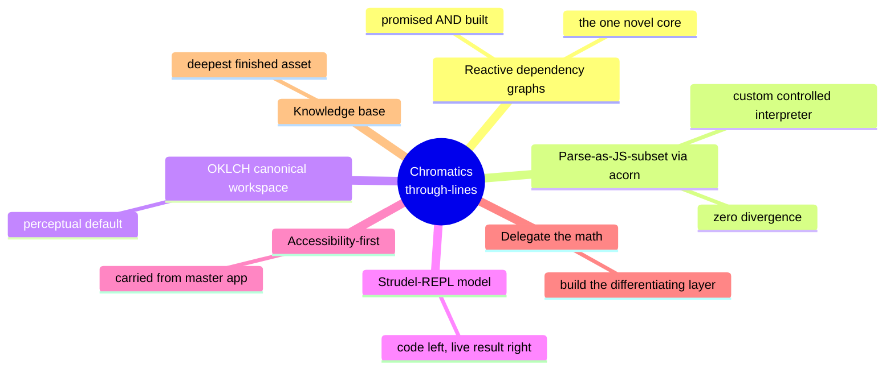
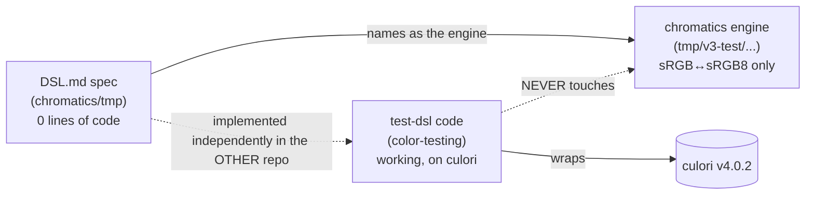

# Investigation Report

> What this note is: the preserved write-up of the **2026-06-24 investigation** that seeded this vault. It renders the raw `investigation.json` (8 source digests + one synthesis) into prose so the reasoning behind every other note is auditable. This is the **genesis record** — everything in [[Vision]], [[Decision Log]], [[Unified Product Plan]] and [[Status & Inventory]] traces back to here.

> [!note] Provenance
> Source of record: `scratchpad/investigation.json` ({ `digests`: 8, `synthesis`: { vision, throughLines, artifactStates, tensions, gaps, convergence, openDecisions, recommendation } }). This note is a faithful distillation of that file, not new analysis. Where the synthesis cites `file:line`, branch names, or real identifiers, they are preserved verbatim.

---

## 1. Scope & method

The investigation was a **parallel fan-out read** across two git repos and one Obsidian knowledge base, followed by a single synthesis pass. Nine readers each took one slice; their findings were compacted into **8 source digests**, then reconciled into the synthesis.

The corpus spanned three physical locations:

| Location | What was read |
|---|---|
| `color-testing` repo, branch **test-dsl** (checked out) | `src/lib/dsl/{lang,evaluator,color}.ts`, `Editor.svelte`, `+page.svelte` (383 lines), layout, README, package.json |
| `color-testing` repo, branch **master** | the pre-pivot static contrast-matrix app |
| `chromatics` repo, branches **tmp / v3-test / dev / dev-dev / research / master** | `DSL.md` spec, the `ConversionRegistry` engine, model files, all `_old/research/` docs |
| Obsidian vault (the `old/` archive) | `Chromatics.md` (2024-11-08), `Chromatics - Planning.md` (2026-04-08), AI/ research dumps, 102-note encyclopedia (73 Color Models + 29 Color Systems) |

The 8 digests map to: (0) the test-dsl running code, (1) `DSL.md` the design doc, (2) the chromatics color-engine library across all branches, (3) the user's planning notes, (4) the AI product-research notes, (5) Library Research v1–v5, (6) the engine-internals research (Conversion Pipeline, Transfer Functions, etc.), (7) the encyclopedic reference inventory.

> [!tip] Read order
> The synthesis is the payload; the digests are evidence. If you only read one thing, read §3 (through-lines) and §9 (recommendation).

---

## 2. The unified vision

The synthesis settled on a single sentence for what Chromatics is:

> [!decision] One-line vision
> **A Strudel-REPL-for-color**: a live-coding web tool where you write JS-like code to declare color *variables* and — critically — the *relationships* between them (e.g. "foreground is the inverse lightness of background, hue rotated 180°"), and the system reactively re-evaluates the whole scheme through a dependency graph, so changing one base color cascades everywhere downstream.

The repeated thesis: **color schemes should be executable dependency graphs, not static 5-swatch palettes** — the genuine gap Coolors / Adobe Color / Paletton do not fill. Around that DSL core sit three supporting layers:

1. A **perceptual color engine**, canonically in OKLCH (today a `culori` wrapper; aspirationally the bespoke `chromatics` typed class-per-model library distilled from the 100+-note knowledge base).
2. A **CodeMirror REPL webapp** with a live swatch inspector, eventual two-way UI↔code editing, and export to CSS vars / JSON tokens / Tailwind.
3. An **accessibility spine** (WCAG/APCA contrast, gamut mapping, CVD simulation) carried over from the original static app.

The deeper framing, in the user's own words: *"the learning has already happened; the DSL is where that knowledge becomes a tool."* The end goal spans a website, an npm color library, and a "Dynamic Theme" capability — unified by one idea: **precise, deterministic, model-aware, relationship-driven color that the user fully controls.** See [[Vision]] for the canonical statement.

---

## 3. The through-lines

Seven themes recurred across *every* layer (spec, planning, research, and code):

- **Color schemes as reactive dependency graphs** — the one genuinely novel, consistently-stated core. Stated identically in the planning note ("dependency graphs, not static palette picks… No existing tool does this"), `DSL.md` ("capture RELATIONSHIPS between colors"), engine-research, **and it actually exists** in test-dsl (`Scope.currentDeps`, `Variable.deps`, the "depends on:" UI). The only feature both promised and built.
- **Parse-as-JS-subset via acorn, evaluate with a custom interpreter** — identical across `DSL.md`, planning note, and running code (`evaluator.ts`: `acorn.parse`, ecmaVersion 2020, restricted node-type switch, `Unsupported syntax` catch-all). **Zero divergence in strategy.**
- **OKLCH/Oklab as the canonical perceptual workspace** — `color.ts` stores `_oklch` internally; the encyclopedia tags both Oklab and Oklch "Critical".
- **Strudel-REPL live-coding model** — code on the left, live visual result on the right; literally implemented in `+page.svelte`.
- **Accessibility-first, carried from the master app** — though only WCAG (`culori wcagContrast`) made it into code; APCA/CVD remain research-only.
- **Delegate the color math, build the differentiating layer** — *"the conversion math is not [the novel contribution]"*; *"writing the 50th Oklab→XYZ converter isn't novel."*
- **Knowledge base as the project's deepest, most-finished asset** — 100+ files; the code is a thin slice of it.

---

## 4. Artifact states

Eight artifacts, each at a very different maturity. See [[Status & Inventory]] for the live table; this is the genesis snapshot.

| Artifact | State | Role |
|---|---|---|
| **color-testing/test-dsl** (`dsl/*`, `+page.svelte`) | Active, recent (Apr 3 2026), functional end-to-end at **v0.0.1**. The single REAL DSL implementation. | The de-facto Phase 1+2+3 product. Took the shortcut (wrap culori) that contradicts the from-scratch engine plan. |
| **chromatics/tmp `DSL.md`** (15,686 bytes) | Mature spec, **zero implementation** behind it on its own repo. Three internal contradictions. | The formal blueprint; test-dsl is an independent implementation of it — in the *other* repo. |
| **chromatics color-engine** (tmp/v3-test/dev/dev-dev) | Active but mid-rewrite, uneven. `dev-dev` = high-water mark (~8 models, parsers, playground). `tmp` = cleanest architecture but only `sRGB↔sRGB8` wired, plus a `get()` bug. | Intended runtime engine — **bypassed entirely** by test-dsl in favor of culori. |
| **color-testing/master** | Stable, shipped. Static contrast-matrix tool + CVD sim + markdown export. | Origin point; donor of accessibility framing. README still describes only this. |
| **Planning notes** (`Chromatics.md` 2024, `Chromatics - Planning.md` 2026-04-08) | Mature, decisive design docs. | **Current source-of-truth direction.** Crucially *reverses* the from-scratch/TypedArray decision in favor of wrapping culori — and the code follows THIS note. |
| **AI research** (Ideas / Existing Products / Dynamic Theme / Library Research v1–v5) | Settled/archival ideation. Internally contradictory (No-AI vs AI-prompt). | The exploration that fed direction; contains the conceptual SEED of the DSL. |
| **Engine-internals research** (Conversion Pipeline, Transfer Functions, Chromatic Adaptation, Gamut Mapping, deltaE, Harmony, Interpolation, Contrast) | Mature, dense, consistent (Apr 8 2026). | The algorithm spec for the eventual full library. Mostly UNUSED by test-dsl. |
| **Encyclopedic reference** (102 notes, each with a `## Chromatics API` block) | Rich but mid-consolidation (2–3 unmerged legacy blocks/note). | Aspirational implementation spec for the full class-per-model engine. Vastly outpaces any code. |

---

## 5. The three DSL/engine artifacts — convergence & divergence

The heart of the investigation: **three artifacts all claim the same idea but were built apart.**

### Where they converge

- **Parsing strategy — full convergence.** Spec, planning, research, and code all agree: acorn → ESTree AST → custom controlled-interpreter walker; explicitly reject raw `eval` (no introspection) and a hand-written grammar. `evaluator.ts` is a faithful implementation of the spec's sketch.
- **Canonical color model — full convergence** on OKLCH internal storage with lazy/cached projection (`color.ts`: `_oklch` private; `_hsl`/`_rgb`/`_hex` caches).
- **Dependency tracking — full convergence.** The spec's "`scope.get` adds to `currentDependencies`" is implemented verbatim (`Scope.currentDeps: Set<string>`, snapshotted per assignment into `Variable.deps`). This is the **core novelty, and it works.**

### Where they diverge

> [!warning] Engine backend — hard divergence
> `DSL.md`'s tech-stack table says the engine is *"chromatics (extended with unified Color class)."* But the test-dsl code **wraps culori directly** (`color.ts` imports `converter/formatHex/clampChroma/wcagContrast/displayable/inGamut/parse` from `'culori'`) and **never touches the chromatics `ConversionRegistry`.** The 2026 planning note reconciles this: it explicitly chose "wrap Culori, don't reimplement." The code follows the *planning note*, contradicting the older library-research/encyclopedia from-scratch design.

- **OKLCH channel naming** — the spec is self-contradictory (`.l` reserved for HSL in its table, but every worked example reads OKLCH as `bg.l/bg.c/bg.h`). The **code resolved it cleanly**: OKLCH = `ok_l/ok_c/ok_h`, HSL = `h/s/l` (`color.ts` getters, lines 37–60). The shipped examples use `ok_*` correctly.
- **`shift()`/`derive()` object-literal gap** (verified, not just suspected) — `color.ts` defines `shift({l,c,h})` / `derive({l,c,h})` (lines 139–157), but `evaluator.ts` has **no `ObjectExpression` case**. Calling `shift({l:0.1})` throws `Unsupported syntax: ObjectExpression`. **Both methods are DEAD from the DSL surface.** The code inherited the spec's contradiction rather than resolving it.
- **Two-way editing** — spec/planning/research name it as the headline differentiator (Option A break-link for MVP, Option C long-term). The code has **zero** two-way editing; the inspector is read-only. The most-emphasized "nobody else does this" feature is unbuilt in the only running artifact.
- **Equality semantics** — `==` and `===` both compile to JS strict `===`; for Color this means **reference equality** (two structurally-identical colors are not `==`). The spec never specified this — a real foot-gun.
- **Highlighter vs evaluator** — `lang.ts` (CodeMirror StreamParser) and `evaluator.ts`/`color.ts` maintain **two independent, manually-synced token sets** that already overlap imperfectly; some after-dot branches are effectively dead.

---

## 6. Tensions

The unresolved strategic forks. See [[Decision Log]] and [[Open Questions]].

1. **Two repos, two implementations of one idea.** The spec lives in `chromatics/tmp/DSL.md` and names chromatics as the engine; the only working DSL lives in `color-testing/test-dsl` on culori. The project is **physically split across two repos that don't share the engine they were supposed to share.**
2. **Build-from-scratch vs wrap-a-library** — the deepest fork. *From-scratch camp:* Library Research v2, the 102-note encyclopedia, the actual chromatics engine code. *Wrap camp:* the 2026 planning note, engine-research, and decisively the **shipped code (culori).** The planning note and code won, but the from-scratch library still exists on the active branch — a sunk-cost pull.
3. **Engine-architecture civil war inside chromatics** — constructor-keyed registry (dev/dev-dev, 8+ models) vs symbol-ref registry (v3-test/tmp, cleaner but only 2 models). The cleaner design won the keying argument but **threw away all the breadth**; the registry migration was started and abandoned.
4. **TypedArray decision reversed.** Library Research v2 + encyclopedia mandate typed-array-backed models; the 2026 planning note explicitly reverses this (Float32 precision loss, allocation overhead). The existing engine is built the now-rejected way.
5. **"No AI" positioning vs the project's own trajectory.** Ideas.md is emphatic ("a brand's palette is too critical to leave to an AI's guess"), yet the gap-analysis floats AI palette prompts and the entire knowledge base is literally "By Claude Code." The No-AI stance reads as a pre-pivot artifact.
6. **Scope** — encyclopedic ambition (102 models/systems incl. ACES, Munsell, Pantone, CAM16) vs the running product (a 4-constructor DSL: HSL/RGB/OKLCH/hex over culori). The gap is enormous.
7. **Deployment/identity drift** — 2024 idea places the app inside `[[WebOS]]`; 2026 targets standalone static deploy. Identity oscillates: website? npm DSL library? Dynamic-Theme NPM package?

---

## 7. Gaps

Things promised everywhere but absent from running code:

- **The chromatics engine is essentially unbuilt** — `tmp` wires only `sRGB↔sRGB8`; the perceptual core (Oklab/Oklch, XYZ hub, P3) the DSL would need does not exist in usable form.
- **No conversion-graph pathfinding** in chromatics — only directly-registered edges work; multi-hop is manual chaining (`rgb.to.RGB().to.LinearRGB().to.XYZ()`).
- **`shift()`/`derive()` uncallable** from the DSL (no `ObjectExpression`) — verified; advertised in API Docs but non-functional.
- **No persistence/sharing** — no URL-hash, no localStorage; the REPL can't save or share a scheme (spec's Phase 4 promised this).
- **No export** — CSS variables / JSON tokens / Tailwind config all promised, none built. This is the bridge to "Dynamic Theme" and real adoption.
- **Two-way editing entirely unbuilt** and has **no supporting algorithm research** — it is vision, not yet designed. Source-mapping is half-present (`Variable.node`) but nothing consumes it.
- **No clamping** on `lighten/darken/saturate/desaturate` — values run <0 or >1; out-of-gamut is only badged, never auto-corrected unless `.gamutMapped` is read.
- **"Dynamic Theme" product** richly researched, **zero code**; the brittle name-substring PREVIEW (`name.includes('bg')`) is the only gesture.
- **`brand-dark.ts`** — the named Phase 1 success gate ("rewrite brand-dark.ts as a DSL script") — **exists on color-testing/`master`** (a 224-line OKLCH TS scheme) but was deleted on `test-dsl`; no DSL-script equivalent exists yet, so the gate is real and diffable but not codified.
- **Stale README** — documents only the old static app.

---

## 8. Open decisions

Six decisions the synthesis surfaced for the user (recommendations carried into [[Decision Log]] / [[Open Questions]]):

| # | Question | Synthesis recommendation |
|---|---|---|
| 1 | Which engine backs the DSL — culori or from-scratch chromatics? | **C, leaning A near-term.** Keep culori (already works); layer model-specific methods on top. Treat the from-scratch engine as an optional learning track. |
| 2 | Where does the project live — color-testing or chromatics? | **C as end-state, A operationally.** Ship from color-testing now; long-term the engine belongs in the published `@lilbunnyrabbit/chromatics` and the REPL consumes it. |
| 3 | Fix `shift()`/`derive()` (currently uncallable)? | **A.** Add a whitelisted `ObjectExpression` case `{l,c,h}`; update highlighter + docs; relax the spec rule to "object literals allowed only as call arguments." |
| 4 | OKLCH channel-naming canonical? | **A.** `ok_l/ok_c/ok_h` + `h/s/l` (what the code already does); edit `DSL.md` to match. |
| 5 | Single source of truth for the token set (evaluator vs highlighter)? | **A now, B later.** Extract one shared manifest; defer the Lezer migration to polish. |
| 6 | Is "No AI" still a positioning pillar? | **C.** Deterministic by default, optional AI assist for naming only; keep "relationships as code" as the real differentiator. |

---

## 9. The recommendation

> [!decision] Headline recommendation
> **Ship the DSL you already have, from `color-testing/test-dsl`, on top of culori — and stop treating the from-scratch chromatics engine as a blocker.**

The evidence is decisive: the only working end-to-end DSL (acorn evaluator + OKLCH/culori `Color` model + CodeMirror REPL + dependency-tracking inspector) lives in test-dsl; the 2026 planning note explicitly chose to wrap culori (*"the DSL is the novel contribution — the conversion math is not"*); and the engine-research independently concluded "wrap Culori." The competing from-scratch engine (symbol-ref registry wiring only `sRGB↔sRGB8`, plus a latent `get()` bug) and the 102-note encyclopedia are valuable as a **reference layer and optional learning track**, but nowhere near able to back the DSL. Force-fitting chromatics under the DSL now trades a working product for a 6–12-month rewrite — the exact trap the user already talked themselves out of.

**Concrete near-term path:**

1. **Make the spec honest** — fix `DSL.md` to match the code: `ok_l/ok_c/ok_h`, the implemented ternary/comparison nodes, and "object literals allowed as call args."
2. **Close the small verified correctness gaps** — add `ObjectExpression` so `shift()`/`derive()` work; unify highlighter/evaluator token sets behind one manifest; apply CSS Color 4 gamut mapping (`culori clampChroma`) instead of just badging.
3. **Build the two tool-making features** — **export** (CSS vars / JSON tokens / Tailwind) and **URL-hash persistence/sharing**. These convert a playground into a tool and wire the DSL into the "Dynamic Theme" use case.
4. **Reserve model-specific chromatics methods** (`hct.tonalPalette`, `oklch.gamutMap`, `lab.deltaE`, APCA, CVD) as a thin layer on culori, added only as the DSL surface demands — the genuine differentiator that requires re-deriving zero converters.
5. **Park two-way UI↔code editing** as the explicit next-phase research item — headline everywhere, but zero algorithm design and zero code; scope it deliberately starting from the spec's Option A (break-link-and-warn on literals).

This recommendation is the backbone of the [[Unified Product Plan]] and the [[Roadmap]].

---

## 10. Why this note exists (genesis marker)

> [!note] Genesis of the vault
> This vault was created on **2026-06-24** by distilling the `old/` Obsidian archive plus the two repos into a structured second brain. This Investigation Report is the **provenance anchor**: every distilled note ([[Vision]], [[Decision Log]], [[Build vs Buy]], [[Architecture Decisions]], [[DSL Spec]], [[DSL Implementation Notes]], [[DSL Gaps & Bugs]], [[Unified Product Plan]], [[Status & Inventory]]) descends from the 8 digests and 1 synthesis preserved here. When a later note and this report disagree, this report is the historical record of *what was true on 2026-06-24*; the living notes supersede it for *current* state.

**See also:** [[Home]] · [[Vision]] · [[Decision Log]] · [[Unified Product Plan]] · [[Status & Inventory]] · [[Open Questions]]
